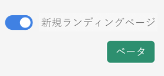
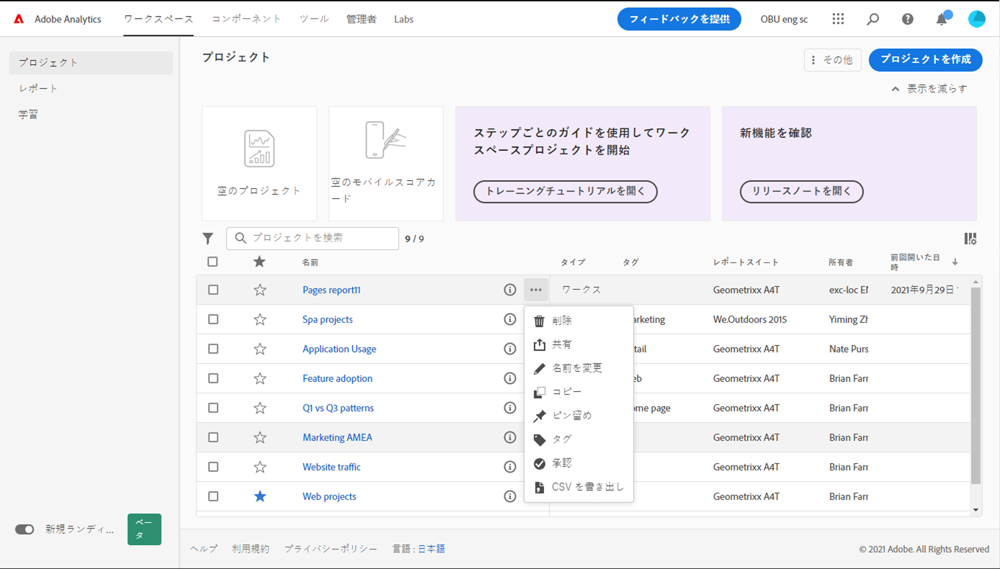
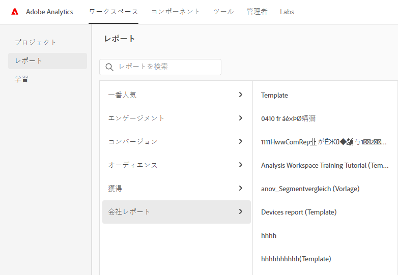

# Adobe Analytics ランディングページ

Adobe Analytics のランディングページでは、[!DNL Analysis Workspace] と [!DNL Reports & Analytics] の両方が単一のインターフェイスと、[!DNL Workspace] 傘下にあるアクセスポイントに統合されます。プロジェクトマネージャーのホームページ、更新されたレポートメニュー、最新化されたレポートおよび学習セクションが用意されており、より効率的に作業を開始することができます。以下は、このトピックの概要に関するビデオです。

>[!VIDEO](https://video.tv.adobe.com/v/334278/?quality=12)

## 新規ランディングページの機能 {#new-features}

| 機能 | 説明 | スクリーンショット |
| --- | --- | --- |
| [!UICONTROL プロジェクト]テーブルをフルスクリーンに拡張する | テーブルを拡張するには、ハンバーガーのメニューアイコンをクリックします。この操作を実行すると、左側のパネルのタブが折りたたまれます。 |  |
| 列の幅のカスタマイズ | 以前は、列の幅は固定されていました。列区切り記号をドラッグして調整できるようになりました。 |  |
| ピン留めされた項目の並べ替え | ピンされた項目を上下に移動するには、ピン留めされた項目の横の省略記号をクリックし、「**[!UICONTROL 上に移動]**」または「**[!UICONTROL 下に移動]**」を選択します。 |  |
| 新規テーブル列 | テーブルの右上に表示される「[!UICONTROL テーブルをカスタマイズ]」アイコンをクリックします。新規テーブル列は次のとおりです。 <ul><li>**[!UICONTROL 予定]**：プロジェクトがスケジュールされた際は[!UICONTROL オン]、そうでない場合は[!UICONTROL オフ]に設定します。[!UICONTROL オン]のリンクをクリックすると、スケジュールされたプロジェクトに関する情報を表示できます。また、プロジェクトの所有者である場合は[プロジェクトスケジュールを編集](/help/analyze/analysis-workspace/curate-share/t-schedule-report.md)できます。</li><li>**[!UICONTROL プロジェクト ID]**：プロジェクト ID は、プロジェクトのデバッグに使用できます。</li><li>**[!UICONTROL 最長の日付範囲]**：日付範囲を長くすると、プロジェクトの複雑さが増し、処理と読み込み時間が長くなる場合があります。 </li><li>**[!UICONTROL クエリ数]**：プロジェクトの読み込み時に Analytics に対して行われたリクエストの合計数です。プロジェクトクエリの数が多いと、プロジェクトが複雑になり、処理と読み込みに時間がかかる場合があります。このデータは、プロジェクトが読み込まれた後、またはスケジュールされたプロジェクトが送信された後にのみ使用できます。 </li></ul> |  |
| シングルクリックでレポートを開く | 以前は、ダブルクリックする必要がありました。 |  |
| **[!UICONTROL Reports &amp; Analytics]** レポートへの新しいリンク | <ul><li>**[!UICONTROL レポート]**／**[!UICONTROL オーディエンス]**／**[!UICONTROL ボット]**</li><li>**[!UICONTROL レポート]**／**[!UICONTROL オーディエンス]**／**[!UICONTROL ボットページ]**<li>**[!UICONTROL レポート]**／**[!UICONTROL エンゲージメント]**／**[!UICONTROL リアルタイム]**</li></ul> |  |
| 標準の新規レポート | <ul><li>**[!UICONTROL レポート]**／**[!UICONTROL 一番人気]**／**[!UICONTROL 次のページ]**</li><li>**[!UICONTROL レポート]**／**[!UICONTROL 一番人気]**／**[!UICONTROL 前のページ]**</li><li>**[!UICONTROL レポート]**／**[!UICONTROL エンゲージメント]**／**[!UICONTROL ページ分析]**／**[!UICONTROL ページの概要]**</li></ul>これらのレポートは[!UICONTROL ワークスペース]形式で、設定とビルドが必要となります。出力は、上位指標のパネル、トレンドデータ、[!UICONTROL フロー]ビジュアライゼーションなどで構成されます。これらのレポートを変更したり、ディメンション、ディメンション項目などを変更できます。これらのレポートは、ワークスペースパネル配下のパネルとしても使用できます。 |  |
| **[!UICONTROL 新規作成]**&#x200B;モーダルが復活しました | ワークスペースで「**[!UICONTROL 新規作成]**」をクリックすると、[!UICONTROL 空のプロジェクト]と[!UICONTROL 空のモバイルスコアカード]のどちらかを、再び選択できるようになりました。会社が作成した任意のテンプレートから選択することもできます。 |  |
| CJA でも入手可能 | このランディングページは、変更された形式で、CJA でも使用できます。 |  |

{style=&quot;table-layout:auto&quot;}

## ランディングページへのアクセス {#access-landing}

Adobe Experience Cloud および Analytics にログインしたら、左下隅にある「[!UICONTROL 新しいランディングページ - ベータ版]」の切り換えボタンを有効にします。切り替えボタンへのアクセスは、会社固有ではなく、組織ごとのユーザー固有です。

## トップメニュー構造 {#top-menu}

* 上位の Analytics メニュー：ほとんどのレポートは、左側のパネルの [!UICONTROL レポート] メニューに表示されます。
* 左側のレールには、[!UICONTROL プロジェクト]、[!UICONTROL レポート]、[!UICONTROL 学習] の 3 つのタブがあります。

### 用語

* **[!UICONTROL プロジェクト]**&#x200B;とは、自分が構築したもの、または他のユーザーが構築し共有したものです。[!UICONTROL プロジェクト]は、空のプロジェクトと空のモバイルスコアカードも指します。
* **[!UICONTROL レポート]**&#x200B;とは、Reports &amp; Analytics のレポートやワークスペースのテンプレートなど、アドビが事前に作成したものを指します。
* **[!UICONTROL テンプレート]**&#x200B;は、アドビの事前定義済みワークスペースプロジェクトの用語としては使用されなくなりました。現在は、[!UICONTROL レポート]の配下にあります。[!UICONTROL テンプレート]という用語は、会社が作成したテンプレートでも引き続き使用されます。

## 「[!UICONTROL プロジェクト]」タブに移動する {#navigate-projects}

[!UICONTROL プロジェクト]は[!UICONTROL ワークスペース]ホームページとして機能します。モバイルスコアカードを含む、ワークスペースプロジェクトがここに表示されます。

>[!NOTE]
>
>次の設定の一部は、セッション全体およびセッション間で保持（記憶）されます。例：開いていたタブ、選択したフィルター、選択した列、列の並べ替え方向。ただし、検索結果は保持されません。

| UI 要素 | 定義 |
| --- | --- |
| ... さらに詳しく | [!UICONTROL チュートリアルを表示]し、[ユーザーの環境設定を編集](/help/analyze/analysis-workspace/user-preferences.md)できます。 |
| [!UICONTROL プロジェクトの作成] | ドロップダウンメニューを使用して、[!UICONTROL ワークスペースプロジェクト]または[!UICONTROL モバイルプロジェクト]を作成できます。 |
| [!UICONTROL 表示回数を減らす／増やす] | バナーの表示および非表示を切り替える： |
| [!UICONTROL 空のプロジェクト] | 入力する空の[ワークスペースプロジェクト](https://experienceleague.adobe.com/docs/analytics/analyze/analysis-workspace/home.html?lang=ja)を作成します。 |
| [!UICONTROL 空のモバイルスコアカード] | 入力する空の[モバイルスコアカード](https://experienceleague.adobe.com/docs/analytics/analyze/mobapp/curator.html?lang=ja)を作成します。 |
| [!UICONTROL トレーニングチュートリアルを開く] | 新規ユーザーがプロジェクトを構築できるよう順を追ってガイドする、ワークスペーストレーニングチュートリアルを開きます。 |
| [!UICONTROL リリースノートを開く] | 最新の Adobe Experience Cloud リリースノートの Adobe Analytics セクションを開きます。 |
| フィルターアイコン | タグ、レポートスイート、所有者、タイプおよびその他のフィルター（自分が所有、自分と共有、お気に入りおよび承認済み）を使用してフィルタリングできます |
| 検索バー | これで、検索にテーブル内のすべての列が含まれます。 |
| 選択ボックス | 1 つ以上のプロジェクトの横にあるこのボックスをクリックすると、実行できるプロジェクト管理アクション（削除、タグ付け、ピン止め、承認、共有、名前変更、コピー、CSV に書き出し）が表示されます。これらのアクションを実行する権限がない可能性があります。 |
| [!UICONTROL お気に入り] | プロジェクトをお気に入りに追加すると、そのプロジェクトに星が付き、フィルタリングできるお気に入りとしてタグ付けされます。 |
| [!UICONTROL 名前] | プロジェクトの名前。 |
| ピンアイコン | 項目をピン止めすると、 *常に* リストの上部に表示されます。 |
| 情報 (i) アイコン | 情報アイコンをクリックすると、このプロジェクトに関する情報（タイプ、プロジェクトの役割、所有者、説明、および共有相手）が表示されます。また、このプロジェクトを[編集または複製](https://experienceleague.adobe.com/docs/analytics/analyze/analysis-workspace/curate-share/share-projects.html?lang=ja)できるユーザーも示します。 |
| 省略記号（...） | プロジェクトの横にある省略記号をクリックすると、実行できるプロジェクト管理アクション（削除、タグ付け、ピン止め、承認、共有、名前変更、コピー、CSV に書き出し）が表示されます。これらのアクションを実行する権限がない可能性があります。 |
| [!UICONTROL タイプ] | ワークスペースプロジェクトとモバイルスコアカードのどちらであるかを示します。 |
| [!UICONTROL タグ] | レポートにタグを付けて、グループに整理できます。 |
| [!UICONTROL プロジェクトの役割] | プロジェクトの役割とは、自分がプロジェクトの所有者であるかどうか、およびプロジェクトの編集または複製の権限を持っているかどうかを指します。 |
| [!UICONTROL レポートスイート] | パネル内のテーブルとビジュアライゼーションは、パネルの右上で選択されたレポートスイートからデータを取得します。 また、レポートスイートでは、左パネルで使用できるコンポーネントも決定します。 プロジェクト内では、分析の使用例に応じて、1 つまたは複数のレポートスイートを使用できます。 レポートスイートのリストは関連度に基づいて並べ替えられます。アドビは、現在のユーザーがスイートを使用した最近の頻度と、組織内でスイートが使用された頻度に基づいて関連度を定義します。 |
| [!UICONTROL 所有者] | プロジェクトを作成したユーザー。 |
| [!UICONTROL 前回開いた日時] | このプロジェクトが最後に開かれた日時。 |
| テーブルアイコンのカスタマイズ | （右上）プロジェクトのリストに列を追加または削除する場合は、列を選択または選択解除して操作を実行します。 |
| &lt;（戻るボタン） | ワークスペースプロジェクトまたはレポートでこのボタンをクリックすると、最新のランディングページ設定に戻ります。ランディングページを離れた時点でのページ設定は、戻った際にも保持されます。 |

## 「[!UICONTROL レポート]」タブに移動する {#navigate-reports}

「[!UICONTROL レポート]」タブは、次の 3 つのレポートセットを統合します。

* 以前は[!UICONTROL ワークスペース]／[!UICONTROL プロジェクト]／[!UICONTROL 新規]の下にあった、事前定義済みの[!UICONTROL ワークスペース]テンプレート。アドビは、このコンテキストでは「テンプレート」という単語を使用しなくなりました。
* 以前の Adobe Analytics の[!UICONTROL レポート]のトップメニューにある、事前定義済みのレポートのほとんど。これらのレポートは、[Analysis Workspace](https://experienceleague.adobe.com/docs/analytics/analyze/analysis-workspace/home.html?lang=ja) に表示されます。
* 会社が構築したもの。

>[!IMPORTANT]
>
>「レポート」で、新しいレポートをお気に入りに登録した場合にのみ、「お気に入り」フォルダーが表示されます。既存の Reports &amp; Analytics のお気に入りは転送されません。

前述のとおり、ここで使用できるのや、以前 Reports &amp; Analytics でグループ化されていた、最も一般的なレポートのみです。ほとんど使用されないレポートや、関連性の低いレポートの一部は移行されませんでした。詳しくは、以下の FAQ を参照してください。

### メニューとサブメニュー {#menus}

次に、メニューとそのサブメニューを示します。特定のレポートが見つからない場合は、「ページで検索」を実行して見つけます。

| メニュー項目 | このメニュー項目のレポート |
| --- | --- |
| **[!UICONTROL 最頻使用]** | <ul><li>トレーニングチュートリアル（既存のワークスペーステンプレート）</li><li>ページ（トップページは何か）</li><li>ページビュー数（生成しているページビュー数はいくつか）</li><li>訪問回数（訪問回数はいくつか）</li><li>訪問者（訪問者は何人か）</li><li>主要指標（最も重要な指標のパフォーマンスはどの程度か）</li><li>サイトセクション（最もページビュー数の多いサイトセクションはどれか）</li><li>次のページ（訪問者が次に閲覧するページは何か）</li><li>前のページ（訪問者が最後に閲覧したページは何か）</li><li>キャンペーン（主要指標を促しているキャンペーンは何か）</li><li>製品（主要指標を推進しているのはどの製品か）</li><li>ラストタッチチャネル（パフォーマンスが最も高いラストタッチチャネルはどれか）</li><li>ラストタッチチャネルの詳細（他のチャネルよりパフォーマンスが優れているラストタッチチャネルはどれか）</li><li>売上高（売上高のパフォーマンスはどの程度か）</li><li>注文（注文のパフォーマンスはどの程度か）</li><li>点数（販売数はいくつか）</li></ul> |
| **[!UICONTROL エンゲージメント]** | <ul><li>主要指標（最も重要な指標のパフォーマンスはどの程度か）</li><li>ページビュー数（生成しているページビュー数はいくつか）</li><li>ページ（トップページは何か）</li><li>訪問回数（訪問回数はいくつか）</li><li>訪問者（訪問者は何人か）</li><li>訪問別滞在時間（ユーザーの滞在時間は1 回の訪問あたりどのくらいか）</li><li>イベント前の時間（成功イベントの前にユーザーが滞在した時間はどれくらいか）</li><li>サイトセクション（最もページビュー数の多いサイトセクションはどれか）</li><li>Web コンテンツの消費（最も消費され、ユーザーを引き付けているのはどのコンテンツか）</li><li>メディアコンテンツ消費（最も消費され、ユーザーを引き付けているのはどのコンテンツか）</li><li>次と前のページフロー（訪問者がたどった次／前のパスは何か）</li><li>フォールアウト（デジタルプロパティのどこでフォールアウトが発生するか）</li><li>クロスデバイス分析（Analysis Workspace でのクロスデバイス分析の使用）</li><li>Web リテンション（常連ユーザーは誰で、どのような行動を取っているか）</li><li>メディアオーディオ消費（オーディオ消費のトレンドとトップ指標は何か）</li><li>メディアの最新性、頻度、ロイヤルティ（常連読者は誰か）</li><li>ページ分析／リロード回数（最もリロード回数の多いページはどれか）</li><li>ページ分析／ページでの滞在時間（ユーザーがページで滞在した時間はどのくらいか）</li><li>入口と出口／入口ページ（上位の入口ページはどれか）</li><li>入口と出口／オリジナルの入口ページ（訪問者が最初にアクセスしたページはどれか）</li><li>入口と出口／単一ページ訪問数（単一ページ訪問数が最も多いページはどれか）</li><li>入口と出口／出口ページ（上位の出口ページはどれか）</li></ul> |
| **[!UICONTROL コンバージョン]** | <ul><li>製品／製品（主要指標を促しているのはどの製品か）</li><li>製品／製品のパフォーマンス（最もパフォーマンスが高い製品はどれか）</li><li>製品／カテゴリー（最もパフォーマンスの高い製品カテゴリーは何か）</li><li>買い物かご／買い物かご（買い物かごに製品を追加したユーザーは何人か）</li><li>買い物かご／買い物かご表示（訪問者が買い物かごを何回表示したか）</li><li>買い物かご／買い物かごへの追加（ユーザーが買い物かごに製品を追加する頻度はどのくらいか）</li><li>買い物かご／買い物かごからの削除（ユーザーが買い物かごから商品を削除する頻度はどのくらいか）</li><li>購入／売上高（売上高のパフォーマンスはどの程度か）</li><li>購入／注文（注文のパフォーマンスはどの程度か）　</li><li>購入／点数（販売数はいくつか）</li><li>[Magento：マーケティングとコマース](https://experienceleague.adobe.com/docs/analytics/analyze/analysis-workspace/build-workspace-project/starter-projects.html?lang=ja#commerce)</li></ul> |
| **[!UICONTROL オーディエンス]** | <ul><li>人物指標（ブランドとやり取りしているユーザーは何人か）</li><li>訪問者プロファイル／場所の概要（ユーザーの間で最も多くの利用を促進しているのは場所はどこか）</li><li>訪問者プロファイル／地理特性／地域 - 郡、地域 - 米国の州、地域 - 地域、地域 - 市区町村、地域 - 米国 DMA（ユーザーがアクセスしている地域はどこか）</li><li>訪問者プロファイル／言語（ユーザーが好む言語はどれか）</li><li>訪問者プロファイル／タイムゾーン（ユーザーはどのタイムゾーンから訪問しているか）</li><li>訪問者プロファイル／ドメイン（訪問者がサイトへのアクセスに使用している ISP はどれか）</li><li>訪問者プロファイル／トップレベルドメイン（サイトへのトラフィックを促進しているのはどのドメインか）</li><li>訪問者プロファイル／技術／技術の概要（訪問者がサイトへのアクセスに使用しているのはどのテクノロジーか）</li><li>訪問者プロファイル／技術／ブラウザー、ブラウザータイプ、ブラウザーの幅、ブラウザーの高さ（ユーザーがサイトへのアクセスに使用しているのはどの会社のブラウザー、ブラウザー バージョン、幅と高さか）</li><li>訪問者プロファイル／テクノロジー／オペレーティングシステム、オペレーティングシステムのタイプ（訪問者が使用している OS とバージョンはどれか）。</li><li>訪問者プロファイル／テクノロジー／携帯電話会社（訪問者がサイトへのアクセスに使用する携帯電話会社はどれか）</li><li>訪問者保持率／再来訪頻度（ユーザーの前回の訪問から現在の訪問までの経過時間はどのくらいか）</li><li>訪問者保持率／再来訪（訪問者のうちの、再訪問者の数）</li><li>訪問者保持率／訪問回数（主要指標の大部分を占める訪問回数のバケットはどれか）</li><li>訪問者保持率／販売サイクル／顧客の忠誠度（ユーザーはどのロイヤルティセグメントに属しているか）</li><li>訪問者保持率／販売サイクル／初回購入までの日数（ユーザーの初回訪問から初回購入までの日数はどのくらいか）</li><li>訪問者保持率／販売サイクル／前回購入からの日数（ユーザーの現在の訪問から前回購入までの日数はどのくらいか）をクリックします。</li><li>訪問者保持率／モバイル／デバイスとデバイスのタイプ（訪問が使用しているデバイスとデバイスのタイプはどれか）</li><li>訪問者保持率／モバイル／製造元（訪問者が使用しているモバイルデバイスのメーカーはどれか）</li><li>訪問者保持率／モバイル／画面サイズ、画面の高さ、画面の幅（訪問者のモバイル画面のサイズ/高さ/幅はどれですか？）</li><li>訪問者保持率／モバイル／[モバイルアプリの使用状況](https://experienceleague.adobe.com/docs/analytics/analyze/analysis-workspace/build-workspace-project/starter-projects.html?lang=ja#mobile)</li><li>訪問者保持率／モバイル／[モバイルアプリジャーニー](https://experienceleague.adobe.com/docs/analytics/analyze/analysis-workspace/build-workspace-project/starter-projects.html?lang=ja#mobile)</li><li>訪問者保持率／モバイル／[モバイルアプリ指標](https://experienceleague.adobe.com/docs/analytics/analyze/analysis-workspace/build-workspace-project/starter-projects.html?lang=ja#mobile)</li><li>訪問者保持率／モバイル／[モバイルアプリメッセージ](https://experienceleague.adobe.com/docs/analytics/analyze/analysis-workspace/build-workspace-project/starter-projects.html?lang=ja#mobile)</li><li>訪問者保持率／モバイル／[モバイルアプリのパフォーマンス](https://experienceleague.adobe.com/docs/analytics/analyze/analysis-workspace/build-workspace-project/starter-projects.html?lang=ja#mobile)</li><li>訪問者保持率／モバイル／[モバイルアプリ保持率](https://experienceleague.adobe.com/docs/analytics/analyze/analysis-workspace/build-workspace-project/starter-projects.html?lang=ja#mobile)</li></ul> |
| **[!UICONTROL 獲得]** | <ul><li>マーケティングチャネル／ファーストタッチチャネル、ファーストタッチチャネルの詳細（ファーストタッチチャネルの種類と、パフォーマンスが最も高い特定のファーストタッチチャネルの種類はどれか）</li><li>マーケティングチャネル／最後のチャネル、最後のチャネルの詳細（ラストタッチチャネル、および最もパフォーマンスの高い特定のラストタッチチャネルはどれか）</li><li>Campaign／Campaign（主要指標を推進しているキャンペーンはどれか）</li><li>Campaign／キャンペーンのパフォーマンス（最も高い売上を促進しているのはどのキャンペーンか）</li><li>キャンペーン／トラッキングコード（パフォーマンスが最も高いキャンペーントラッキングコードはどれか）</li><li>[Web 獲得](https://experienceleague.adobe.com/docs/analytics/analyze/analysis-workspace/build-workspace-project/starter-projects.html?lang=ja#web)</li><li>[モバイル獲得](https://experienceleague.adobe.com/docs/analytics/analyze/analysis-workspace/build-workspace-project/starter-projects.html?lang=ja#mobile)</li><li>[Advertising Analytics: 有料検索](https://experienceleague.adobe.com/docs/analytics/analyze/analysis-workspace/build-workspace-project/starter-projects.html?lang=ja#advertising)</li><li>検索キーワード - すべて、有料、自然（主要指標を最も促進している検索キーワードおよび有料／自然検索キーワードはどれか）</li><li>検索エンジン - すべて、有料、自然（主要指標を最も促進している検索エンジンおよび有料／自然検索エンジンはどれか）</li><li>すべての検索ページのランク（ユーザーはどの検索ページから訪問しているか）</li><li>参照ドメイン（サイトへのトラフィックを促進しているのはどのドメインか）</li><li>オリジナルの参照ドメイン（サイトを訪問する前に最初に訪問したドメインは何か）</li><li>リファラー（クリックスルーしてサイトにアクセスする前に、ユーザーが閲覧していた URL はどれか）</li><li>リファラータイプ（参照 URL が属するカテゴリはどれか）</li></ul> |
| **[!UICONTROL 会社レポート]** | ユーザーが使用するために会社が作成したレポート。以下の「会社レポートの作成」を参照してください。 |

### テンプレートの場所（現在はレポートと呼ばれています） {#templates}

| レポート（テンプレート）名 | レポートの場所 |
| --- | --- |
| トレーニングチュートリアル | 最も人気のある > トレーニングチュートリアル |
| web コンテンツ消費 | エンゲージメント > web コンテンツ消費 |
| メディアコンテンツ消費 | エンゲージメント > メディアコンテンツ消費 |
| クロスファイル分析 | エンゲージメント > クロスデバイス分析 |
| web 定着 | エンゲージメント > web 定着 |
| メディアオーディオ消費 | エンゲージメント > メディアオーディオ消費量 |
| メディアの最新性、頻度、ロイヤルティ | エンゲージメント > メディアの最新性、頻度、ロイヤルティ |
| ITP の影響 | エンゲージメント > ITP の影響 |
| 製品パフォーマンス | コンバージョン > 製品 > 製品パフォーマンス |
| Magento：Marketing &amp; Commerce | コンバージョン > Magento：Marketing &amp; Commerce |
| 人物指標 | オーディエンス > 人物指標 |
| ロケーションの概要 | オーディエンス > 訪問者プロファイル > ロケーションの概要 |
| 技術概要 | オーディエンス > 訪問者プロファイル > 技術 > 技術概要 |
| モバイルアプリの使用状況 | オーディエンス > モバイル > モバイルアプリの使用 |
| モバイルアプリジャーニー | オーディエンス > モバイル > モバイルアプリジャーニー |
| モバイルアプリ指標 | オーディエンス > モバイル > モバイルアプリメッセージ |
| モバイルアプリのパフォーマンス | オーディエンス > モバイル > モバイルアプリのパフォーマンス |
| モバイルアプリの定着 | オーディエンス > モバイル > モバイルアプリの定着 |
| キャンペーンパフォーマンス | 獲得 > キャンペーン > キャンペーンのパフォーマンス |
| モバイルの獲得 | 獲得 > モバイルの獲得 |
| Web 獲得 | 獲得 > Web 獲得 |
| Advertising Analytics：有料検索 | 獲得 > Advertising Analytics：有料検索 |

### 「レポート」タブの使用 {#use-reports}

Reports &amp; Analytics を現在ご利用中のお客様に対して、従来のレポートの使用方法と、ワークスペース内に表示されるレポートの使用方法を簡単に紹介します。レポートは、既存のテンプレートのように機能します。変更を加えると、別のレポートに移動する際に変更を保存または破棄するよう求められます。 変更を保存する場合は、レポートを新しいプロジェクトとして保存します。

1. 「[!UICONTROL レポート]」タブに移動します
1. 表示するレポートを選択します。例えば、「[!UICONTROL 一番人気]」で、「[!UICONTROL ページ]」レポートを選択します。
1. 右側の「**[!UICONTROL レポートを開く]**」をクリックします。

   

1. Analysis Workspace に表示されるページレポートには、2 つの[ビジュアライゼーション](/help/analyze/analysis-workspace/visualizations/freeform-analysis-visualizations.md)（[棒グラフ](/help/analyze/analysis-workspace/visualizations/bar.md)と[概要番号](/help/analyze/analysis-workspace/visualizations/summary-number-change.md)）および[フリーフォームテーブル](/help/analyze/analysis-workspace/visualizations/freeform-table/freeform-table.md)が表示されます。使用される指標は発生件数です。
1. ここから、複数のオプションを選択できます。これらのオプションには、次のようなものがあります。

   * レポートをそのまま使用できます。
   * 上部のセグメントドロップゾーンに、1 つ以上のセグメントをドラッグできます。例えば、「[!UICONTROL モバイル顧客]」セグメントをドラッグし、結果が変化することを確認します。
   * 右上のカレンダーに移動して、日付範囲を変更できます。
   * ディメンション分類の追加、他の指標へのドラッグ、および好きな方法でレポートの一般的なカスタマイズを実行できます。

### （カスタム）会社レポートの作成 {#company-report}

カスタムレポートは会社レポートと呼ばれ、会社レポートメニューに表示されます（以下を参照してください）。以前に作成されたものと新しいものが、ここに一覧表示されます。

新しい会社レポートを作成するには、

1. ワークスペースを目的の状態になるように作成します。
1. [!UICONTROL プロジェクト ]メニューを開き、「**[!UICONTROL 会社レポートとして保存...]**」をクリックします。

   

1. 目的のフィールドをすべてモーダルに追加し、保存します。

   レポートは会社レポートリストに追加され、ログイン会社のユーザーが利用できます。

その他の学習オプション：

* 開いているレポートの左上で、Analysis Workspace の 20 分間のビデオの概要を確認できます。
* 新規ユーザーには、新しいプロジェクトの構築手順を示す[トレーニングチュートリアル](https://www.youtube.com/watch?v=lCH1Kl1q9Wk)ビデオをお勧めします。
* [完全な Analysis Workspace のドキュメント](/help/analyze/analysis-workspace/home.md)へのリンクはこちらです。
* 完全な [Analysis Workspace の YouTube プレイリスト](https://www.youtube.com/playlist?list=PL2tCx83mn7GuNnQdYGOtlyCu0V5mEZ8sS)はこちらです。

## 「学習」タブへの移動 {#navigate-learning}

学習ページには、実践ビデオツアーとチュートリアルのほか、ドキュメントへのリンクが含まれています。

* [!UICONTROL ワークスペースの基本]ツアーでは、ワークスペースに直接アクセスし、ワークスペースのレイアウトと、最も一般的なアクションをどこで見つけて実行できるかについて説明します。このツアーは、パネルヘッダーからツールチップポップオーバーを使用して、ワークスペースでいつでも直接再起動できます。
* ビデオ／ツアーをクリックすると、「**[!UICONTROL 閲覧済み]**」タグが追加されます。このタグは、学習コンテンツの進捗状況を追跡するのに役立ちます。コンテンツをまだ完了していない場合は、タグをクリックするとタグが消えます。
* ビデオモーダルの「**[!UICONTROL 詳細情報]**」ボタンをクリックすると、先ほど視聴したビデオに関連する詳細なヘルプコンテンツが記載された Adobe Experience League ドキュメントページが表示されます。「**[!UICONTROL その他のビデオを視聴する]**」をクリックすると、Analysis Workspace YouTube の完全なプレイリスト全体が表示されます。

## ランディングページの設定 {#set-landing}

ユーザーは好みのランディングページを設定できます。

1. Analytics／[!UICONTROL コンポーネント]／[!UICONTROL 環境設定]／[!UICONTROL 一般]に移動します。
1. 希望するランディングページを確認します。

   

## 「レポート」タブを非表示にする {#hide-reports}

管理者は、組織内のすべてのユーザーの「レポート」タブを非表示にできます。

1. [!UICONTROL Analytics]／[!UICONTROL コンポーネント]／[!UICONTROL 環境設定]／[!UICONTROL 会社]に移動します。
1. **[!UICONTROL 「レポート」タブを非表示]**&#x200B;をオンにします。

## ランディングページに関する FAQ {#landing-faq}

| 質問 | 回答 |
| --- | --- |
| [!UICONTROL ワークスペース]にあったテンプレートはどこにありますか。 | これらのテンプレートは、「[!UICONTROL レポート]」タブの下にグループ化されています。 |
| ベータ版をオプトアウトできますか？ | ベータ版はいつでもオプトアウトできます。 |
| ベータ版プログラム UI での作業内容は、実稼動用の[!UICONTROL ワークスペース]エクスペリエンスに引き継がれますか。 | はい、ベータ版で行った作業はすべて古い／現在の[!UICONTROL ワークスペース]エクスペリエンスに引き継がれます。 |
| 現在の [!DNL Reports & Analytics] のお気に入りは引き継がれますか。 | いいえ、引き継がれません。ただし、[!UICONTROL ワークスペース]プロジェクトのお気に入りは引き継がれます。 |
| ピン留めできるプロジェクトに最大数はありますか？ | いいえ。固定できるプロジェクトの数に制限はありません。 |
| 管理者は、このランディングページをユーザーに指定できますか？ | いいえ。管理者は、ユーザーの代わりにランディングページを指定することはできません。個々のユーザーは、自分で切り替えをオンにする必要があります。 |
| 現在 [!DNL Reports & Analytics] にあるすべてのレポートは、引き続き使用できますか。 | いいえ。全体的な使用状況のデータに基づき、次のレポートは廃止されました。 <ul><li>任意のカスタム eVars/props/events/classifications<li>推奨レポート</li><li>時間別／日別／週別／月別／四半期別／年別ユニーク訪問者数</li><li>日別／週別／月別／四半期別／年別ユニーク顧客数</li><li>アクション名の深度</li><li>アクション名の概要</li><li>ダッシュボードを追加</li><li>年齢</li><li>音声サポート</li><li>請求情報</li><li>ページへのクリック数</li><li>色深度</li><li>cookie サポート</li><li>Cookie</li><li>接続タイプ</li><li>クリエイティブエレメント</li><li>クレジットカードの種類</li><li>クロスセル</li><li>カスタムイベントファネル</li><li>カスタムリンク</li><li>顧客 ID</li><li>曜日</li><li>入口アクション名</li><li>出口アクション名</li><li>出口リンク</li><li>フォールアウト</li><li>ファイルのダウンロード数</li><li>ストア内を検索</li><li>フルパス</li><li>性別</li><li>ヒットタイプ VISTA ルール</li><li>画像のサポート</li><li>Java</li><li>JavaScript</li><li>JavaScript バージョン</li><li>ブックマークの管理</li><li>ダッシュボードを管理</li><li>モニターの色深度</li><li>モニターの解像度</li><li>ニュースレターへの新規登録</li><li>次のアクション名</li><li>次のアクション名のフロー</li><li>Null 検索</li><li>オペレーティングシステム</li><li>注文の確認</li><li>その日のページ</li><li>エラーページ（404）</li><li>パスファインダー</li><li>パスの長さ</li><li>前のアクション名</li><li>前のアクション名のフロー</li><li>製品アクティビティ</li><li>製品コスト</li><li>製品部門</li><li>製品在庫カテゴリ</li><li>製品名</li><li>製品レビュー</li><li>製品シーズン</li><li>製品共有</li><li>製品ズーム</li><li>リロード</li><li>検索</li><li>サーバー</li><li>単一ページ訪問数</li><li>配送先情報</li><li>サイト階層</li><li>Social メンション数</li><li>時刻</li><li>アクション名での滞在時間</li><li>ビデオサポート</li><li>訪問者の州</li></ul> |
