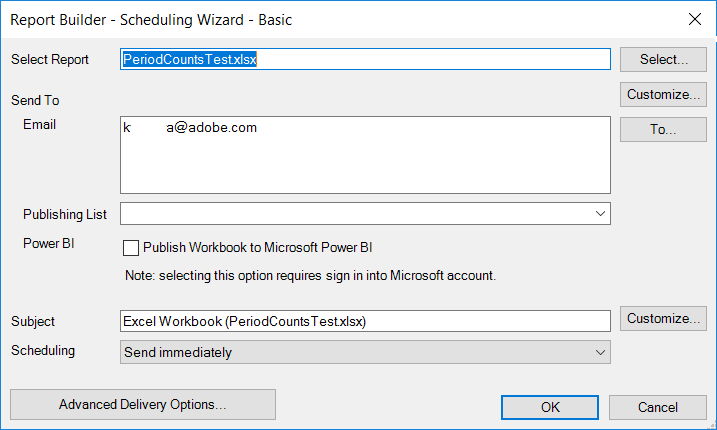
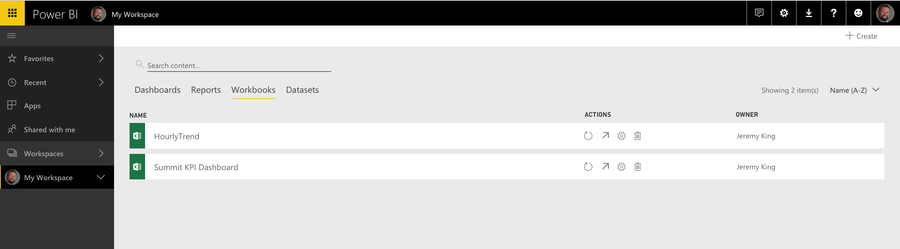
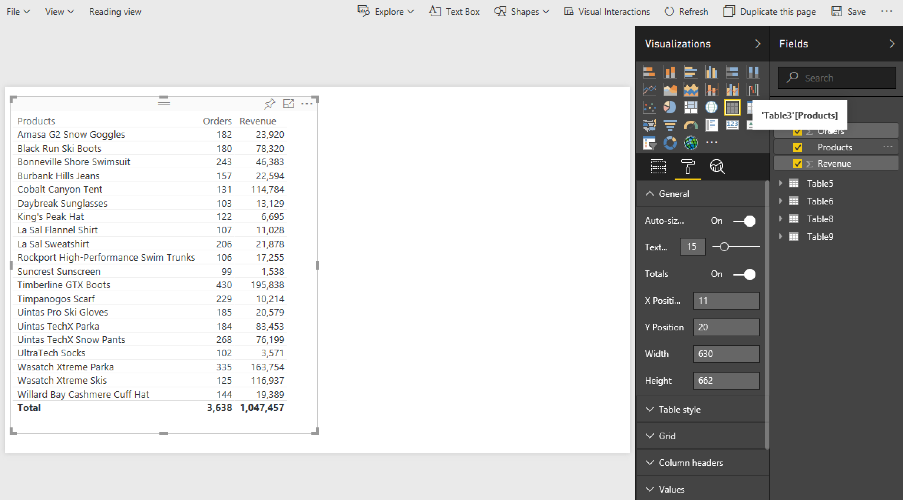
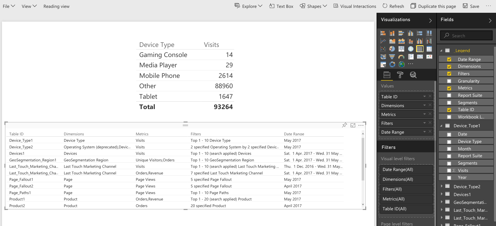

# Power BI への発行 - 概要

{{legacy-arb}}

Microsoft Power BIは、データを分析してインサイトを共有するためのビジネス分析ダッシュボードです。 Adobe AnalyticsとPower BIの連携により、Microsoft Power BI内でReport Builder Analyticsのデータを視覚化し、組織全体で簡単に共有できます。

これまで、アナリストは、メールまたは ftp を使用して Report Builder ワークブックの配信をスケジュールしていました。 それが、関係するビジネスユーザーが、様々なプラットフォームやデバイスからアクセス可能な web ベース環境で、正確かつ最新のデータに、Power BI アカウント内からアクセスできるようになりました。

Report Builder のレポート生成機能を Power BI の視覚化機能と組み合わせることで、組織の全員が情報にアクセスできるようになります。 また、Power BI を使用すると、Adobe Analytics を他のデータソース（POS、CRM など）と統合して、独自の顧客インサイト、関連性および機会を発見することもできます。

## 必要システム構成 {#section_0B71092D853446F38FA36447DAC0D32B}

* Adobe Report Builder 5.5 が[インストールされている](/help/analyze/legacy-report-builder/setup/t-install-arb.md)
* Power BI にログインできるアクティブな Microsoft アカウント

## ワークブックを Power BI に発行する {#section_21CA66229EC240D49594A9A7D3FBA687}

スケジュールされたワークブックは、Adobe Analytics のデータが取り込まれた、フォーマット済みの Excel スプレッドシートです。定期的なスケジュールで配信されます。

**Report Builder でのワークブックの発行**

1. Report Builderで、ブックを生成して保存します。
1. Report Builder ツールバーで、**[!UICONTROL スケジュール]**／**[!UICONTROL 新規作成]**&#x200B;をクリックします。

1. 基本スケジューリングウィザードで、**[!UICONTROL Microsoft Power BIへのワークブックの公開]**&#x200B;の横にあるチェックボックスをオンにします。

   

1. メールを指定して、すぐに送信するか、スケジュール頻度（時間、日など）を指定します。
1. **[!UICONTROL OK]**&#x200B;をクリックして公開します。
1. これで、Microsoft アカウントにログインするよう求められます。 資格情報を入力してください。
1. Report Builder ワークブックがスケジュールされ、Power BIに公開されます。

   スケジュールされた各インスタンスで、Report Builder スケジューリングプロセスが更新されたAnalytics データでワークブックを更新した後、ワークブックはMicrosoft Power BIに公開されます。

**Power BI での Report Builder のワークブックデータの表示**

1. Power BI で、[!UICONTROL ワークブック]メニューの下に表示されるワークブックをダブルクリックします。

   

1. これで、ワークブックのダッシュボードデータを表示できるようになります。  

1. このワークブックの領域をピン留めして任意の Power BI ダッシュボードに追加できます。

## ワークブック内のすべてのフォーマット済みテーブルを Power BI データセットテーブルとして発行する {#section_7C54A54E75184DD6BAEF4ACCE241239A}

>[!NOTE]
>
>ワークブックにマクロが含まれている場合、「すべてのフォーマット済みテーブルを Power BI データセットテーブルとして発行」は無効になります。

ワークブック全体を読み込む代わりに、ワークブック内のすべての書式設定されたテーブルのコンテンツのみを読み込むことができます。

**ユースケース**：複数のReport Builder リクエストからデータを取得し、多くの数式を含む概要テーブルを作成するExcel ブックがあります。 Power BIには概要テーブルのみを読み込み、そのビジュアライゼーションを作成できます。

**Report Builder でのフォーマット済みテーブルの発行**

1. Report Builder で、ヘッダー行とそれに続くデータ行を含むデータテーブルを生成します。
1. テーブルを選択し、[!UICONTROL ホーム]メニューから&#x200B;**[!UICONTROL テーブルとしてフォーマット]**&#x200B;を選択します。 テーブルにはデフォルトで名前（テーブル 1、テーブル 2 など）が付けられますが、[!UICONTROL デザイン]メニューで名前を変更できます。

1. Report Builder ツールバーで、**[!UICONTROL スケジュール]**／**[!UICONTROL 新規作成]**&#x200B;をクリックします。

1. 基本のスケジュールウィザードで、**[!UICONTROL アドバンススケジュールオプション]**&#x200B;をクリックします。
1. [!UICONTROL スケジュールウィザード - アドバンス]の「**[!UICONTROL 発行オプション]**」タブで「**[!UICONTROL すべてのフォーマット済みテーブルを Power BI データセットテーブルとして発行]**」の横にあるチェックボックスをオンにします。

   

1. （オプション）Power BIで公開されたアセットの名前をカスタマイズできます。 これは、バージョン管理をワークブック名（myworkbook_v1.1.xlsxなど）の一部として使用し、公開済みのPower BI アセットの名前にバージョン番号を表示しない場合に便利です。 また、バージョン番号が変更されても、公開済みアセットは変更されないという利点もあります。 （ここでは[仕様](/help/analyze/legacy-report-builder/c-publish-power-bi/specifications-limits.md)を表示します）。

**Power BI でのテーブルデータの表示**

1. Power BI で、**[!UICONTROL Workspace]**／**[!UICONTROL データセット]**&#x200B;メニューに移動します。

   

1. 公開したデータセットを選択し、その横にある「[!UICONTROL &#x200B; レポートを作成]」アイコンをクリックします。 テーブルがフィールドとして表示されます。

   

1. テーブルとその関連列を選択します。

   

1. [!UICONTROL &#x200B; ビジュアライゼーション &#x200B;] メニューから、Power BIでテーブルをビジュアライズする方法を選択できます。 例えば、データを折れ線グラフとして表示できます。

   

1. ここから、このデータセットテーブルのビジュアライゼーションを作成できます。

## すべての Report Builder リクエストを Power BI データセットテーブルとして発行する {#section_0C26057C7DBB4068A643FDD688F6E463}

すべてのリクエストをデータセットテーブルに変換し、その上にビジュアライゼーションを作成することができます。

>[!IMPORTANT]
>
>ワークブックに 100 を超えるリクエストが含まれている場合、Power BI に発行されるのは最初の 100 件のリクエストのみです。 さらに、Power BIに公開されるリクエストごとに、最初の10,000行のデータのみが公開されます。 そのため、これらのリクエストはスケジュールを通じて正常に配信されますが、Power BIへの公開の範囲は限られます。

1. Report Builderで、Report Builder リクエストを含むブックを開くか作成します。
1. Report Builder ツールバーで、**[!UICONTROL スケジュール]**／**[!UICONTROL 新規作成]**&#x200B;をクリックします。

1. 基本のスケジュールウィザードで、**[!UICONTROL アドバンススケジュールオプション]**&#x200B;をクリックします。
1. [!UICONTROL スケジュールウィザード - 詳細]の「**[!UICONTROL 発行オプション]**」タブで、「**[!UICONTROL すべての Report Builder リクエストを Power BI データセットテーブルとして発行]**」の横のボックスをオンにします。「

1. 「**[!UICONTROL OK]**」をクリックします。

**Power BI でのリクエストデータの表示**

スケジュールされた各Report Builder リクエストは、データセットのテーブルとして公開されます。 各リクエストテーブルは、リクエスト内のプライマリディメンションにちなんで名前が付けられ、[!UICONTROL &#x200B; レポートスイート &#x200B;]と[!UICONTROL &#x200B; セグメント &#x200B;]列があります。

1. Power BI で、**[!UICONTROL Workspace]**／**[!UICONTROL データセット]**&#x200B;メニューに移動します。

1. 公開したリクエストを選択し、その横にある「[!UICONTROL &#x200B; レポートを作成]」アイコンをクリックします。

   リクエストが[!UICONTROL &#x200B; フィールド &#x200B;] メニューにテーブルとして表示されることに注意してください。

   

   >[!NOTE]
   >
   >ワークシートで Report Builder リクエストのレイアウトをどのように設定しても（ピボットレイアウト、カスタムレイアウト、一部の列を非表示）、リクエストは同じ 2 次元の単一ヘッダー行形式（日付、ディメンション、指標、レポートスイート、セグメント）で常に発行されます。

1. **[!UICONTROL Legend]**&#x200B;という名前の追加のテーブルがあることも確認してください。 Report Builderのコンテキストからリクエストを取り出すと、各リクエストが何を表しているかを覚えるのが難しい場合があります。 例えば、凡例テーブルの目的は、テーブル IDの下の各リクエストの名前を表示することです。 他の凡例の列を追加して、リクエストの全体像を把握することもできます。

   
