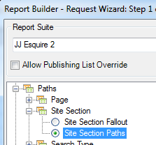
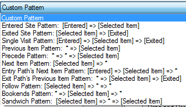
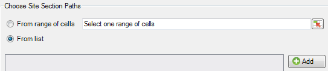

# リクエストウィザードを使用したパスレポートのフィルタリング

{{legacy-arb}}

フィルターを適用してパスレポートを作成する手順について説明します。

この例では、サイトセクションのパスを使用します。

1. Adobe Report Builder で「**[!UICONTROL 作成]**」をクリックして、リクエストウィザードを表示します。
1. 適切なレポートスイートを選択します。
1. 左側のツリービューで、**[!UICONTROL パス]**／**[!UICONTROL サイトセクション]**／**[!UICONTROL サイトセクションのパス]**&#x200B;を選択します。

   

1. 適切な日付を指定します。

1. 「**[!UICONTROL 次へ]**」をクリックします。

1. ウィザードの手順 2 の「**[!UICONTROL 行ラベル]**」で、「**[!UICONTROL 上位 1 ～ 10（パターン適用）]**」リンクをクリックします。 パスレポートに、デフォルトでパターンが適用されます。

   既定のパス パターンを示す

1. 「**[!UICONTROL フィルター]**」オプションを選択します。

   フィルターオプションを強調表示する

1. **[!UICONTROL 「サイトセクションのパス」のパスパターンを定義]**&#x200B;ダイアログボックスで、次の項目を指定できます。
   * 最初のレポートの開始ランク。
   * このレポートに表示するエントリの数。
1. 「**[!UICONTROL 編集]**」をクリックして、パスパターンを定義します。

1. カスタムパターンが必要な場合は、左側のリストから任意の&#x200B;**[!UICONTROL パターンオブジェクト]**&#x200B;を右側の&#x200B;**[!UICONTROL パターンビルダーキャンバス]**&#x200B;にドラッグ＆ドロップします。

   

1. 「**[!UICONTROL パターンを選択]**」ドロップダウンリストから事前定義済みのパターンを選択して、変更することもできます。 利用可能なパターンは次のとおりです。

   

   これらのパターンの中には、入口パスの次のアイテムパターン、出口パスの前のアイテムパターン、次のアイテムパターンなど、Report Builderに固有のものがあります。

## 定義済みパターンを編集するには

パターンを選択した後で、定義済みのパターンを編集できます。

1. 上記の手順から続けて、パターンを選択します。 例えば、**[!UICONTROL Exited Site Pattern]**&#x200B;を選択します。

   選択したパターンを強調表示する

1. ユーザーが終了する前に従うサイトセクションのパスを定義します。 「**[!UICONTROL 特定アイテム：0 個選択されました]**」をクリックします。 このパスを定義するには、既存のリクエストを編集する場合は、セルの範囲から選択するか、セクションのリストから選択します。

1. 過去のリクエストのセルの範囲から選択するには、「**[!UICONTROL セル範囲から選択]**」を選択して、セルセレクターアイコンをクリックします。 次に、レポートからセルを選択します。

   

1. サイトセクションのリストから選択するには、「**[!UICONTROL リストから選択]**」を選択して、「**[!UICONTROL 追加]**」をクリックします。

1. 「**[!UICONTROL 使用可能な要素]**」列から要素を選択し、オレンジ色の矢印をクリックして、「**[!UICONTROL 選択された要素]**」列に要素を移動します。 「**[!UICONTROL OK]**」をクリックします。

   使用可能な要素と選択した要素を示す

1. 作成したパターンを保存するには、「**[!UICONTROL 保存]**」をクリックします。

1. **[!UICONTROL OK]**&#x200B;を3回クリックし、**[!UICONTROL 終了]**&#x200B;をクリックして、フィルタリングされたパスを生成します。
