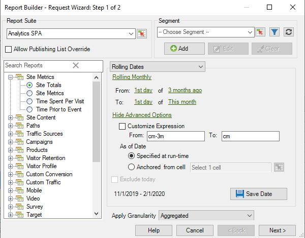

# カスタマイズされた日付式

{{legacy-arb}}

カスタム式を作成して、複雑な日付範囲を指定することができます。

式を作成する場合は、カレンダーを参照して、週数と日数を正しく指定します。 Excelには、日付間の日数、作業日数、月数、年数を計算できる組み込み関数がいくつかあります。 これらの関数を数式で使用して、週や四半期などの他の間隔を計算できます。

**カスタム式を有効にするには**

次の例は、**[!UICONTROL 日付]**&#x200B;のカスタム式を有効にする方法を示しています。

1. [!UICONTROL  リクエストウィザード：ステップ 1]で、**[!UICONTROL プリセット日]**&#x200B;を使用する代わりに、**[!UICONTROL ローリング日]**&#x200B;を選択します。

   

1. 週単位、月単位、四半期単位、年単位に切り替えます。 以下のオプションがどのように変更されるかに注目してください。
1. 詳細なカスタマイズオプションについては、**[!UICONTROL 詳細オプションを表示]**&#x200B;をクリックしてください。

   

1. 例えば、上記の日付を3か月前の初日から今月の初日まで毎月ローリングするように変更した場合、アドバンスオプション部分の日付は次のように更新されます。

   

1. **[!UICONTROL 式をカスタマイズ]**&#x200B;を有効にします。 **[!UICONTROL 日付]**&#x200B;の下でオプションを選択すると、カスタム日付式の構文を簡単に確認できます。

   「式をカスタマイズ」が選択されたことを示す

   詳細オプションを使用して、カスタム日付式を組み合わせることができます。 例えば、年の最初から先月末までのデータを表示する場合は、次のように入力できます。`From: cy` `To: cm-1d`。 ウィザードでは、これらの日付は1/1/2020-1/31/2020と表示されます。
