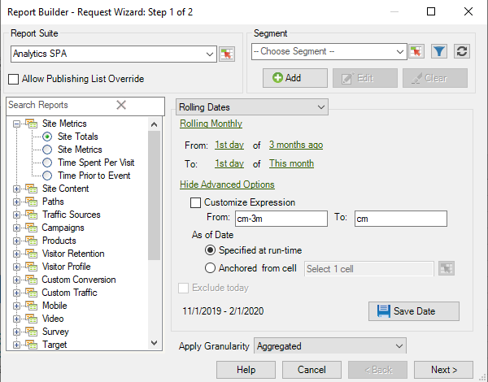
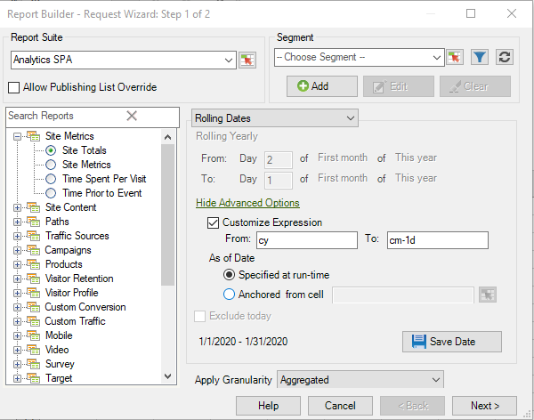

# カスタマイズされた日付式

{{legacy-arb}}

カスタム式を作成して、複雑な日付範囲を指定することができます。

式を作成する場合は、カレンダーを参照して週数と日数を正しく指定します。 Excel には、期間の日数、勤務日数、月数、年数を計算できる、様々なビルトイン関数があります。これらの関数を数式で使用して、週や四半期などの他の期間を計算することもできます。

**カスタム式を有効にするには**

次の例では、**[!UICONTROL 相対日付]** のカスタム式を有効にする方法を示します。

1. [!UICONTROL  リクエストウィザード：手順 1] で **[!UICONTROL プリセットされた日付]** の代わりに **[!UICONTROL 相対日付]** を選択します。

   

1. 週単位、月単位、四半期単位、年単位のローリングに切り替えます。 以下のオプションの変更点に注目してください。
1. その他のカスタマイズ オプションを表示するには、[**[!UICONTROL 詳細オプションの表示]**] をクリックします。

   

1. 例えば、上記の日付を 3 か月前の初日から今月の初日まで毎月ローリングに変更した場合、事前オプションの部分の日付が更新され、次の日付が反映されます。

   

1. **[!UICONTROL 式をカスタマイズ]** を有効にします。 **[!UICONTROL 相対日付]** の下のオプションを選択すると、カスタム日付式の構文を簡単に確認できます。

   

   詳細オプションを使用して、カスタムの日付式を組み合わせて一致させることができます。 例えば、年の最初の月から先月 1 か月の終わりまでのデータを表示する場合は、次のように入力します。`From: cy` `To: cm-1d`。 ウィザードでは、これらの日付は 2020 年 1 月 1 日～2020 年 1 月 31 日と表示されます。
