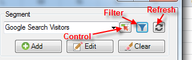
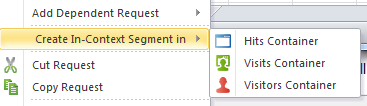
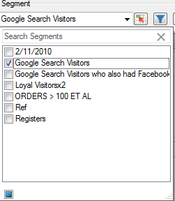
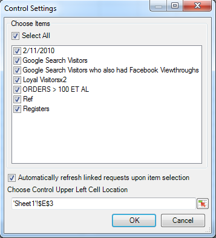
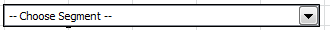
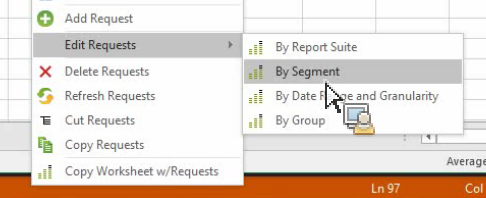

# セグメントの管理

{{legacy-arb}}

Report Builder で Adobe Analytics のセグメントを追加、編集、適用およびフィルターする方法について説明します。

Report Builderでは、リクエストウィザードの手順1でセグメント化パネルを使用して、セグメントを作成および管理できます。

## セグメントの追加または編集 {#section_B2BC136F9A53498D90C7C2ECC5DB892B}

>[!NOTE]
>
>Report Builder でセグメントを追加または編集するためのインターフェイスは、Microsoft Internet Explorer ウィンドウで Analytics のセグメントビルダーを起動します。 Report Builderのセッションは引き続きアクティブになります。 この操作では、Internet Explorer以外のブラウザーはサポートされていません。

1. リクエストウィザードの手順1のセグメントパネルで、**[!UICONTROL 追加]**&#x200B;をクリックします。
1. Internet Explorer ウィンドウが起動し、Analytics セグメントビルダーインターフェイスが開きます。 セグメントの作成方法について詳しくは、「[Analytics セグメント化](/help/components/segmentation/seg-home.md)」を参照してください。
1. セグメントを定義して保存したら、リクエストウィザードに戻ります。
1. 「更新」アイコンをクリックして、セグメントリストを更新します。

>[!IMPORTANT]
>
>セグメント一覧はキャッシュされるため、一覧を更新しないと新しく作成したセグメントは表示されません。

## コンテキスト内セグメントの作成 {#section_6DD2C663B2854469AA1075438F907678}

レポート閲覧中に、表示されているディメンションを使ってセグメントを作成したい場合があります。 これらのセグメントは、Report Builderのインターフェイスで作成できます。 例えば、ページリクエスト出力から数ページを選択し、これらの値に基づいてセグメントを作成します。

1. セグメントに変換するレポート出力項目を選択します。
1. 右クリックして&#x200B;**[!UICONTROL 次の中にコンテキスト内セグメントを作成]**&#x200B;を選択し、適切なコンテナ（ヒット数コンテナ、訪問コンテナ、訪問者コンテナ）を指定します。

   

   コンテナについて詳しくは、[ セグメント化ガイド ](/help/components/segmentation/seg-home.md)を参照してください。

1. セグメントビルダーUIがInternet Explorerで起動するようになりました。 セグメントビルダーUIは、コンテナと指定したフィルターで初期化されます。
1. セグメントに名前と説明を追加したら、セグメントを保存します。
1. Report Builderに戻り、「更新」アイコンをクリックして、セグメントのリストを更新します。
1. これで、このセグメントを適用する準備が整いました。

## セグメントの検索と適用

Reports &amp; Analytics （現在は提供終了）、Report Builder、またはData Warehouseで作成されたセグメントは、このセグメントリストに表示されます。 リストを更新するには、更新アイコン をクリックします。

任意のリクエストに1つまたは複数のセグメントを適用できます。 これには、連続性のあるセグメントが含まれます。

1. 「**[!UICONTROL セグメント]**」ドロップダウンリストに移動し、「**[!UICONTROL セグメントを選択]**」ボックス右側の小さい下矢印をクリックして、すべてのセグメントを表示します。

1. 適用するセグメントのチェックボックスをオンにします。

   選択したセグメントを表示する

>[!NOTE]
>
>管理者であるか管理者以外であるかを問わず、Report Builderでは、自分が所有するセグメントと、自分と共有されているセグメントのみを表示できます。

## セグメントのフィルタリング {#filter}

**フィルターアイコンをクリックして、** セグメントをフィルタリング：

使用可能なフィルターは次のとおりです。

| フィルター名 | 説明 |
|---|---|
| タグ | 特定のタグを持つセグメントをフィルタリングできます。 タグフィルターでは、AND演算子が使用されます。 2つのタグをオンにすると、右側のペインに&#x200B;**両方**&#x200B;のタグが付けられたセグメントが表示されます。 |
| 所有者 | セグメントを所有者でフィルタリングできます。 所有者フィルターはOR演算子を使用することに注意してください。 2人の所有者を確認すると、右側のペインに&#x200B;**いずれかの**&#x200B;所有者が所有するセグメントが表示されます。 |
| その他のフィルター> *レポートスイート名のみ* | Adobe Analyticsのセグメントビルダーで「Only *レポートスイート名*」フィルターを適用し、[!DNL Report Builder]に詳細フィルターを表示すると、選択したレポートスイートのセグメントのみが詳細フィルターに表示されます。 |
| その他のフィルター／自分が所有 | 所有しているすべてのセグメントが表示されます。 |
| その他のフィルター／自分と共有 | 他のユーザーが共有したすべてのセグメントが表示されます。 |
| その他のフィルター／お気に入り | お気に入りとしてマークしたすべてのセグメントが表示されます。 |
| その他のフィルター／承認済み | すべての正式に承認されたセグメントを表示します。 |

## ワークブックへのセグメントコントロールの追加 {#segment-control}

セグメントコントロールを追加すると、リクエストウィザードに移動することなく、ワークブック内からセグメントを切り替えることができるようになります。

1. セグメント ドロップダウンの横にあるコントロール アイコン をクリックします。

1. セグメントコントロールに表示するすべてのセグメントを確認するか、**[!UICONTROL すべてを選択]**&#x200B;を確認します。

   すべての設定を選択したコントロール設定ダイアログの

1. 項目の選択時にリンクされたリクエストを自動的に更新する&#x200B;**[!UICONTROL オプションに注意してください]**。

   * オンにすると、このコントロールを使用するすべてのリクエストが更新されます。
   * オンになっていない場合、関連するリクエストパラメーターは更新されますが、リクエストは更新されません。

1. セグメントコントロールの左上のセルの位置を指定します。

1. **[!UICONTROL OK]**&#x200B;をクリックすると、セグメントコントロールが指定された場所に表示されます。

   「セグメントを選択」フィールドのドロップダウンフィールドを示す

## セグメントのリストを更新する {#refresh}

新しいセグメントを追加したり、既存のセグメントを編集したりするときは、更新アイコン をクリックして、キャッシュされたセグメントのリストを更新する必要があります。

## 複数のリクエストにわたるセグメントの管理 {#manage}

v5.4より前は、Report Builderでは、複数のリクエストでセグメントを変更できるようになりました。 しかし、このプロセスは常に既存のセグメントに取って代わられました。 各リクエストに1つの新しいセグメントを追加したいユーザーは、セグメントを追加すると、各リクエストに既に割り当てられている以前のセグメントのセットが削除されるため、これを実行できませんでした。

Report Builder 5.4では、複数のリクエスト内のすべてのセグメントを追加、削除、置換、置換できます。

1. ワークブックで複数のリクエストを選択します。
1. 右クリックして、**[!UICONTROL 要求を編集]** > **[!UICONTROL セグメント別]**&#x200B;を選択します。

   

1. グループを編集ダイアログで、次の4つのオプションのいずれかを選択します。

   | オプション | 説明 |
   |---|---|
   | セグメントを追加 | 現在のセグメントのリストに追加する1つ以上のセグメントを選択できます。 |
   | セグメントを置換 | 1つ以上のセグメントに置き換えるセグメントを選択できます。 |
   | すべてのセグメントを次で置換 | 現在のセグメントを置き換える1つ以上のセグメントを選択できます。 |
   | セグメントを削除 | リクエストからセグメントを削除できます。 |
