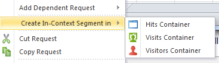

# セグメントの管理

{{legacy-arb}}

Report Builder で Adobe Analytics のセグメントを追加、編集、適用およびフィルターする方法について説明します。

Report Builderには、リクエストウィザードの手順 1 でセグメント化パネルが用意されており、セグメントを作成および管理できます。

## セグメントの追加または編集 {#section_B2BC136F9A53498D90C7C2ECC5DB892B}

>[!NOTE]
>
>Report Builder でセグメントを追加または編集するためのインターフェイスは、Microsoft Internet Explorer ウィンドウで Analytics のセグメントビルダーを起動します。Report Builder セッションはアクティブなままです。 ブラウザーを Internet Explorer 以外に変更することはできません。

1. リクエストウィザードの手順 1 のセグメントパネルで、「**[!UICONTROL 追加]**」をクリックします。
1. Internet Explorer のウィンドウが起動し、Analytics セグメントビルダーインターフェイスが開きます。セグメントの作成方法について詳しくは、「[Analytics セグメント化](/help/components/segmentation/seg-home.md)」を参照してください。
1. セグメントを定義して保存したら、リクエストウィザードに戻ります。
1. 更新アイコンをクリックして、セグメント一覧を更新します

>[!IMPORTANT]
>
>セグメント一覧はキャッシュされるため、一覧を更新しないと新しく作成したセグメントは表示されません。

## コンテキスト内セグメントの作成 {#section_6DD2C663B2854469AA1075438F907678}

レポート閲覧中に、表示されているディメンションを使ってセグメントを作成したい場合があります。Report Builder インターフェイスからこのようなセグメントを作成できます。例えば、ページリクエスト出力からいくつかのページを選択し、それらの値に基づいてセグメントを作成できます。

1. セグメントに含めるレポート出力項目を選択します。
1. 右クリックして&#x200B;**[!UICONTROL 次の中にコンテキスト内セグメントを作成]**&#x200B;を選択し、適切なコンテナ（ヒット数コンテナ、訪問コンテナ、訪問者コンテナ）を指定します。

   

   コンテナについて詳しくは、[セグメント化ガイド](/help/components/segmentation/seg-home.md)を参照してください。

1. セグメントビルダーの UI が Internet Explorer で起動します。セグメントビルダーの UI に指定したコンテナおよびフィルターが反映されます。
1. セグメントに名前と説明を追加し、保存します。
1. Report Builderに戻り、更新アイコンをクリックしてセグメントのリストを更新します。
1. これで、このセグメントを適用する準備が整いました。

## セグメントの検索および適用 {#search}

Reports &amp; Analytics （現在は提供終了）、Report Builder、Data Warehouseで作成されたすべてのセグメントがこのセグメントリストに表示されます。 リストを更新するには、更新アイコン  をクリックします。

リクエストに 1 つ以上のセグメントを適用できます。これには順次セグメントも含まれます。

1. 「**[!UICONTROL セグメント]**」ドロップダウンリストに移動し、「**[!UICONTROL セグメントを選択]**」ボックス右側の小さい下矢印をクリックして、すべてのセグメントを表示します。

1. 適用するセグメントのチェックボックスをオンにします。

   

>[!NOTE]
>
>管理者でも管理者以外でも、Report Builderでは、自分が所有しているセグメントと自分に共有されているセグメントのみを表示できます。

## セグメントのフィルタリング {#filter}

**フィルター** セグメントを作成するには、フィルターアイコン  をクリックします。

次のフィルターを利用できます。

| フィルター名 | 説明 |
|---|---|
| タグ | タグでセグメントをフィルターできます。タグフィルターでは、AND 演算子が使用されます。2 つのタグのチェックボックスをオンにすると、右側のペインに、**両方の**&#x200B;タグが付けられているセグメントが表示されます。 |
| 所有者 | セグメントを所有者でフィルタリングできます。所有者フィルターでは、OR 演算子が使用されます。2 人の所有者のチェックボックスをオンにすると、右側のペインに、**いずれかの**&#x200B;所有者が所有するセグメントが表示されます。 |
| その他のフィルター／「*レポートスイート名*」のみ | Adobe Analyticsのセグメントビルダーで「*レポートスイート名のみ*」フィルターを適用してから、[!DNL Report Builder] で詳細フィルターを表示すると、詳細フィルターには、選択したレポートスイートのセグメントのみが表示されます。 |
| その他のフィルター／自分が所有 | 自分が所有しているセグメントをすべて表示します。 |
| その他のフィルター／自分と共有 | 自分と共有されているすべてのセグメントが表示されます。 |
| その他のフィルター／お気に入り | お気に入りとしてマークしたすべてのセグメントが表示されます。 |
| その他のフィルター／承認済み | 正式に承認されたすべてのセグメントが表示されます。 |

## ワークブックへのセグメントコントロールの追加 {#segment-control}

セグメントコントロールを追加すると、リクエストウィザードに移動することなく、ワークブック内からセグメントを切り替えることができるようになります。

1. セグメントドロップダウンの横にあるコントロールアイコン  をクリックします。

1. セグメントコントロールに表示したいセグメントのチェックボックスをオンにするか、または「**[!UICONTROL すべて選択]**」チェックボックスをオンにします。

   

1. 「**[!UICONTROL リンクされたリクエストをアイテム選択に基づいて自動的にリフレッシュ]**」オプションも指定します。

   * このオプションを有効にすると、このコントロールを使用するすべてのリクエストが自動で更新されます。
   * このオプションを有効にしないと、リクエストの設定は更新されますが、リクエストのデータは更新されません。

1. セグメントコントロールの左上のセルの場所を指定します。

1. 「**[!UICONTROL OK]**」をクリックすると、指定した場所にセグメントコントロールが表示されます。

   

## セグメントの一覧の更新 {#refresh}

新しいセグメントを追加したり、既存のセグメントを編集したりするたびに、更新アイコン  をクリックして、キャッシュされたセグメント一覧を更新する必要があります。

## 複数のリクエストにわたるセグメントの管理 {#manage}

v5.4 より前の Report Builder を使用すると、ユーザーは複数のリクエストのセグメントを変更できます。ただし、この処理は、通常、既存のセグメントを置き換えます。セグメントの追加によって各リクエストに既に割り当てた以前のセグメントのセットが削除されるので、ユーザーは、各リクエストに 1 つの新しいセグメントを追加することはできませんでした。

Report Builder 5.4 を使用すると、複数のリクエストでセグメントの追加、削除、置換、全置換をおこなうことができます。

1. ワークブックで複数のリクエストを選択します。
1. 右クリックして、**[!UICONTROL リクエストを編集]**／**[!UICONTROL セグメント別]**&#x200B;を選択します。

   

1. グループを編集ダイアログで、次の 4 つのオプションのうちいずれかを選択します。

   | オプション | 説明 |
   |---|---|
   | セグメントの追加 | 1 つまたは複数のセグメントを選択して、現在のセグメントのリストに追加できます。 |
   | セグメントを置換 | 1 つまたは複数のセグメントで置き換えるセグメントを選択できます。 |
   | すべてのセグメントを次で置換 | 現在のセグメントから置換する 1 つまたは複数のセグメントを選択できます。 |
   | セグメントを削除 | リクエストからセグメントを削除できます。 |
