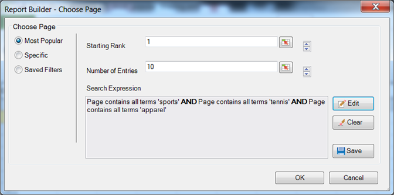

# 最頻使用フィルター

{{legacy-arb}}

Boolean ロジックと AND／OR 検索式を使用して設定する、ランキングおよび条件フィルター。

最頻使用フィルターは、Boolean ロジックと AND／OR 条件を使用して設定する式フィルターです。「[!UICONTROL  を含まないページ&#x200B;]*`<product name>`*」、「[!UICONTROL すべてを含む]」、「[!UICONTROL いずれかを含む]」、「[!UICONTROL すべてを除外]」などの条件を設定できます。 現在のワークブックや他のワークブックで使用する他のリクエスト用に、これらの式を[保存](/help/analyze/legacy-report-builder/layout/c-filter-dimensions/saved-filters.md)することができます。

**最頻使用フィルターを作成するには**

1. リクエストを作成または編集して、[!UICONTROL リクエストウィザード：ステップ 2] に進みます。

1. [!UICONTROL リクエストウィザード：ステップ 2] で、グリッド内のディメンションの横にあるリンクをクリックし、「**[!UICONTROL フィルター]**」を選択します。

   アプリケーション、ユーザー、およびプロジェクトでフィルターを適用するオプションを含むフィルターを定義ダイアログを表示する

1. 「[!UICONTROL ページを選択]」フォームで、「**[!UICONTROL ランクから選択]**」を有効にして、次のオプションを設定します。

   **開始ランク：** ディメンションの開始ランク。 デフォルトのランクが1の場合、レポートされるデータのリストの上位の項目が示されます。 例えば、ディメンション [!UICONTROL Page]の場合、開始記号1は、サイトで最も要求されたページを1つ示します。 10または別の値を開始ランクセルとして指定すると、10から始まるレポートが最も高くなります。 指標は降順に配置されるので、最もアクティビティの多い行項目がリストの最初にレポートされます。 1つのリクエストで50,000を超えるページ名が必要だが、レポートするページが数千ある場合は、リクエストをコピーして開始ランクを変更し、50,000個のブロックで適切なデータを取得できます。

   **エントリ数：**（[!UICONTROL ピボットレイアウト]のみ）表示される項目数を指定します。 指標によっては、100件のエントリがリストされていることもあれば、いくつか表示されていることもあります。 例えば、ディメンション [!UICONTROL  サイトセクション ]の場合、25件のエントリ数は、レポートに最も訪問された25 ページが表示されていることを示します。

   矢印を使用すると、シートの最初のデータポイントの[!UICONTROL 開始ランク ]と[!UICONTROL  エントリ数]を変更できます。 デフォルトでは、[!UICONTROL 開始順位]は1に設定され、[!UICONTROL  エントリ数]は10に設定されています。 これらの値は、特定の指標に対して最小1から最大50,000まで調整可能です。 各指標には、[!UICONTROL  エントリ数]に独自の上限があります。 これらのフィールドでは、負の値または0は許可されません。 [!UICONTROL 開始順位]を15として、[!UICONTROL  エントリ数]を10として選択した場合、指標のデータリクエストは最も訪問された10 ページを返します。最初に訪問されたページは、特定の日付範囲のリストの15番目です。 15位から25位までの最もリクエストされたページはすべて、降順で表示されます。

   >[!NOTE]
   >
   >既存のリクエストにフィルターを適用すると、表示されているデータが変更されます。 上位10個の[!UICONTROL  ページ ]をセル $A$1 ～ $A$10にマッピングし、[!UICONTROL 開始順位]に1個、エントリ数[!UICONTROL に10個を割り当てたとします]。 これらの値を変更して、[!UICONTROL 開始順位]の1を表示し、[!UICONTROL  エントリ数]の3のみを表示すると、以前にセル $A$4 ～ $A$10に入力したデータは表示されなくなります。

1. 検索式を作成するには、「**[!UICONTROL 追加]**」をクリックします。

1. 「[!UICONTROL フィルターを定義]」フォームで、必要に応じて条件を設定します。

   フィルターの定義ダイアログを表示している

   セルを選択アイコンを使用すると、セルの値で定義された条件を見つけることができます。 

   **条件を追加** リンクを使用すると、式に条件を追加できます。 追加できる条件の数に制限はありません。

1. 「**[!UICONTROL OK]**」をクリックします。

   右下の「OK」ボタンを含むフィルターを定義ダイアログの

1. 「[!UICONTROL ページを選択]」で「**[!UICONTROL 保存]**」をクリックし、式を保存します。
1. 「**[!UICONTROL OK]**」をクリックします。
