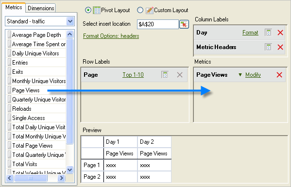
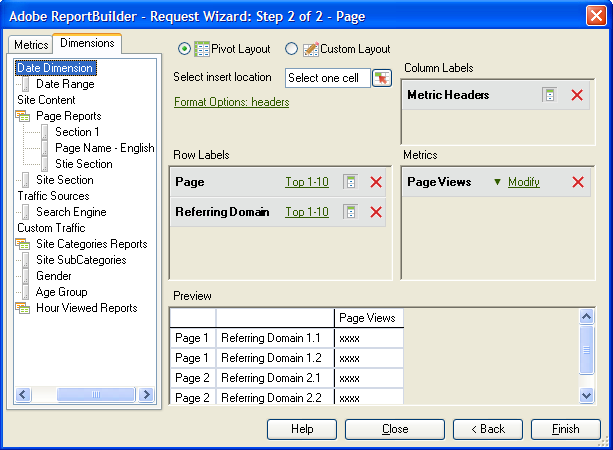

# 指標およびディメンションの追加

{{legacy-arb}}

リクエストに指標およびディメンションを追加する手順です。

1. [!UICONTROL &#x200B; リクエストウィザード：ステップ 1] フォームを使用して[&#x200B; データリクエストを作成](/help/analyze/legacy-report-builder/data-requests/data-requests.md)し、**[!UICONTROL 次へ]**&#x200B;をクリックします。
1. [!UICONTROL &#x200B; リクエストウィザード：ステップ 2] フォームで、指標をダブルクリックするか、目的の位置にドラッグします。

   

   指標を追加すると、リクエスト内で指標を複数回表示できるため、[!UICONTROL 指標] タブから指標が削除されません。 例えば、各値に加えて指標の小計を表示できます。 ただし、ディメンションを追加または削除するたびに、使用可能な指標のリストが変更されます。

   [!UICONTROL 指標] レイアウトセクションには、指標のみを追加できます。 指標は、[!UICONTROL 指標ヘッダー]として[!UICONTROL 列ラベル &#x200B;] レイアウトに追加されます。 [!UICONTROL 指標ヘッダー]を[!UICONTROL 列レイアウト &#x200B;]から[!UICONTROL 行レイアウト &#x200B;]に移動すると、そこに表示され、分類として指標として使用されます。

   「指標」タブの指標リストのすぐ上に検索バーが表示されます。

   

## ガイドライン

指標とディメンションを追加する際には、次のガイドラインを検討してください。

* 検索語を入力すると、リストは自動的に更新され、検索語と一致するラベルを持つ指標が表示されます。
* 一致は大文字と小文字を区別せず、*contains*&#x200B;検索と同等です。
* フルワード検索およびその他の特殊な検索フラグ（で始まり、で終わり、ORなど） はサポートされていません。

「[!UICONTROL 完了]」または「[!UICONTROL &#x200B; キャンセル &#x200B;]」をクリックするか、リクエストウィザードの手順1に戻るか、指標カテゴリを変更すると、検索語句がクリアされます。

検索語がクリアされていません：

* リストから指標アイテムをドラッグ&amp;ドロップ（またはダブルクリック）して、ピボットレイアウト/カスタムレイアウト指標パネルに追加します。
* ピボットレイアウト/カスタムレイアウト指標パネルから指標アイテムを削除する場合。
* 「Dimension」タブをクリックしてから、「指標」タブに戻ります。
* 他のサブフォーム（モーダルまたはモデルなし）を呼び出すと、終了時にリクエストウィザードに戻ります。ステップ 2. 例えば、次のフォームがあります

   * Dimension Filter Forms
   * 日付範囲の書式設定Forms
   * 書式オプションフォーム
   * テキストフォームの前置と後置
   * 出力範囲の場所フォーム

## リクエストを指標でソート

オプションで、リクエストを指標で並べ替えることができます。

リクエストを指標でソートするには

1. 指標ラベルをクリックします。
1. ディメンションを追加。 ディメンションは、指標を追加するのと同じように追加します。 上記の手順1と2を参照してください。

   「[!UICONTROL &#x200B; ディメンション &#x200B;]」タブには、[!UICONTROL &#x200B; リクエストウィザード：ステップ 1]、レポートスイートの設定で選択した基本レポートの分類または分類であるディメンションが表示されます。 ディメンションをレイアウトグリッドにドロップすると、ツリー表示からディメンションが削除され、使用可能な残りのディメンションのリストが再計算されます。

   [!UICONTROL 日付] ディメンションが自動的に追加されます。 使用可能な日付ディメンションは、[!UICONTROL &#x200B; リクエストウィザード：ステップ 1]で選択した粒度に応じて変更されます。 有効な値は次のとおりです。

   * 時間
   * 日
   * 週
   * 月
   * 年
   * 日付範囲（精度が指定されていない場合）

1. [フォーマットオプション](/help/analyze/legacy-report-builder/layout/t-format-display-headers.md)とフィルターを設定して、指標とディメンションを変更します。
1. 「**[!UICONTROL 完了]**」をクリックします。
次の例では、[!UICONTROL ページ]指標に関連するディメンションが表示されています。 [!UICONTROL 参照ドメイン &#x200B;] ディメンションは、[!UICONTROL &#x200B; ページ &#x200B;]と[!UICONTROL 参照ドメイン &#x200B;]の間に内訳レポートを作成します。 「[!UICONTROL Dimension]」タブが更新され、分類レポートに追加できるディメンションのみが表示されます。

   
