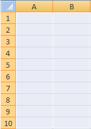

# 指標およびディメンションのセルへのマッピング

{{legacy-arb}}

アイテムをスプレッドシートにマッピングする前に、スプレッドシートが保護されていないことを確認してください。 ワークシートの保護スキームによってユーザーのアクションが防止されている場合、スプレッドシートでセルを選択することはできません。 まず、シートの保護を解除してから、セルマッピングを追加します。

マップする領域とセルの数は、選択した指標、粒度、日付範囲、設定したフィルターによって異なります。 例えば、[!UICONTROL &#x200B; サイト指標] > [!UICONTROL &#x200B; トラフィックレポート &#x200B;]を選択し、[!UICONTROL 週]の精度を設定し、[!UICONTROL 過去2週間]の日付範囲を設定すると、[!UICONTROL &#x200B; リクエストウィザードで3つのセル（[!UICONTROL &#x200B; カスタムレイアウト &#x200B;]を使用する場合）をマッピングするよう求められます。手順2]。 リクエストは、週1のデータと週2のデータを取得します。各データポイントの値はページビューの値に等しくなります。 3番目のセルは行見出しとして機能し、[!UICONTROL 書式オプション &#x200B;]を使用して設定できます。

スプレッドシート上の互換性のない場所を誤ってマッピングすると、Report Builderでエラーが発生します。

詳しくは、次の節を参照してください。

* [セルの範囲の選択 &#x200B;](/help/analyze/legacy-report-builder/layout/map-metrics-and-dimensions-to-cells.md#section_1E37FB46DA194FB7A1050B8833A48AC6)
* [セル選択のテクニック &#x200B;](/help/analyze/legacy-report-builder/layout/map-metrics-and-dimensions-to-cells.md#section_760421C3D7F84D67A639174710C93B22)
* [マッピング時の問題](/help/analyze/legacy-report-builder/layout/map-metrics-and-dimensions-to-cells.md#section_CC1BCF841291447EB3A994EB08F3A099)

## セルの範囲を選択 {#section_1E37FB46DA194FB7A1050B8833A48AC6}

[!UICONTROL リクエストウィザード：ステップ 2] で、トレンドリクエストに対して「[!UICONTROL カスタムレイアウト]」を有効にすると、セルの一定の範囲にリクエストをマッピングすることができます。

マップするアイテムの横にある&#x200B;**[!UICONTROL 範囲セレクター]** をクリックします。

* **範囲内のすべてのセル：**&#x200B;[!UICONTROL カスタムレイアウト]スタイルのリクエストに対して、セルの範囲を選択する必要があります。
* **範囲の最初のセル：**&#x200B;範囲の左上にあたるセルを選択します。その後、「[!UICONTROL 範囲の方向]」が表示されるので、そこで入力セルと出力セル（列または行）について、縦方向または横方向を指定します。 Report Builderでセルを選択するには、このオプションを使用します。
* **範囲の方向：**&#x200B;列または行としてセル範囲の方向を指定します。
* **範囲の先頭のセルを選択：**&#x200B;セル参照を表示します。

## 細胞を選択するための技術 {#section_760421C3D7F84D67A639174710C93B22}

**[!UICONTROL 範囲選択]**&#x200B;アイコン  をクリックして日付を設定できます。

をクリックし、スプレッドシートで選択したいセル範囲をマウスでクリック＆ドラッグして、データを選択します。 連続した選択範囲は、黒い境界線で囲まれます。

選択した行を分離すると、各行の周囲に薄い白い境界線が表示されます。

1つのリクエストで別々の行をマッピングするには、[!UICONTROL Control] キーを使用し、目的のセルの上にカーソルをクリックしてドラッグします。 これは、リクエストで、40個のセルを持つ1つの連続した領域ではなく、各10個のセルを持つ4つの領域を呼び出す場合に実行します。

セルを選択したら、[!UICONTROL 範囲選択] フォームの&#x200B;**[!UICONTROL 範囲セレクター]**&#x200B;をもう一度クリックして、[!UICONTROL &#x200B; リクエストウィザードに戻ります。手順2]。

## マッピングの問題のトラブルシューティング{#section_CC1BCF841291447EB3A994EB08F3A099}

既にアクティブなマッピングがあるセルに誤ってマッピングを選択した場合、セル参照は範囲選択アイコンの横にあるテキストボックスに表示されません。 [!UICONTROL OK]をクリックすると、Report Builderにエラーが表示されます。*選択した範囲は、別のリクエストの範囲と交差します。*&#x200B;選択を変更してください。

* それでもセルを使用する必要がある場合は、目的のセルを右クリックし、**[!UICONTROL リクエストの削除]**&#x200B;を選択します。

このメッセージを避けたい場合は、次の2つのアプローチを取ることができます。

* リクエストとマッピングがあるセルに書式を追加して、レポートの書式を計画します
* マッピングを含むスプレッドシートの領域をテストします

リクエストが埋め込まれた領域をテストするには、次の操作を行います。

* [!UICONTROL &#x200B; リクエストマネージャー]を起動し、テーブルに記載されている個々のリクエストをクリックします。 リクエストをクリックすると、リクエストがマッピングされているスプレッドシートのセルがハイライト表示されます。
* 新しいマッピングに使用するスプレッドシートでセルを選択し、[!UICONTROL &#x200B; シートから]をクリックします。 [!UICONTROL 要求マネージャー]は、選択したセルと交差する出力項目を持つリスト内の要求を選択します。 リクエストが選択されていない場合は、セルを使用できます。
* スプレッドシートでセルを選択し、コンテキストメニューで右クリックして、[!UICONTROL &#x200B; リクエストを編集]できるかどうかを確認します。 その場合、これらのセルに関連付けられたリクエストがあります。
