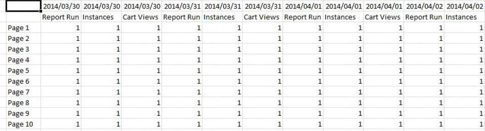

# リクエストを作成および編集するオフラインモード

{{legacy-arb}}

オフラインモードでは、プレースホルダーデータを返し、リクエストの作成および編集のプロセスにかかる時間を短縮します。

新しいリクエストを作成または編集すると、レポート API呼び出しが行われ、応答が取得されます。 このような呼び出しにより、次の手順に進む前にデータが返されるのを待つ必要があるため、リクエスト作成プロセスが遅くなることがあります。 オフラインモードでは、プレースホルダーデータのみが返され、APIは作成されません。

オフラインモードを有効にするには

1. Report Builder メニューの&#x200B;**[!UICONTROL Options]**&#x200B;をクリックします。

   オフラインコードが選択されたオプション画面の

1. 「**[!UICONTROL オフラインモードを有効にしてリクエストを作成および編集する]**」の横にあるチェックボックスをオンにします。
1. **[!UICONTROL 指標データを]**&#x200B;として表示フィールドに、リクエストで返すプレースホルダーデータを入力します。 例えば、「1」と入力します。
1. 「**[!UICONTROL OK]**」をクリックします。
1. リクエストウィザードを使用して、オフラインモードでリクエストを作成して実行します。 次のスクリーンショットは、「1」をプレースホルダーデータとするリクエストの例を示しています。

   

   >[!IMPORTANT]
   >
   >実際のデータでリクエストを実行する前に、オフラインモードを無効にしていることを確認してください。
