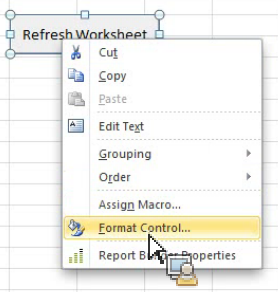

# Microsoft Excel でのReport Builder関数の使用

{{legacy-arb}}

Report Builder関数を使用すると、Report Builder ユーザーインターフェイスにアクセスせずに機能にアクセスできます。

例えば、他のソースから Excel に取り込まれたデータに基づく入力フィルターでReport Builder リクエストを自動的に更新するには、文字列 RefreshRequestsInCellsRange （..）関数を使用します。 すべての呼び出しは非同期で、すぐに戻り、完全に実行されるのを待つことはありません。

**要件**

* Report Builder 5.0 （以降）が必要です。

次の表に、公開された関数を示します。

| 関数名 | タイプ | 説明 |
|:---| --- | ---|
| AsyncRefreshAll （） | string | ワークブックに存在するすべての Report Builder リクエストを更新します。 |
| AsyncRefreshRange(string rangeAddressInA1Format) | string | 指定したセル範囲アドレス （A1 フォーマットのセル範囲を表す文字列式。例：&quot;Sheet1!A2:A10&quot;）に存在するすべてのReport Builder リクエストを更新します。 |
| AsyncRefreshRangeAltTextParam （） | string | MS フォームコントロールの代替テキストから渡される、指定されたセル範囲にあるすべての Report Builder リクエストを更新します。 |
| AsyncRefreshActiveWorksheet （） | string | アクティブなワークシートにあるすべての Report Builder リクエストを更新します。 |
| AsyncRefreshWorksheet(string worksheetName) | string | 指定したワークシート（タブに表示されるワークシート名）にあるすべての Report Builder リクエストを更新します。 |
| AsyncRefreshWorksheetAltTextParam （）; | string | MS フォームコントロールの代替テキストから渡される、特定のワークシート名にあるすべての Report Builder リクエストを更新します。 |
| トリガー GetLastRunStatus （） | string | 最後に実行した関数のステータスを示す文字列を返します。 |

Report Builder関数にアクセスするには、**[!UICONTROL 数式]**/**[!UICONTROL 関数の挿入]** に移動します。 検索フィールドを使用して関数を検索するか、カテゴリを選択してそのカテゴリ内の関数を一覧表示します。


## 例 {#section_034311081C8D4D7AA9275C1435A087CD}

次の使用例は *セル P5 の値が文字列または空白の場合、セル P9 の範囲を更新する* を示しています。

```
=IF(OR(ISTEXT(P5),ISBLANK(P5)),AsyncRefreshRange("P9"),"")
```

## 書式設定コントロールでのReport Builder関数の使用 {#section_26123090B5BD49748C8D8ED7A1C5ED84}

作成したコントロールにマクロを割り当てることができ、そのコントロールはブックの要求を更新する関数にすることができます。 例えば、関数 AsyncRefreshActiveWorksheet は、ワークシートのすべてのリクエストを更新します。ただし、特定のリクエストのみを更新したい場合もあります。

1. コントロールを配置します。
1. コントロールを右クリックして、**[!UICONTROL マクロの割り当て]**&#x200B;を選択します。
1. Report Builder関数の名前を入力します（パラメーターやかっこは使用しません）。


## フォーマットコントロールを使用したReport Builder関数へのパラメーターの受け渡し {#section_ECCA1F4990D244619DFD79138064CEF0}

パラメーターを取る 2 つの関数を、形式コントロールで使用できます。 **代替テキスト：** フィールドを使用する必要があります。

* AsyncRefreshRange(string rangeAddressInA1Format)
* AsyncRefreshWorksheet(string worksheetName)

フォーマットコントロールを使用してReport Builder関数にパラメーターを渡すには、次の手順を実行します

1. コントロールを右クリックして、**[!UICONTROL コントロールの書式設定]**&#x200B;を選択します。

   

1. 「**[!UICONTROL 代替テキスト]**」タブをクリックします。

   

1. 「**[!UICONTROL 代替テキスト]**」に、更新するセルの範囲を入力します。
1. **[!UICONTROL 数式]**/**[!UICONTROL 関数を挿入]**/**[!UICONTROL Report Builder.ReportBuilder.Bridge]** の下のAdobe パラメーターのリストを開きます。

1. AltTextParam で終わる上記 2 つの関数のいずれかの関数名を入力して、「**[!UICONTROL OK]**」をクリックします。
