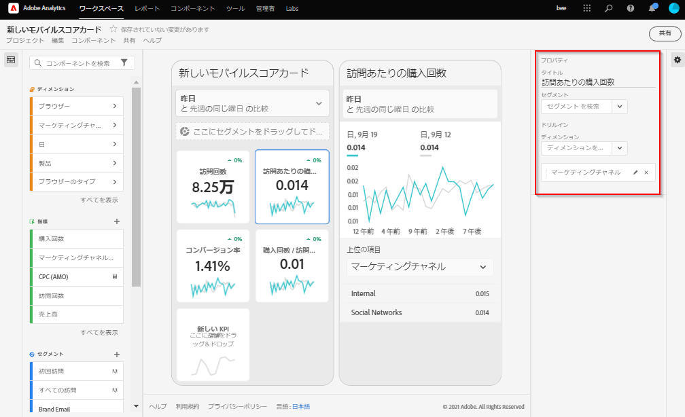

# スコアカードの作成

Adobe Analyticsのスコアカードには、次に示すように、エグゼクティブユーザーの主要データのビジュアライゼーションがレイアウトで並べて表示されます。

このスコアカードのキュレーターは、スコアカードビルダーを使用して、エグゼクティブコンシューマーのスコアカードに表示するタイルを設定できます。 また、タイルをタップした後に詳細ビューや分類を調整する方法も設定できます。 スコアカードビルダーインターフェイスを次に示します。

スコアカードを作成するには、次の手順を実行する必要があります。

1. 「[!UICONTROL 空のモバイルスコアカード]」テンプレートにアクセスします。
2. スコアカードにデータを構成し、保存します。

## 「[!UICONTROL 空のモバイルスコアカード]」テンプレートへのアクセス

「[!UICONTROL 空のモバイルスコアカード]」テンプレートにアクセスするには以下の方法があります。

**新規プロジェクトを作成**

1. Adobe Analytics を開いて「**[!UICONTROL Workspace]**」タブをクリックします。
1. 「**[!UICONTROL プロジェクトを作成]**」をクリックし、「**[!UICONTROL 空のモバイルスコアカード]**」プロジェクトテンプレートを選択します。
1. 「**[!UICONTROL 作成]**」をクリックします。

または

1. 「**[!UICONTROL ツール]**」メニューから、**[!UICONTROL Analytics ダッシュボード（モバイルアプリ）]**」を選択します。 
1. 次の画面で、「**[!UICONTROL スコアカードを新規作成]**」ボタンをクリックします。

## スコアカードでのデータの構成と保存

スコアカードテンプレートを実装する手順は、次のとおりです。

1. 右側のハンドレイルの「**[!UICONTROL プロパティ]**」で、データを使用する&#x200B;**[!UICONTROL プロジェクトレポートスイート]**&#x200B;を指定します。

   

1. スコアカードに新しいタイルを追加するには、左のパネルから指標をドラッグし、「**[!UICONTROL ここに指標をドラッグ＆ドロップ]**」ゾーンにドロップします。同様のワークフローを使用して、2 つのタイル間に指標を挿入することもできます。

   

   *各タイルから、関連ディメンションのリストの上位アイテムなど、指数に関する追加情報を表示する詳細ビューにアクセスできます。*

1. 指標に関連ディメンションを追加するには、左のパネルからディメンションをドラッグし、タイルにドロップします。例えば、適切なディメンション（この例では **[!DNL DMA Region]**）をタイルにドラッグ＆ドロップして、**[!UICONTROL ユニーク訪問者]**&#x200B;指標に追加できます。追加したディメンションは、タイル固有の&#x200B;**[!UICONTROL プロパティ]**&#x200B;の分類セクションに表示されます。タイルごとに複数のディメンションを追加できます。

   

   スコアカードビルダーでタイルをクリックすると、右側のレールにそのタイルに関連付けられているプロパティと特性が表示されます。このレールでは、タイルに新しい&#x200B;**[!UICONTROL タイトル]**&#x200B;を指定したり、左側のレールからコンポーネントをドラッグ＆ドロップするのではなく、コンポーネントを指定してタイルを構成したりできます。

   

   また、タイルをクリックすると、動的なポップアップに、アプリケーション内のエグゼクティブユーザーに分類ビューがどのように表示されるかが表示されます。ディメンションがタイルに適用されていない場合、分類ディメンションは、デフォルトの日付範囲に応じて、**時間**&#x200B;または&#x200B;**日**&#x200B;になります。

   

   タイルに追加された各ディメンションは、アプリケーションの詳細ビューのドロップダウンリストに表示されます。エグゼクティブユーザーは、ドロップダウンリストにリストされたオプションから選択できるようになります。

1. 個々のタイルにセグメントを適用するには、左パネルからセグメントをドラッグし、タイルの上に直接ドロップします。スコアカード内のすべてのタイルにセグメントを適用する場合は、スコアカードの上にタイルをドロップします。または、日付範囲の下にあるフィルターメニューでセグメントを選択して、セグメントを適用することもできます。[スコアカードに対するフィルターの構成と適用](https://experienceleague.adobe.com/docs/analytics-learn/tutorials/analysis-workspace/using-panels/using-drop-down-filters.html?lang=ja)は、Adobe Analytics Workspace と同じ方法でおこないます。

   

1. 同様に、スコアカード全体に適用されるコンポーネントを削除するには、タイルの外側のスコアカード上の任意の場所をクリックし、コンポーネントにカーソルを合わせたときに表示される「**x**」をクリックして削除します。例えば「**初回訪問**」セグメントの場合は次のようになります。

   

1. 日付範囲のドロップダウンを選択して、スコアカードで選択できる日付範囲の組み合わせを追加および削除します。

   

   新しいスコアカードはそれぞれ、今日と昨日のデータにフォーカスした 6 つの日付範囲の組み合わせで始まります。 x をクリックして不要な日付範囲を削除したり、鉛筆をクリックして各日付範囲の組み合わせを編集したりできます。

   

   プライマリ日付を作成または変更するには、ドロップダウンを使用して使用可能な日付範囲から選択するか、日付コンポーネントを右側のレールからドロップゾーンにドラッグ＆ドロップします。

   

   比較日を作成するには、ドロップダウンメニューで、一般的な時間比較の便利な事前設定から選択します。 また、日付コンポーネントを右側のレールからドラッグ＆ドロップすることもできます。

   

   必要な日付範囲がまだ作成されていない場合は、カレンダーアイコンをクリックして新しい日付範囲を作成できます。

   

1. これにより、新しい日付範囲コンポーネントを作成して保存できる日付範囲ビルダーに移動します。 スコアカードに名前を付けるには、画面の左上にある名前空間をクリックして、新しい名前を入力します。

   

## スコアカードの共有

エグゼクティブユーザーとスコアカードを共有する手順は、次のとおりです。

1. **[!UICONTROL 共有]**&#x200B;メニューをクリックし、「**[!UICONTROL スコアカードの共有]**」を選択します。

1. **[!UICONTROL モバイルスコアカードの共有]**&#x200B;フォームで、次の方法でフィールドに入力します。

   * スコアカードの名前を指定します。
   * スコアカードの説明を指定します。
   * 関連するタグを追加します。
   * スコアカード受信者を指定します。

1. 「**[!UICONTROL 共有]**」をクリックします。

受信者は、共有したスコアカードに Analytics ダッシュボードでアクセスできます。 その後、スコアカードビルダーでスコアカードに変更を加えると、共有スコアカードで自動的に更新されます。 エグゼクティブユーザーがアプリケーションのスコアカードを更新すると、変更が表示されます。

新しいコンポーネントを追加してスコアカードを更新する場合、エグゼクティブユーザーがこれらの変更にアクセスできることを確認するために、スコアカードを再度共有する（および「**[!UICONTROL 埋め込みコンポーネントを共有]**」オプションをオンにする）ことができます。