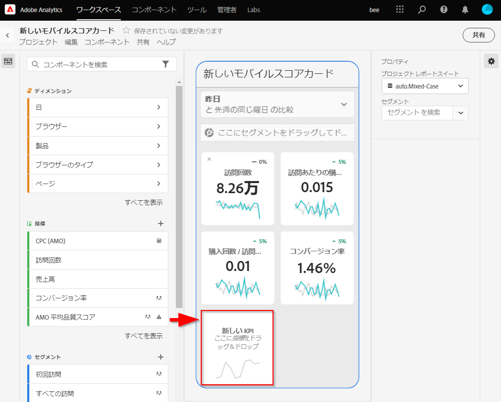

# スコアカードの作成

次の情報は、Adobe Analytics データのキュレーターに、エグゼクティブユーザー向けのダッシュボードの設定方法と表示方法を示しています。まず、Adobe Analyticsダッシュボードのスコアカードビルダーのビデオを確認できます。

>[!VIDEO](https://video.tv.adobe.com/v/34544)

Adobe Analyticsのスコアカードには、次に示すように、エグゼクティブユーザーの主要データのビジュアライゼーションがレイアウトで並べて表示されます。

このスコアカードのキュレーターは、スコアカードビルダーを使用して、エグゼクティブコンシューマーのスコアカードに表示するタイルを設定できます。 また、タイルをタップした後に詳細ビューや分類を調整する方法も設定できます。 スコアカードビルダーインターフェイスを次に示します。

スコアカードを作成するには、次の手順を実行する必要があります。

1. 「[!UICONTROL 空のモバイルスコアカード]」テンプレートにアクセスします。
2. スコアカードにデータを構成し、保存します。

## 「[!UICONTROL 空のモバイルスコアカード]」テンプレートへのアクセス

[!UICONTROL  空のモバイルスコアカード ] テンプレートにアクセスするには、新しいプロジェクトを作成するか、ツールメニューを使用します。

### 新規プロジェクトを作成

1. Adobe Analytics を開いて「**[!UICONTROL Workspace]**」タブをクリックします。
1. 「**[!UICONTROL プロジェクトを作成]**」をクリックし、「**[!UICONTROL 空のモバイルスコアカード]**」プロジェクトテンプレートを選択します。
1. 「**[!UICONTROL 作成]**」をクリックします。

### ツールメニュー

1. **[!UICONTROL ツール]** メニューから、**[!UICONTROL Analytics ダッシュボード（モバイルアプリ）]** を選択します。
1. 次の画面で、「**[!UICONTROL 新しいスコアカードを作成]**」をクリックします。

## スコアカードでのデータの構成と保存

スコアカードテンプレートを実装する手順は、次のとおりです。

1. 右側のハンドレイルの「**[!UICONTROL プロパティ]**」で、データを使用する&#x200B;**[!UICONTROL プロジェクトレポートスイート]**&#x200B;を指定します。

   

1. スコアカードに新しいタイルを追加するには、左のパネルから指標をドラッグし、「**[!UICONTROL ここに指標をドラッグ＆ドロップ]**」ゾーンにドロップします。同様のワークフローを使用して、2 つのタイル間に指標を挿入することもできます。

   

1. 各タイルから、関連ディメンションのリストの上位アイテムなど、指数に関する追加情報を表示する詳細ビューにアクセスできます。

### ディメンションまたは指標の追加

指標に関連ディメンションを追加するには、左のパネルからディメンションをドラッグし、タイルにドロップします。

例えば、適切なディメンション（この例では **[!DNL Marketing Channel]**）をタイルにドラッグ&amp;ドロップして、**[!UICONTROL 個別訪問者数]** 指標に追加できます。 Dimension分類は、タイル固有の **[!UICONTROL プロパティ]** の [!UICONTROL  ドリルイン ]（分類）セクションの下に表示されます。 タイルごとに複数のディメンションを追加できます。

### セグメントの適用

個々のタイルにセグメントを適用するには、左パネルからセグメントをドラッグし、タイルの上に直接ドロップします。

スコアカード内のすべてのタイルにセグメントを適用する場合は、スコアカードの上にタイルをドロップします。または、日付範囲の下にあるフィルターメニューでセグメントを選択して、セグメントを適用することもできます。[スコアカードに対するフィルターの構成と適用](https://experienceleague.adobe.com/docs/analytics-learn/tutorials/analysis-workspace/using-panels/using-drop-down-filters.html?lang=ja)は、Adobe Analytics Workspace と同じ方法でおこないます。

### 日付範囲の追加

日付範囲のドロップダウンを選択して、スコアカードで選択できる日付範囲の組み合わせを追加および削除します。

新しいスコアカードはそれぞれ、今日と昨日のデータにフォーカスした 6 つの日付範囲の組み合わせで始まります。 x をクリックして不要な日付範囲を削除したり、鉛筆をクリックして各日付範囲の組み合わせを編集したりできます。

プライマリ日付を作成または変更するには、ドロップダウンを使用して使用可能な日付範囲から選択するか、日付コンポーネントを右側のレールからドロップゾーンにドラッグ＆ドロップします。

比較日を作成するには、ドロップダウンメニューで、一般的な時間比較の便利な事前設定から選択します。 また、日付コンポーネントを右側のレールからドラッグ＆ドロップすることもできます。

必要な日付範囲がまだ作成されていない場合は、カレンダーアイコンをクリックして新しい日付範囲を作成できます。

これにより、新しい日付範囲コンポーネントを作成して保存できる日付範囲ビルダーに移動します。 

### ビジュアライゼーションの適用

Analytics ダッシュボードには、4 つのビジュアライゼーションが用意され、ディメンション項目に関する優れたインサイトが得られるようになりました。 タイルのプロパティの [!UICONTROL  グラフのタイプ ] を変更して、別のビジュアライゼーションを適用します。

** Donutvisualization**

このビジュアライゼーションは、円グラフと同様に、データを全体の一部または断片として表示します。合計の割合を比較する際にドーナツグラフを使用します。 例えば、個別訪問者の合計数に貢献した広告プラットフォームを確認するとします。

**行のビジュアライゼーション**

行のビジュアライゼーションでは、時間の経過に伴う値の変化を確認できるように、折れ線で指標が表されます。折れ線グラフ は、時間がディメンションとして使用される場合にのみ使用できます。

**[!UICONTROL 横棒グラ] フ**

このビジュアライゼーションでは、1 つ以上の指標の様々な値を表す横棒グラフが表示されます。

### タイルのプロパティの表示と設定

スコアカードビルダーでタイルをクリックすると、右側のパネルにそのタイルに関連付けられているプロパティと特性が表示されます。 このレールでは、タイルに新しい&#x200B;**[!UICONTROL タイトル]**&#x200B;を指定したり、左側のレールからコンポーネントをドラッグ＆ドロップするのではなく、コンポーネントを指定してタイルを構成したりできます。

タイルをクリックすると、動的なポップアップに、アプリ内のエグゼクティブユーザーにドリルイン（分類）ビューがどのように表示されるかが表示されます。 ディメンションがタイルに適用されていない場合、分類ディメンションは、デフォルトの日付範囲に応じて、**時間**&#x200B;または&#x200B;**日**&#x200B;になります。

分類を使用すると、次の小売の例のように、指標とディメンションを他の指標とディメンションで逐語的に分類して、分析を絞り込むことができます。

* 個別訪問者数指標を広告プラットフォーム (AMO ID) 別に分類
* 製品カテゴリ別に分類された訪問（小売）
* 製品名別に分類された合計売上高

タイルに追加された各ディメンションは、アプリケーションの詳細ビューのドロップダウンリストに表示されます。エグゼクティブユーザーは、ドロップダウンリストにリストされたオプションから選択できるようになります。

### コンポーネントの削除

同様に、スコアカード全体に適用されるコンポーネントを削除するには、タイルの外側のスコアカード上の任意の場所をクリックし、コンポーネントにカーソルを合わせたときに表示される「**x**」をクリックして削除します。例えば「**初回訪問**」セグメントの場合は次のようになります。

## スコアカードの名前の設定

スコアカードに名前を付けるには、画面の左上にある名前空間をクリックして、新しい名前を入力します。

## スコアカードの共有

エグゼクティブユーザーとスコアカードを共有する手順は、次のとおりです。

1. **[!UICONTROL 共有]**&#x200B;メニューをクリックし、「**[!UICONTROL スコアカードの共有]**」を選択します。

1. **[!UICONTROL モバイルスコアカードの共有]**&#x200B;フォームで、次の方法でフィールドに入力します。

   * スコアカードの名前の指定
   * スコアカードの説明の入力
   * 関連するタグを追加します。
   * スコアカードの受信者の指定

1. 「**[!UICONTROL 共有]**」をクリックします。

受信者は、共有したスコアカードに Analytics ダッシュボードでアクセスできます。 その後、スコアカードビルダーでスコアカードに変更を加えると、共有スコアカードで自動的に更新されます。 エグゼクティブユーザーがアプリケーションのスコアカードを更新すると、変更が表示されます。

新しいコンポーネントを追加してスコアカードを更新する場合、エグゼクティブユーザーがこれらの変更にアクセスできるように、スコアカードを再び共有する（および「**[!UICONTROL 埋め込みコンポーネントを共有]**」オプションを選択する）ことができます。