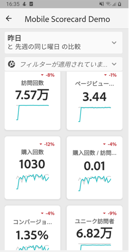

# ベータ版：Analytics モバイルアプリキュレーターガイド

## はじめに

The Adobe Analytics モバイルアプリは、Adobe Analytics からの洞察をいつでもどこでも提供します。このアプリを使用すると、Adobe Analytics のデスクトップ UI から作成して共有できる直感的なスコアカードにモバイルからアクセスできます。スコアカードは、主要指標とその他のコンポーネントを並べて表示したレイアウトで構成され、タップすると、より詳細な分類やトレンドレポートを表示できます。スコアカードは最も重要なデータに応じて調整できます。モバイルアプリは iOS と Android の両方のオペレーティングシステムでサポートされています。

## このガイドについて

このガイドは、Adobe Analytics データのキュレーターが Analytics モバイルアプリでエグゼクティブユーザーのスコアカードを設定するのに役立つように作成されています。キュレーターは、組織の管理者、またはアプリのスコアカードの設定を担当する他の役割を持つ人です。スコアカードを設定すると、重要な概要データの広範なレンダリングを、各自のモバイルデバイス上ですばやく簡単に表示できるようになります。エグゼクティブユーザーは Analytics モバイルアプリのエンドユーザーですが、このガイドは、データキュレーターがアプリを効果的に設定するのに役立ちます。

## 用語集

次の表に、Analytics モバイルアプリのオーディエンス、機能および操作について理解するための用語を示します。

| 用語 | 定義 |
|--- |--- |
| 消費者 | モバイルデバイス上で Analytics の主要指標と洞察を表示するエグゼクティブユーザー |
| キュレーター | Analytics から洞察を検索して配信し、消費者が表示するスコアカードを構成する、データ専門家 |
| キュレーション | 消費者に関連する指標、ディメンション、その他のコンポーネントを含むモバイルスコアカードを作成または編集する行為 |
| スコアカード | 1 つ以上のタイルを含むモバイルアプリビュー |
| タイル | スコアカードビュー内の指標のレンダリング |
| 分類 | スコアカードでタイルをタップしてアクセスできるセカンダリビュー。このビューは、タイルに表示されている指標に対して展開され、オプションで追加の分類ディメンションに関するレポートを表示します。 |
| 日付範囲 | モバイルアプリレポートの主な日付範囲 |
| 比較日付範囲 | プライマリ日付範囲と比較される日付範囲 |

 
## エグゼクティブユーザー用のスコアカードの作成

モバイルスコアカードでは、次のように、エグゼクティブユーザーの主要データのビジュアライゼーションがレイアウトで並べて表示されます。

このスコアカードのキュレーターは、スコアカードビルダーを使用して、消費者のスコアカードに表示するタイルを構成できます。また、タイルをタップした後に詳細ビューや分類を調整する方法も設定できます。スコアカードビルダーインターフェイスを次に示します。

スコアカードを作成するには、次の手順を実行する必要があります。

1. 「空のモバイルスコアカード」テンプレートにアクセスします。
2. スコアカードにデータを構成し、保存します。

### 「空のモバイルスコアカード」テンプレートへのアクセス

「空のモバイルスコアカード」テンプレートにアクセスするには以下の方法があります。

**新規プロジェクトを作成**

1. Adobe Analytics を開いて「**ワークスペース**」タブをクリックします。
2. 「**新規プロジェクトを作成**」ボタンをクリックして、「**空のモバイルスコアカード**」プロジェクトテンプレートを選択します。
3. 「**作成**」ボタンをクリックします。

*注意：以下に示すように、「空のモバイルスコアカード」テンプレートが表示されない場合、会社はまだベータ版に対して有効化されていません。カスタマーサービスマネージャーにお問い合わせください。*

**プロジェクトを追加**

**プロジェクト**&#x200B;画面の「**コンポーネント**」タブで、「**追加**」ボタンをクリックし、「**モバイルスコアカード**」を選択します。

**Analytics ツールの使用**

Analytics で、**ツール**&#x200B;メニューをクリックして「**モバイルアプリ**」を選択します。次の画面で、「**スコアカードの作**&#x200B;成」ボタンをクリックします。

### スコアカードでのデータの構成と保存

スコアカードテンプレートを実装する手順は、次のとおりです。

1. 右側のハンドレイルの「**プロパティ**」で、データを使用する&#x200B;**プロジェクトレポートスイート**&#x200B;を指定します。

   

2. スコアカードに新しいタイルを追加するには、左のパネルから指標をドラッグし、「**ここに指標をドラッグ＆ドロップ**」にドロップします。同様のワークフローを使用して、2 つのタイル間に指標を挿入することもできます。

   

   *各タイルから、関連ディメンションのリストの上位アイテムなど、指数に関する追加情報を表示する詳細ビューにアクセスできます。*

3. 指標に関連ディメンションを追加するには、左のパネルからディメンションをドラッグし、タイルにドロップします。例えば、適切なディメンション（この例では **DMA 地域**）をタイルにドラッグ＆ドロップして、**個別訪問者数**&#x200B;指標に追加できます。追加したディメンションは、タイル固有の&#x200B;**プロパティ**&#x200B;の分類セクションに表示されます。タイルごとに複数のディメンションを追加できます。

   

   *注意：スコアカードキャンバスにディメンションをドロップして、すべてのタイルにディメンションを追加することもできます。*

   スコアカードビルダーでタイルをクリックすると、右側のレールにそのタイルに関連付けられているプロパティと特性が表示されます。このレールでは、タイルに新しい&#x200B;**タイトル**&#x200B;を指定したり、左側のレールからコンポーネントをドラッグ＆ドロップするのではなく、コンポーネントを指定してタイルを構成したりできます。

   また、タイルをクリックすると、動的なポップアップに、アプリ内のエグゼクティブユーザーに内訳ビューがどのように表示されるかが表示されます。ディメンションがタイルに適用されていない場合、内訳ディメンションは、デフォルトの日付範囲に応じて、**時間**&#x200B;または&#x200B;**日**&#x200B;になります。

   

   *タイルに追加された各ディメンションが、アプリの詳細ビューのドロップダウンリストにどのように表示されるかに注意してください。エグゼクティブユーザーは、ドロップダウンリストにリストされたオプションから選択できるようになります。*

4. 個々のタイルにセグメントを適用するには、左パネルからセグメントをドラッグし、タイルの上に直接ドロップします。スコアカード内のすべてのタイルにセグメントを適用する場合は、スコアカードの上にタイルをドロップします。

5. 同様に、スコアカード全体に適用されるコンポーネントを削除するには、タイルの外側のスコアカード上の任意の場所をクリックし、コンポーネントにカーソルを合わせたときに表示される「**x**」をクリックして削除します。**モバイル顧客**&#x200B;セグメントについては以下に示します。

   

6. スコアカードの&#x200B;**プロパティ**&#x200B;では、オプションで次も指定できます。

   * デフォルト日付範囲：****&#x200B;ここで指定する範囲は、エグゼクティブユーザーがアプリのスコアカードに最初にアクセスしたときに適用される範囲と同じです。

   * **比較日付範囲**

   * スコアカード全体に適用する&#x200B;**セグメント**

7. スコアカードに名前を付けるには、画面の左上にある名前空間をクリックして、新しい名前を入力します。

   

## スコアカードの共有

エグゼクティブユーザーとスコアカードを共有する手順は、次のとおりです。

1. **共有**&#x200B;メニューをクリックし、「**スコアカードの共有**」を選択します。

2. 共有フォームに入力します。****

   * スコアカードの名前を指定します。
   * スコアカードの説明を指定します。
   * 関連するタグを追加します。
   * スコアカード受信者を指定します。
   * 「**埋め込みコンポーネントを受信者と共有**」オプションを選択して、エグゼクティブユーザーがスコアカード内のすべてのコンポーネントにアクセスできるようにします。

3. 「**共有**」をクリックします。

受信者は、共有したスコアカードに Analytics モバイルアプリでアクセスできます。その後、スコアカードビルダーでスコアカードに変更を加えると、共有されたスコアカードが自動的に更新されます。エグゼクティブユーザーがアプリのスコアカードを更新すると、変更が表示されます。

*注意：新しいコンポーネントを追加してスコアカードを更新する場合、エグゼクティブユーザーがこれらの変更にアクセスできることを確認するために、スコアカードを再度共有する（および「**埋め込みコンポーネントを受信者と自動的に共有**」オプションをオンにする）ことができます。*

## アプリでのエグゼクティブユーザーの設定

場合によっては、エグゼクティブユーザーがアプリにアクセスして使用するために追加の支援が必要になることがあります。この節では、その支援を提供するのに役立つ情報を提供します。

### エグゼクティブユーザーのアクセス

エグゼクティブユーザーがアプリケーション上のスコアカードにアクセスするのを支援するには、次の点を確認します。

* ユーザーのモバイル OS が、iOS バージョン 10 以上、または Android バージョン 4.4（KitKat）以上である
* ユーザーに Adobe Analytics への有効なログインがある
* モバイルスコアカードを正しく作成し、共有している
* ユーザーが Analysis Workspace およびスコアカードが基づくレポートスイートにアクセスできる
* ユーザーがスコアカードに含まれるコンポーネントにアクセスできる注意：スコアカードを共有する際に、「**埋め込みコンポーネントを受信者と自動的に共有**」オプションを選択できます。

### エグゼクティブユーザーのアプリ使用

ベータフェーズの間、アプリが公開される前は、アプリにアクセスできるユーザーを制御できます。

1. エグゼクティブユーザーがアプリをダウンロードしてインストールできるようにします。これを行うには、エグゼクティブユーザーが iOS と Android のどちらのデバイスを使用しているかに応じて以下の手順を実行して、アクセスを授与します。

   **iOS**：

   1. 次のパブリックリンクをクリックします（Analytics の&#x200B;**ツール**／**モバイルアプリ**&#x200B;でも利用できます）。

      [iOS リンク](https://testflight.apple.com/join/WtXMQxlI)：`https://testflight.apple.com/join/WtXMQxlI`

      リンクをクリックすると、次の Testflight 画面が表示されます。

      

   2. 画面の「**App Store で表示**」リンクをタップして、Testflight アプリをダウンロードします。

   3. Testflight アプリをインストールしたら、以下に示すように、Testflight 内から Adobe Analytics モバイルアプリを探してインストールします。

      
   **Android**：

   1. デバイスで次の Play ストアリンクをタップします（Analytics の「**ツール**／**モバイルアプリ**」でも利用できます）。
      [Android](https://play.google.com/apps/testing/com.adobe.analyticsmobileapp)：`https://play.google.com/apps/testing/com.adobe.analyticsmobileapp`

      リンクをタップしたら、次の画面で「テスターになる」リンクをタップします。

      

   2. 次の画面の「Google Play リンクでダウンロードする」をタップします。****

      

   3. アプリをダウンロードしてインストールします。
ダウンロードしてインストールすると、エグゼクティブユーザーは既存の Adobe Analytics 資格情報を使用してアプリにサインインできます。Adobe ID または Enterprise／Federated ID を使用できます。
   

2. スコアカードへのアクセスを支援します。エグゼクティブユーザーがアプリにサインインすると、**会社を選択**&#x200B;画面が表示されます。この画面には、エグゼクティブユーザーが所属するログイン会社が表示されます。スコアカードにアクセスする手順は、次のとおりです。

   * 共有したスコアカードに適用されるログイン会社または Experience Cloud 組織の名前をタップします。次に、スコアカードリストに、そのログイン会社のエグゼクティブと共有されているすべてのスコアカードが表示されます。
   * 該当する場合は、**最近変更された項目**&#x200B;で、このリストを並べ替えます。
   * スコアカードの名前をタップして表示します。
   

   注意：エグゼクティブユーザーがログインし、何も共有されていないというメッセージが表示された場合、以下の可能性があります。

   * エグゼクティブユーザーが間違った Analytics インスタンスを選択した
   * スコアカードがエグゼクティブユーザーと共有されていない

      
   エグゼクティブユーザーが適切な Analytics インスタンスにログインでき、スコアカードが共有されていることを確認します。

3. 共有するスコアカードにタイルが表示される方法をエグゼクティブユーザーに説明します。

   

   タイルに関する追加情報：

   * スパークラインの精度は、日付範囲の長さに依存します。
      * 1 日 - 時間ごとの傾向を表示
      * 2 日以上 1 年未満 - 毎日の傾向を表示
      * 1 年以上 - 毎週の傾向を表示
   * 値の変化パーセントの式は、（指標合計（現在の日付範囲） - 指標合計（比較日付範囲））÷指標合計（比較日付範囲）です。
   * 画面をプルダウンして、スコアカードを更新できます。

4. タイルをタップすると、そのタイルの詳細な内訳の仕組みを表示できます。

   

5. スコアカードの日付範囲を変更する手順は、次のとおりです。

   

   *注意：同様に、上記の内訳ビュー内で日付範囲を変更することもできます。*

   タップした間隔（**日**、**週**、**月**、**年**）に応じて、現在の期間またはその直前の日付範囲の 2 つのオプションが表示されます。次の 2 つのオプションのいずれかをタップして、最初の範囲を選択します。「**比較**」リストで、表示されたオプションのいずれかをタップして、この期間のデータを選択した最初の日付範囲と比較します。画面右上の「**完了**」をタップします。「**日付範囲**」フィールドとスコアカードタイルは、選択した新しい範囲の新しい比較データで更新されます。

6. アプリでフィードバックを残す手順は、次のとおりです。

   1. アプリ画面の右上にあるユーザーアイコンをタップします。
   2. **アカウント**&#x200B;画面で、「**フィードバック**」オプションをタップします。
   3. タップして、フィードバックを残すためのオプションを表示します。
   
   

**バグを報告する手順は、次のとおりです。**

オプションをタップして、バグのサブカテゴリを選択します。バグを報告するためのフォームで、一番上のフィールドに電子メールアドレスを入力し、その下のフィールドにバグの説明を入力します。アカウント情報のスクリーンショットがメッセージに自動的に添付されますが、必要に応じて、添付画像の「**X**」をタップして削除できます。また、画面録画の取得、スクリーンショットの追加、ファイルの添付のオプションもあります。レポートを送信するには、フォームの右上にある紙飛行機のアイコンをタップします。

**改善を提案する手順は、次のとおりです。**

オプションをタップして、提案のサブカテゴリを選択します。提案フォームの一番上のフィールドに電子メールアドレスを入力し、その下のフィールドに提案を入力します。アカウント情報のスクリーンショットがメッセージに自動的に添付されますが、必要に応じて、添付画像の「**X**」をタップして削除できます。また、画面録画の取得、スクリーンショットの追加、ファイルの添付のオプションもあります。提案を送信するには、フォームの右上にある紙飛行機のアイコンをタップします。

**質問する手順は、次のとおりです。**

オプションをタップします。一番上のフィールドに電子メールアドレスを入力し、その下のフィールドに質問を入力します。スクリーンショットがメッセージに自動的に添付されますが、必要に応じて、添付画像の「**X**」をタップして削除できます。また、画面録画の取得、スクリーンショットの追加、ファイルの添付のオプションもあります。質問を送信するには、フォームの右上にある紙飛行機のアイコンをタップします。
