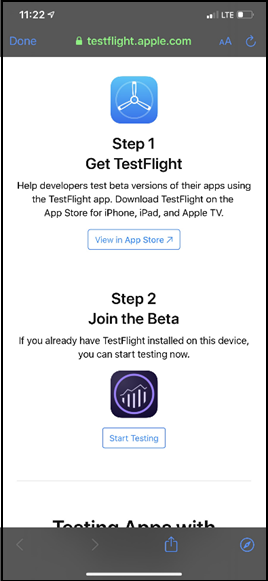
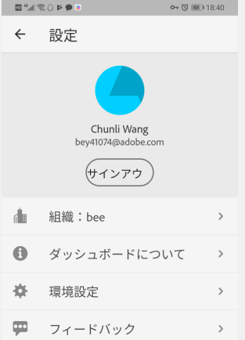
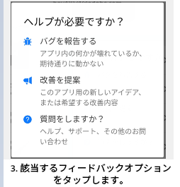

# Adobe Analyticsダッシュボード:エグゼクティブユーザークイック開始ガイド

## はじめに

Adobe Analyticsダッシュボードは、Adobe Analyticsからいつでも、どこでもインサイトを提供します。  このアプリでは、モバイルで直感的なスコアカードにアクセスできます。スコアカードは、主要指標とその他のコンポーネントを並べて表示したレイアウトで構成され、タップすると、より詳細な分類やトレンドレポートを表示できます。ダッシュボードは、iOSとAndroidの両方のオペレーティングシステムでサポートされています。

## このガイドについて

このガイドは、エグゼクティブユーザーがAnalyticsユーザーのスコアカードを読み、解釈するのに役立つことを目的としています。ダッシュボード エグゼクティブユーザーは、自分のモバイルデバイスで、重要な概要データの幅広いレンダリングをすばやく簡単に表示できます。

## 用語集

| 用語 | 定義 |
|--- |--- |
| 消費者 | モバイルデバイス上で Analytics の主要指標と洞察を表示するエグゼクティブユーザー |
| キュレーター | Analytics から洞察を検索して配信し、消費者が表示するスコアカードを構成する、データ専門家 |
| キュレーション | 消費者に関連する指標、ディメンション、その他のコンポーネントを含むモバイルスコアカードを作成または編集する行為 |
| スコアカード | 1つ以上のダッシュボードを含む表示 |
| タイル | スコアカードビュー内の指標のレンダリング |
| 分類 | スコアカードでタイルをタップしてアクセスできるセカンダリビュー。このビューは、タイルに表示されている指標に対して展開され、オプションで追加の分類ディメンションに関するレポートを表示します。 |
| 日付範囲 | ダッシュボードレポート |
| 比較日付範囲 | プライマリ日付範囲と比較される日付範囲 |

## デバイスでダッシュボードを設定する

このダッシュボードを効果的に使用するには、スコアカードキュレータに設定の支援を依頼する必要があります。 この節では、キュレーターの支援を得てセットアップを行う際に役立つ情報を提供します。

### アクセス権の取得

スコアカードにアクセスするには、ダッシュボード上の次のことを確認します。

* Adobe Analytics への有効なログインがある
* キュレーターがモバイルスコアカードを正しく作成し、共有している

### ダウンロードとインストールのダッシュボード

アプリをダウンロードしてインストールするには、デバイス上のオペレーティングシステムに従って手順に従います。

**iOS デバイスの場合：**

1. Click the following public link (It is also available in Analytics under **Tools** > **dashboards**):

   [iOS リンク](https://testflight.apple.com/join/WtXMQxlI)：`https://testflight.apple.com/join/WtXMQxlI`

   リンクをクリックすると、次の Testflight 画面が表示されます。

   

2. 画面の「**App Store で表示**」リンクをタップして、Testflight アプリをダウンロードします。

3. Testflightアプリをインストールした後、次に示すように、Testflight内からAdobe Analyticsダッシュボードを探してインストールします。

   

**Android デバイスの場合：**

1. Tap the following Play Store link on the user&#39;s device (It is also available in Analytics under **Tools** > **dashboards**):

   [Android](https://play.google.com/apps/testing/com.adobe.analyticsmobileapp)：`https://play.google.com/apps/testing/com.adobe.analyticsmobileapp`

   リンクをタップしたら、次の画面で「テスターになる」リンクをタップします。

   

2. 次の画面の「Google Play リンクでダウンロードする」をタップします。****

   

## 使用ダッシュボード

ダッシュボード:

1. アプリにサインインします。ログイン画面は、ユーザーを起動すると表示されます。ダッシュボード 既存の Adobe Analytics 資格情報を使用して、画面の指示に従います。Adobe ID または Enterprise／Federated ID を使用できます。

   

2. 会社を選択します。After you sign into dashboards, the **Choose a company** screen appears. この画面には、所属するログイン会社が一覧表示されます。自分と共有しているスコアカードに関連付けられている会社名をタップします。

3. 次に、自分と共有されているすべてのスコアカードが「スコアカード」リストに表示されます。表示するスコアカードをタップします。

   

   *注意：ログインして、何も共有されていないというメッセージが表示された場合は、キュレーターに次の点を確認してください。*

   * *適切な Analytics インスタンスにログインできる*
   * *スコアカードが共有されている*

      

4. スコアカードでのタイルの表示を確認します。

   

   タイルに関する追加情報：

   * スパークラインの精度は、日付範囲の長さに依存します。
   * 1 日 - 時間ごとの傾向を表示
   * 2 日以上 1 年未満 - 毎日の傾向を表示
   * 1 年以上 - 毎週の傾向を表示
   * 値の変化パーセントの式は、（指標合計（現在の日付範囲） - 指標合計（比較日付範囲））÷指標合計（比較日付範囲）です。
   * 画面をプルダウンして、スコアカードを更新できます。

5. タイルをタップすると、そのタイルの詳細な内訳の仕組みを表示できます。

   

6. スコアカードの日付範囲を変更する手順は、次のとおりです。

   

   *注意：同様に、上記の内訳ビュー内で日付範囲を変更することもできます。*

   タップした間隔（**日**、**週**、**月**、**年**）に応じて、現在の期間またはその直前の日付範囲の 2 つのオプションが表示されます。次の 2 つのオプションのいずれかをタップして、最初の範囲を選択します。「**比較**」リストで、表示されたオプションのいずれかをタップして、この期間のデータを選択した最初の日付範囲と比較します。画面右上の「**完了**」をタップします。「**日付範囲**」フィールドとスコアカードタイルは、選択した新しい範囲の新しい比較データで更新されます。

7. スコアカードの更新：スコアカードに興味のあるすべての指標や内訳が含まれていない場合は、Analytics チームに連絡してスコアカードの更新を依頼してください。更新されたら、画面上のカードをプルダウンすると、最近追加したデータをロードして更新を表示できます。

8. フィードバック：フィードバックを残す手順は、次のとおりです。

   1. ユーザー画面の右上にあるユーザーアイコンをダッシュボードします。
   2. **アカウント**&#x200B;画面で、「**フィードバック**」オプションをタップします。
   3. タップして、フィードバックを残すためのオプションを表示します。
   
   

**バグを報告する手順は、次のとおりです。**

オプションをタップして、バグのサブカテゴリを選択します。バグを報告するためのフォームで、一番上のフィールドに電子メールアドレスを入力し、その下のフィールドにバグの説明を入力します。アカウント情報のスクリーンショットがメッセージに自動的に添付されますが、必要に応じて、添付画像の「**X**」をタップして削除できます。また、画面録画の取得、スクリーンショットの追加、ファイルの添付のオプションもあります。レポートを送信するには、フォームの右上にある紙飛行機のアイコンをタップします。

**改善を提案する手順は、次のとおりです。**

オプションをタップして、提案のサブカテゴリを選択します。提案フォームの一番上のフィールドに電子メールアドレスを入力し、その下のフィールドに提案を入力します。アカウント情報のスクリーンショットがメッセージに自動的に添付されますが、必要に応じて、添付画像の「**X**」をタップして削除できます。また、画面録画の取得、スクリーンショットの追加、ファイルの添付のオプションもあります。提案を送信するには、フォームの右上にある紙飛行機のアイコンをタップします。

**質問する手順は、次のとおりです。**

オプションをタップします。一番上のフィールドに電子メールアドレスを入力し、その下のフィールドに質問を入力します。スクリーンショットがメッセージに自動的に添付されますが、必要に応じて、添付画像の「**X**」をタップして削除できます。また、画面録画の取得、スクリーンショットの追加、ファイルの添付のオプションもあります。質問を送信するには、フォームの右上にある紙飛行機のアイコンをタップします。
