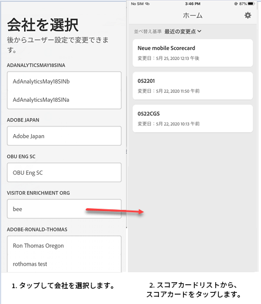

# Adobe Analytics ダッシュボード：エグゼクティブユーザークイックスタートガイド

次の情報は、Adobe Analyticsダッシュボードの使用と表示に関するベストプラクティスに関する情報をエグゼクティブユーザーに提供します。

## はじめに

Adobe Analytics ダッシュボードは、Adobe Analytics からの洞察をいつでもどこでも提供します。このアプリケーションでは、モバイルで直感的なスコアカードにアクセスできます。スコアカードは、主要指標とその他のコンポーネントを並べて表示したレイアウトで構成され、タップすると、より詳細な分類やトレンドレポートを表示できます。ダッシュボードは iOS と Android の両方のオペレーティングシステムでサポートされています。

## このガイドの詳細

このガイドは、エグゼクティブユーザーが Analytics ダッシュボードでスコアカードを読み、解釈するのに役立つように作成されています。エグゼクティブユーザーは、自分のモバイルデバイスで、重要な概要データの幅広いレンダリングをすばやく簡単に表示できます。

## 用語集

| 用語 | 定義 |
|--- |--- |
| 消費者 | モバイルデバイス上で Analytics の主要指標と洞察を表示するエグゼクティブユーザー |
| キュレーター | Analytics から洞察を検索して配信し、消費者が表示するスコアカードを構成する、データ専門家 |
| キュレーション | 消費者に関連する指標、ディメンション、その他のコンポーネントを含むモバイルスコアカードを作成または編集する行為 |
| スコアカード | 1 つ以上のタイルを含むダッシュボードビュー |
| タイル | スコアカードビュー内の指標のレンダリング |
| 分類 | スコアカードでタイルをタップしてアクセスできるセカンダリビュー。このビューは、タイルに表示されている指標に対して展開され、オプションで追加の分類ディメンションに関するレポートを表示します |
| 日付範囲 | ダッシュボードレポートの主な日付範囲 |
| 比較日付範囲 | プライマリ日付範囲と比較される日付範囲 |

## デバイスでのダッシュボードの設定

ダッシュボードを効果的に使用するには、スコアカードキュレーターに設定の支援を依頼する必要があります。この節では、キュレーターの支援を得てセットアップを行う際に役立つ情報を提供します。

### アクセス権の取得

ダッシュボードのスコアカードにアクセスするには、次の点を確認します。

* Adobe Analytics への有効なログインがある
* キュレーターがモバイルスコアカードを正しく作成し、共有している

### ダッシュボードのダウンロードとインストール

アプリケーションをダウンロードしてインストールするには、デバイス上のオペレーティングシステムに従って手順に従います。

**iOS デバイスの場合：**

1. 次のパブリックリンクをクリックします（Analytics の&#x200B;**ツール**／**ダッシュボード**&#x200B;でも利用できます）。

   [iOS リンク](https://testflight.apple.com/join/WtXMQxlI)：`https://testflight.apple.com/join/WtXMQxlI`

   リンクをクリックすると、次の Testflight 画面が表示されます。

   

2. 画面の「**App Store で表示**」リンクをタップして、Testflight アプリケーションをダウンロードします。

3. Testflight アプリケーションをインストールしたら、以下に示すように、Testflight 内から Adobe Analytics ダッシュボードを探してインストールします。

   

**Android デバイスの場合：**

1. デバイスで次の Play ストアリンクをタップします（Analytics の「**ツール**／**ダッシュボード**」でも利用できます）。

   [Android](https://play.google.com/apps/testing/com.adobe.analyticsmobileapp)：`https://play.google.com/apps/testing/com.adobe.analyticsmobileapp`

   リンクをタップしたら、次の画面で「テスターになる」リンクをタップします。

   

2. 次の画面の「**Google Play リンクでダウンロードする**」をタップします。

   

## ダッシュボードの使用

ダッシュボードを使用するには：

1. アプリケーションにサインインします。アプリケーションを起動すると、ログイン画面が表示されます。既存の Adobe Analytics 資格情報を使用して、画面の指示に従います。Adobe ID または Enterprise／Federated ID を使用できます。

   

2. 会社を選択します。ダッシュボードにサインインすると、**会社を選択**&#x200B;画面が表示されます。この画面には、所属するログイン会社が一覧表示されます。自分と共有しているスコアカードに関連付けられている会社名をタップします。

3. 次に、自分と共有されているすべてのスコアカードが「スコアカード」リストに表示されます。表示するスコアカードをタップします。

   

   *注意：ログインして、何も共有されていないというメッセージが表示された場合は、キュレーターに次の点を確認してください。*

   * *適切な Analytics インスタンスにログインできる*
   * *スコアカードが共有されている*

      

4. スコアカードでのタイルの表示を確認します。

   

   タイルに関する追加情報：

   * スパークラインの精度は、日付範囲の長さに依存します。
   * 1 日 - 時間ごとの傾向を表示
   * 2 日以上 1 年未満 - 毎日の傾向を表示
   * 1 年以上 - 毎週の傾向を表示
   * 値の変化パーセントの式は、（指標合計（現在の日付範囲） - 指標合計（比較日付範囲））÷指標合計（比較日付範囲）です。
   * 画面をプルダウンして、スコアカードを更新できます。

5. タイルをタップすると、そのタイルの詳細な内訳の仕組みを表示できます。

   

6. スコアカードの日付範囲を変更する手順は、次のとおりです。

   

   *注意：同様に、上記の内訳ビュー内で日付範囲を変更することもできます。*

   タップした間隔（**日**、**週**、**月**、**年**）に応じて、現在の期間またはその直前の日付範囲の 2 つのオプションが表示されます。次の 2 つのオプションのいずれかをタップして、最初の範囲を選択します。「**比較**」リストで、表示されたオプションのいずれかをタップして、この期間のデータを選択した最初の日付範囲と比較します。画面右上の「**完了**」をタップします。「**日付範囲**」フィールドとスコアカードタイルは、選択した新しい範囲の新しい比較データで更新されます。

7. スコアカードの更新：スコアカードに興味のあるすべての指標や内訳が含まれていない場合は、Analytics チームに連絡してスコアカードの更新を依頼してください。更新されたら、画面上のカードをプルダウンすると、最近追加したデータをロードして更新を表示できます。

8. フィードバック：フィードバックを残す手順は、次のとおりです。

   1. ダッシュボード画面の右上にあるユーザーアイコンをタップします。
   2. **アカウント**&#x200B;画面で、「**フィードバック**」オプションをタップします。
   3. タップして、フィードバックを残すためのオプションを表示します。
   
   

**バグを報告する手順は、次のとおりです。**

オプションをタップして、バグのサブカテゴリを選択します。バグを報告するためのフォームで、一番上のフィールドに電子メールアドレスを入力し、その下のフィールドにバグの説明を入力します。アカウント情報のスクリーンショットがメッセージに自動的に添付されますが、必要に応じて、添付画像の「**X**」をタップして削除できます。また、画面録画の取得、スクリーンショットの追加、ファイルの添付のオプションもあります。レポートを送信するには、フォームの右上にある紙飛行機のアイコンをタップします。

**改善を提案する手順は、次のとおりです。**

オプションをタップして、提案のサブカテゴリを選択します。提案フォームの一番上のフィールドに電子メールアドレスを入力し、その下のフィールドに提案を入力します。アカウント情報のスクリーンショットがメッセージに自動的に添付されますが、必要に応じて、添付画像の「**X**」をタップして削除できます。また、画面録画の取得、スクリーンショットの追加、ファイルの添付のオプションもあります。提案を送信するには、フォームの右上にある紙飛行機のアイコンをタップします。

**質問する手順は、次のとおりです。**

オプションをタップします。一番上のフィールドに電子メールアドレスを入力し、その下のフィールドに質問を入力します。スクリーンショットがメッセージに自動的に添付されますが、必要に応じて、添付画像の「**X**」をタップして削除できます。また、画面録画の取得、スクリーンショットの追加、ファイルの添付のオプションもあります。質問を送信するには、フォームの右上にある紙飛行機のアイコンをタップします。
