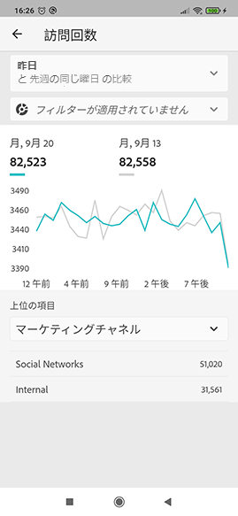

# アプリを使用したエグゼクティブユーザーの設定

場合によっては、エグゼクティブユーザーがアプリケーションにアクセスして使用するために追加の支援が必要になることがあります。この節では、その支援を提供するのに役立つ情報を提供します。

## アプリユーザーが Adobe Analytics のアクセス権を持っていることを確認します

1. [Experience Cloud Admin Console](/help/admin/admin-console/permissions/product-profile.md) で新しいユーザーを設定します。

1. スコアカードを共有するには、Analysis Workspace、スコアカードの基になるレポートスイート、セグメント、指標、ディメンションなどのスコアカードのコンポーネントにアクセスするための権限をアプリユーザーに付与する必要があります。

## アプリユーザーのシステム前提条件

エグゼクティブユーザーがアプリのスコアカードにアクセスできるようにするには、次の点を確認します。

* ユーザーのモバイル OS が、iOS バージョン 10 以上または Android バージョン 4.4（KitKat）以上である。
* ユーザーに Adobe Analytics への有効なログインがある。
* モバイルスコアカードを正しく作成し、共有している。
* ユーザーがスコアカードに含まれるコンポーネントにアクセスできる。スコアカードを共有する際に、「**[!UICONTROL 埋め込みコンポーネントを共有]**」オプションを選択することもできます。

## エグゼクティブによるアプリのダウンロードとインストールの支援

**iOS**：

次のリンク（Analytics の&#x200B;**[!UICONTROL ツール]**／**[!UICONTROL Analytics ダッシュボード（モバイルアプリ）]**&#x200B;でも利用できます）をクリックし、画面の指示に従ってアプリをダウンロード、インストールし、開きます。

`[iOS link](https://apple.co/2zXq0aN)`

**Android**：

次のリンク（Analytics の&#x200B;**[!UICONTROL ツール]**／**[!UICONTROL Analytics ダッシュボード（モバイルアプリ）]**&#x200B;でも利用できます）をクリックし、画面の指示に従ってアプリをダウンロード、インストールし、開きます。

`[Android link](https://bit.ly/2LM38Oo)`

ダウンロードしてインストールすると、エグゼクティブユーザーは既存の Adobe Analytics 資格情報を使用してアプリケーションにサインインできます。Adobe ID または Enterprise／Federated ID を使用できます。

## エグゼクティブによるスコアカードへのアクセスの支援

1. エグゼクティブユーザーにアプリにログインしてもらいます。

   **[!UICONTROL 会社を選択]**&#x200B;画面が表示されます。この画面には、エグゼクティブユーザーが所属するログイン会社が表示されます。

1. 共有したスコアカードに適用されるログイン会社または Experience Cloud 組織の名前をタップしてもらいます。

   スコアカードリストに、そのログイン会社のエグゼクティブと共有されているすべてのスコアカードが表示されます。

1. 該当する場合は、**[!UICONTROL 最近変更された項目]**&#x200B;で、このリストを並べ替えてもらいます。

1. スコアカードの名前をタップして表示してもらいます。

   

### スコアカード UI の説明

共有するスコアカードにタイルが表示される仕方をエグゼクティブユーザーに説明します。

タイルに関する追加情報：

* スパークラインの精度は、日付範囲の長さに依存します。
* 1 日 - 時間ごとの傾向を表示
   * 2 日以上 1 年未満 - 毎日の傾向を表示。
   * 1 年以上 - 毎週の傾向を表示。
   * 値の変化パーセントの式は、（指標合計（現在の日付範囲） - 指標合計（比較日付範囲））÷指標合計（比較日付範囲）です。
   * 画面をプルダウンして、スコアカードを更新できます。

1. タイルをタップすると、そのタイルの詳細な分類の仕組みを表示できます。

   

   * スパークライン上の任意のポイントをタップすると、そのポイントに関連付けられたデータがライン上に表示されます。

   * タイルに追加されたディメンションのデータを表示するテーブルが含まれます。下向き矢印をタップして、ディメンションを選択します。タイルにディメンションが追加されていない場合は、テーブルにグラフデータが表示されます。

1. スコアカードの日付範囲を変更するには、「日付」ヘッダーをタップし、表示するプライマリと比較の日付範囲の組み合わせを選択します。

   

## アプリの環境設定の変更

環境設定を変更するには、上記の「**[!UICONTROL 環境設定]**」オプションをタップします。環境設定で、生体認証ログインをオンにするか、次に示すようにアプリケーションのダークモードを設定できます。

## トラブルシューティング

エグゼクティブユーザーがログインし、何も共有されていないというメッセージが表示された場合、次の可能性があります。

* エグゼクティブユーザーが間違った Analytics インスタンスを選択した、または
* スコアカードがエグゼクティブユーザーと共有されていない

エグゼクティブユーザーが適切な Adobe Analytics インスタンスにログインでき、スコアカードが共有されていることを確認します。

>[!IMPORTANT]
>
>2020 年 10 月以降、アドビは、「Adobe Analytics ダッシュボード」アプリのパフォーマンスを最適化するための一連の機能強化を徐々に展開していきます。 これらの機能強化は、スコアカードに日付（現在の日を除く）を入力するために使用される、履歴 Analytics データのキャッシュに重点を置いています。 このデータは、セキュリティで保護された Microsoft Azure パブリッククラウドストレージアカウントで最大 24 時間キャッシュされます。 これらのパフォーマンス向上機能をオプトアウトする場合は、アドビアカウントチームにお問い合わせください。
