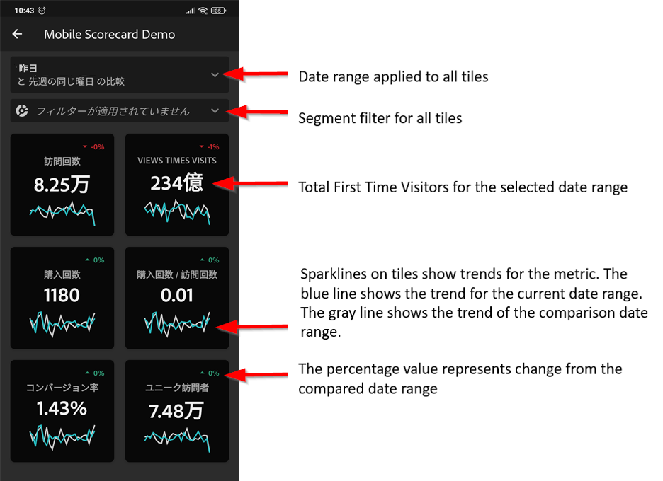
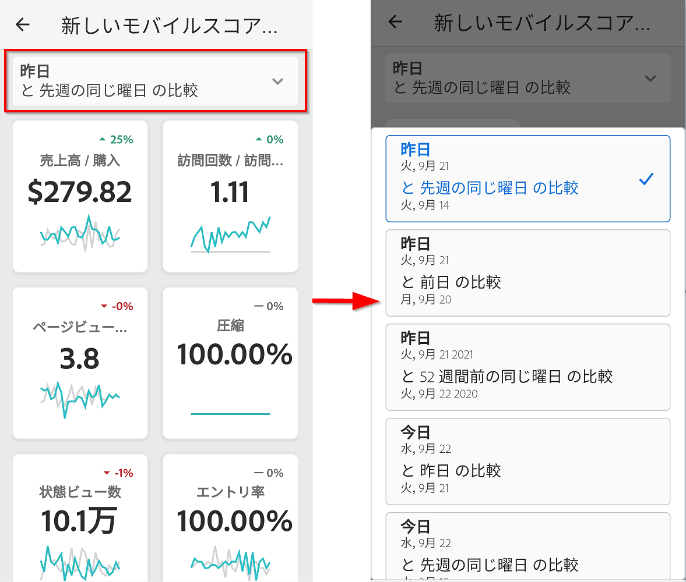
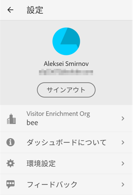

# アプリを使用したエグゼクティブユーザーの設定

場合によっては、エグゼクティブユーザーがアプリケーションにアクセスして使用するために追加の支援が必要になることがあります。この節では、その支援を提供するのに役立つ情報を提供します。

## エグゼクティブユーザーのシステム前提条件

エグゼクティブユーザーがアプリケーションのスコアカードにアクセスできるようにするには、次の点を確認します。

* ユーザーのモバイル OS が、iOS バージョン 10 以上、または Android バージョン 4.4（KitKat）以上である
* ユーザーに Adobe Analytics への有効なログインがある
* モバイルスコアカードを正しく作成し、共有している
* ユーザーが Analysis Workspace およびスコアカードが基づくレポートスイートにアクセスできる
* ユーザーがスコアカードに含まれるコンポーネントにアクセスできるスコアカードを共有する際に、「**[!UICONTROL 埋め込みコンポーネントを共有]**」オプションを選択できることにご注意ください。

## エグゼクティブによるアプリのダウンロードとインストールの支援

**iOS**：

次のリンク（Analytics の&#x200B;**[!UICONTROL ツール]**／**[!UICONTROL Analytics ダッシュボード（モバイルアプリ）]**&#x200B;でも利用できます）をクリックし、画面の指示に従ってアプリをダウンロード、インストールし、開きます。

`[iOS link](https://apple.co/2zXq0aN)`

**Android**：

次のリンク（Analytics の&#x200B;**[!UICONTROL ツール]**／**[!UICONTROL Analytics ダッシュボード（モバイルアプリ）]**&#x200B;でも利用できます）をクリックし、画面の指示に従ってアプリをダウンロード、インストールし、開きます。

`[Android link](https://bit.ly/2LM38Oo)`

ダウンロードしてインストールすると、エグゼクティブユーザーは既存の Adobe Analytics 資格情報を使用してアプリケーションにサインインできます。Adobe ID または Enterprise／Federated ID を使用できます。

## エグゼクティブのスコアカードへのアクセスを支援

1. エグゼクティブユーザーにアプリにログインしてもらう。

   **[!UICONTROL 会社を選択]** 画面が表示されます。 この画面には、エグゼクティブユーザーが所属するログイン会社が表示されます。

1. 共有したスコアカードに適用されるログイン会社またはExperience Cloud組織の名前をタップさせます。

   次に、「スコアカード」リストに、そのログイン会社のエグゼクティブと共有されているすべてのスコアカードが表示されます。

1. 該当する場合は、このリストを **[!UICONTROL 最近変更された]** で並べ替えます。

1. スコアカードの名前をタップして表示するように設定します。

   

### スコアカード UI の説明

共有するスコアカードにタイルが表示される方法をエグゼクティブユーザーに説明します。

タイルに関する追加情報：

* スパークラインの精度は、日付範囲の長さに依存します。
* 1 日 - 時間ごとの傾向を表示
   * 2 日以上 1 年未満 - 毎日の傾向を表示
   * 1 年以上 - 毎週の傾向を表示
   * 値の変化パーセントの式は、（指標合計（現在の日付範囲） - 指標合計（比較日付範囲））÷指標合計（比較日付範囲）です。
   * 画面をプルダウンして、スコアカードを更新できます。

1. タイルをタップすると、そのタイルの詳細な分類の仕組みを表示できます。

   

   * スパークライン上の任意のポイントをタップすると、そのポイントに関連付けられたデータがライン上に表示されます。

   * タイルに追加されたディメンションのデータを表示するテーブルが含まれます。下向き矢印をタップして、ディメンションを選択します。タイルにディメンションが追加されていない場合は、テーブルにグラフデータが表示されます。

1. スコアカードの日付範囲を変更するには、「日付」ヘッダーをタップし、表示するプライマリと比較の日付範囲の組み合わせを選択します。

   

## アプリの環境設定の変更

環境設定を変更するには、上記の「**[!UICONTROL 環境設定]**」オプションをタップします。環境設定で、生体認証ログインをオンにするか、次に示すようにアプリケーションのダークモードを設定できます。

## トラブルシューティング

エグゼクティブユーザーがログインし、何も共有されていないというメッセージが表示された場合、以下の可能性があります。

* エグゼクティブユーザーが間違った Analytics インスタンスを選択している場合、
* スコアカードがエグゼクティブユーザーと共有されていない場合があります。

エグゼクティブユーザーが適切なAdobe Analyticsインスタンスにログインでき、スコアカードが共有されていることを確認します。

### 不具合の報告

オプションをタップして、バグのサブカテゴリを選択します。バグを報告するためのフォームで、一番上のフィールドに電子メールアドレスを入力し、その下のフィールドにバグの説明を入力します。アカウント情報のスクリーンショットがメッセージに自動的に添付されますが、必要に応じて、添付画像の「**X**」をタップして削除できます。また、画面録画の取得、スクリーンショットの追加、ファイルの添付のオプションもあります。レポートを送信するには、フォームの右上にある紙飛行機のアイコンをタップします。

### フィードバックを残す

1. アプリケーション画面の右上にある設定アイコンをタップします。
1. **[!UICONTROL 設定]**&#x200B;画面で、「**[!UICONTROL フィードバック]**」オプションをタップします。
1. タップして、フィードバックを残すためのオプションを表示します。

   

### 改善の提案

オプションをタップして、提案のサブカテゴリを選択します。提案フォームの一番上のフィールドに電子メールアドレスを入力し、その下のフィールドに提案を入力します。アカウント情報のスクリーンショットがメッセージに自動的に添付されますが、必要に応じて、添付画像の「**X**」をタップして削除できます。また、画面録画の取得、スクリーンショットの追加、ファイルの添付のオプションもあります。提案を送信するには、フォームの右上にある紙飛行機のアイコンをタップします。

### 質問

オプションをタップします。一番上のフィールドに電子メールアドレスを入力し、その下のフィールドに質問を入力します。スクリーンショットがメッセージに自動的に添付されますが、必要に応じて、添付画像の「**X**」をタップして削除できます。また、画面録画の取得、スクリーンショットの追加、ファイルの添付のオプションもあります。質問を送信するには、フォームの右上にある紙飛行機のアイコンをタップします。

>[!IMPORTANT]
>
>2020 年 10 月以降、アドビは、「Adobe Analytics ダッシュボード」アプリのパフォーマンスを最適化するための一連の機能強化を徐々に展開していきます。 これらの機能強化は、スコアカードに日付（現在の日を除く）を入力するために使用される、履歴 Analytics データのキャッシュに重点を置いています。 このデータは、セキュリティで保護された Microsoft Azure パブリッククラウドストレージアカウントで最大 24 時間キャッシュされます。 これらのパフォーマンス向上機能をオプトアウトする場合は、CSM にお問い合わせください。
