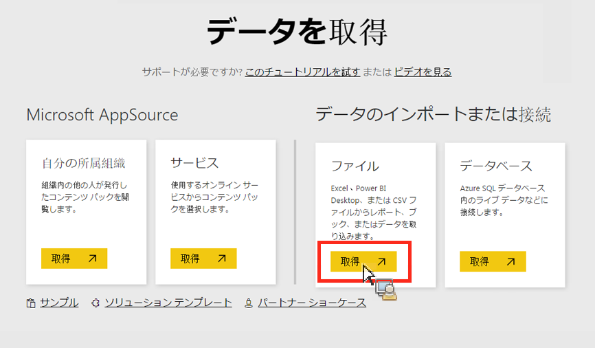

# Power BIへのデータの手動読み込み

Power BI に Analytics データを手動でインポートするには、次の手順に従います。

1. Power BI で、画面の左下にある「**[!UICONTROL データを取得]」をクリックします。**
1. **[!UICONTROL 「インポート」または「データに接続]** / **[!UICONTROL ファイル]**»で、??«取得??****

   

1. 「ローカルファイル」をクリックします。

   

1. Choose which file to upload and click **[!UICONTROL Open]**.
1. Click **[!UICONTROL Upload]** under **[!UICONTROL Upload your Excel file to Power BI]**.

   

1. 「ファイルがアップロードされました」というメッセージが表示されます。

