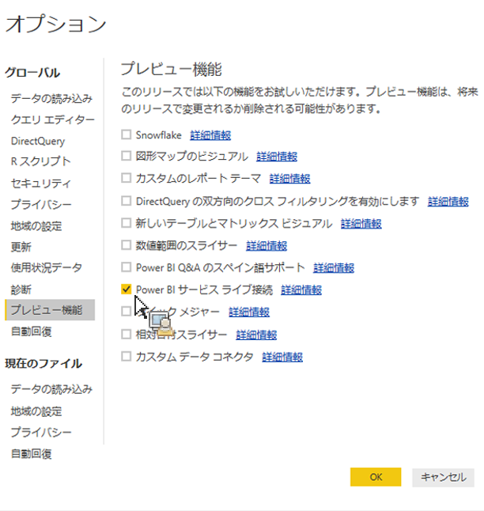

# 発行済みアセットをPower BIデスクトップに取り込む

Report Builder から発行されたアセットを Power BI Desktop に取り込む方法を説明します。

## 前提条件 {#section_BDFDAE1E300B429FB6EBCB21AD1383A0}

* 最新バージョン（2017 年 4 月リリース）の Power BI Desktop をインストールしておく必要があります。
* この手順では、Report Builder でフォーマットされたテーブルまたはリクエストを Power BI サービスに既に発行していることを前提としています。

## 手順 {#section_CB03E6E1B066457EA0F6FC08FFF5EFDD}

2017 年 4 月の Power BI Desktop のアップデートで、Power BI サービスのデータセットに接続する機能が Microsoft によってリリースされました。この機能を使用すると、クラウドに発行済みの既存のデータセットから新しいレポートを作成できます。この機能を活用すれば、チームでの共同作業を円滑にし、重複作業を減らすことができます。

1. In Power BI Desktop, go to **[!UICONTROL File]** &gt; **[!UICONTROL Options and settings]** &gt; **[!UICONTROL Options]** &gt; **[!UICONTROL Preview features.]**
1. **[!UICONTROL Power BI Service Live Connectionを有効に]** して **[!UICONTROL "OK]**」をクリックします。 

1. Power BI Desktop を再起動します。
1. Once you have restarted the desktop, go to **[!UICONTROL Home]** &gt; **[!UICONTROL Get Data]** &gt; **[!UICONTROL More...]**.
1. **[!UICONTROL "Power BIサービス]**」を検索して選択します。
1. **[!UICONTROL Microsoft Power BIサービス]** / **[!UICONTROL マイワークスペース]**&#x200B;で、Report Builderから以前に発行したデータセットを選択します。

詳しくは、[Microsoft のブログ投稿](https://powerbi.microsoft.com/en-us/blog/connecting-to-datasets-in-the-power-bi-service-from-desktop/)を参照してください。
