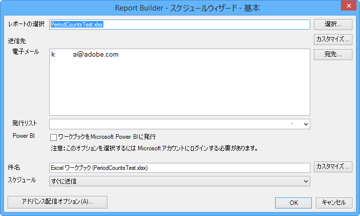
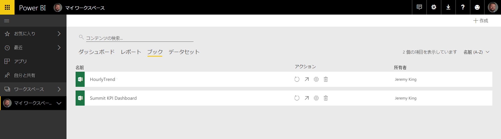
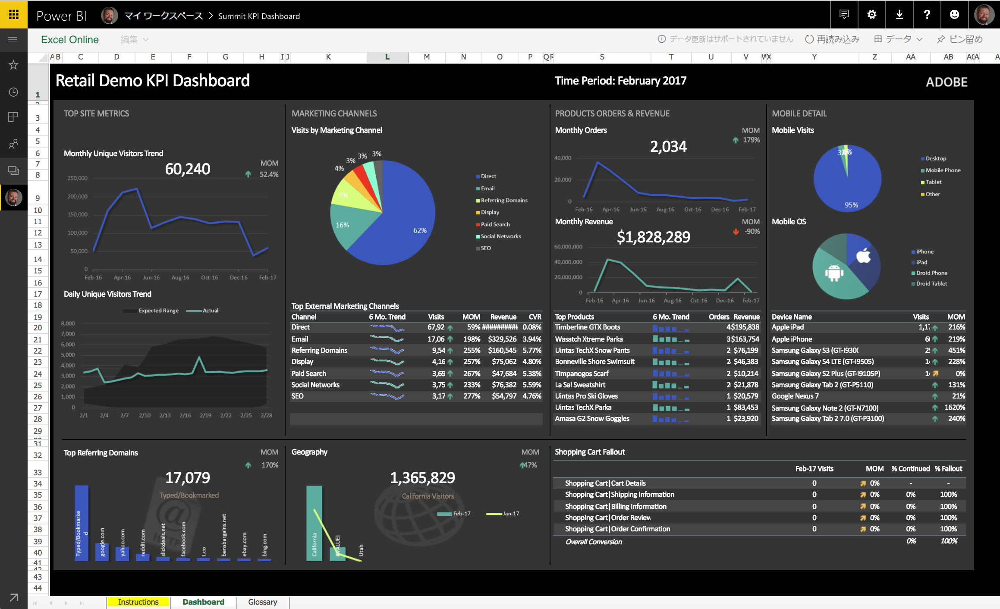
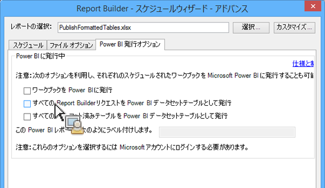
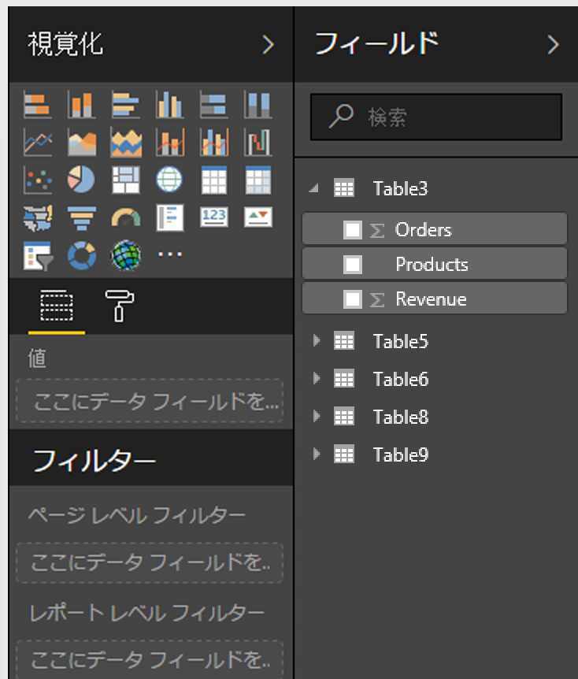
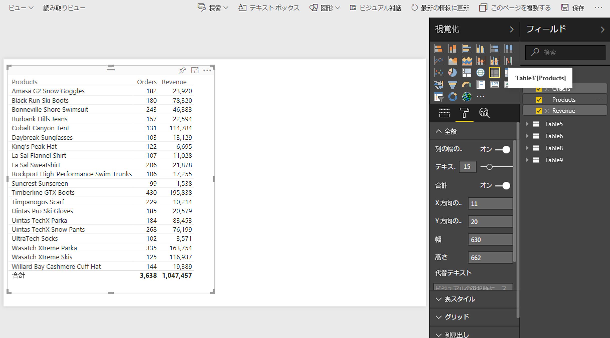
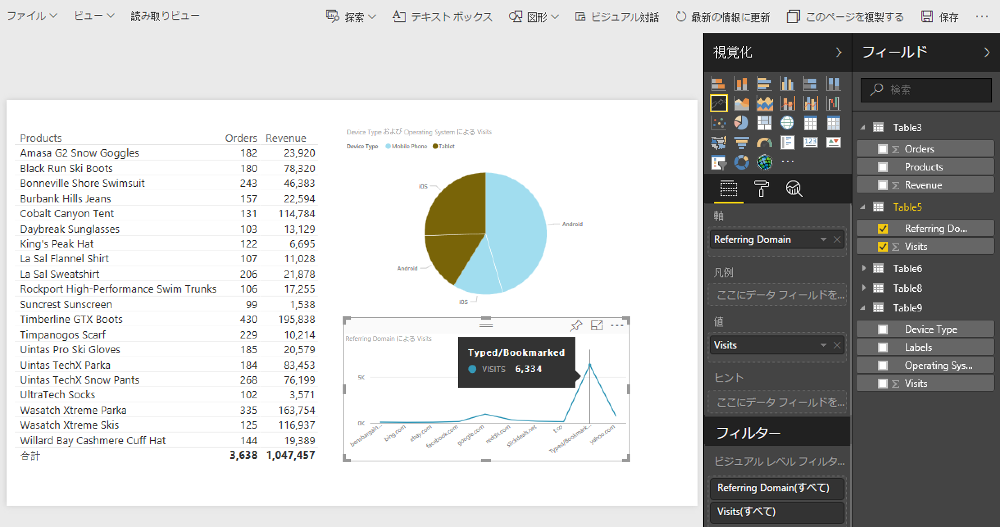
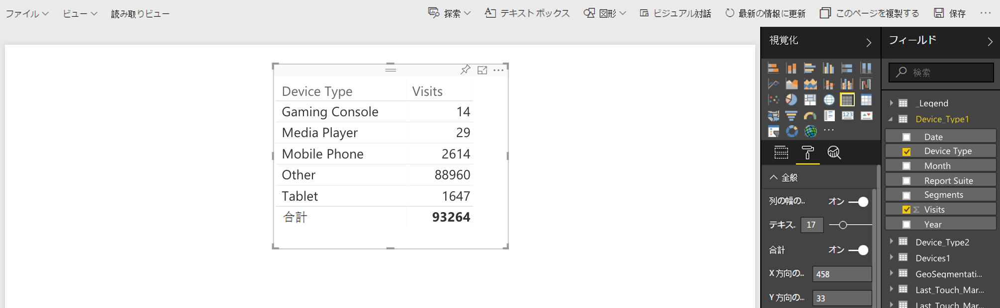
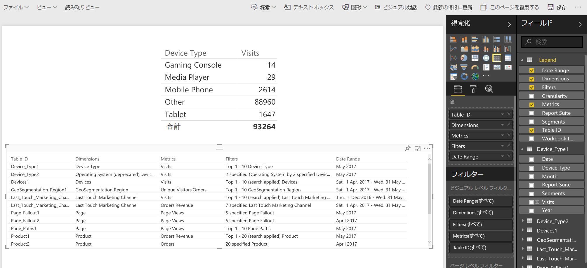

# Power BIに公開-概要

Microsoft Power BI は、データを分析してインサイトを共有するビジネス分析ダッシュボードのスイートです。Adobe Analytics と Power BI を統合すると、Microsoft Power BI 内で Report Builder Analytics データを視覚化し、組織全体で簡単に共有できます。

これまで、アナリストは Report Builder ワークブックを電子メール（または ftp）で配信するようスケジュールを設定していました。それが、関係するビジネスユーザーが様々なプラットフォームやデバイスからアクセス可能な Web ベース環境で正確かつ最新のデータに（Power BI アカウント内から）アクセスできるようになりました。

Report Builder のレポート生成機能を Power BI の視覚化機能と組み合わせることで、組織の全員が情報にアクセスできるようになります。Power BI を使用すると、Adobe Analytics を他のデータソース（POS、CRM など）と統合して、独自の顧客インサイト、関連事項および機会を発見することもできます。

Adobe Report Builder との統合により、以下のことができるようになります。

* [スケジュールされた Report Builder ワークブックを Power BI に発行する](../../../analyze/report-builder/whats-new-arb.md#section_21CA66229EC240D49594A9A7D3FBA687)
* [ワークブック内のすべてのフォーマット済みテーブルを Power BI データセットテーブルとして発行する](../../../analyze/report-builder/whats-new-arb.md#section_7C54A54E75184DD6BAEF4ACCE241239A)
* [すべての Report Builder リクエストを Power BI データセットテーブルとして発行する](../../../analyze/report-builder/whats-new-arb.md#section_0C26057C7DBB4068A643FDD688F6E463)

## システム要件 {#section_0B71092D853446F38FA36447DAC0D32B}

* Adobe Report Builder 5.5 [installed](../../../analyze/report-builder/setup/t-install-arb.md#task_0CA66703882F469EB6DBD9298975D6C3)
* Power BI にログインできるアクティブな Microsoft アカウント

## Publish workbook to Power BI {#section_21CA66229EC240D49594A9A7D3FBA687}

スケジュールされたワークブックは、Adobe Analytics のデータが取り込まれた、フォーマット済みの Excel スプレッドシートです。スケジュールに従って定期的に送信されます。

**Report Builderでのワークブックの発行**

1. Report Builder で、ワークブックを生成して保存します。
1. On the Report Builder Toolbar, click **[!UICONTROL Schedule]** &gt; **[!UICONTROL New]**.

1. In the Basic Scheduling Wizard, check the box next to **[!UICONTROL Publish Workbook to Microsoft Power BI]**.

   

1. 電子メールを指定してすぐに送信するか、スケジュールの頻度（毎時、毎日など）を指定します。
1. 「**[!UICONTROL OK]」をクリックして発行します。**
1. Microsoft アカウントにログインするよう求められます。資格情報を入力します。
1. Report Builder ワークブックがスケジュールされて Power BI に発行されます。

   スケジュールされた各インスタンスでは、Report Builder のスケジュールプロセスによってワークブックが更新済みの Analytics データで更新された後、Microsoft Power BI に発行されます。

**Power BIでReport Builderワークブックデータを表示する**

1. Power BI で、[!UICONTROL ワークブック]メニューの下に表示されるワークブックをダブルクリックします。

   

1. これで、ワークブックのダッシュボードデータを表示できるようになります。  

1. このワークブックの領域をピン留めして任意の Power BI ダッシュボードに追加することができます。

## Publish all formatted tables in the workbook as Power BI dataset tables {#section_7C54A54E75184DD6BAEF4ACCE241239A}

>[!NOTE]
>
>ワークブックにマクロが含まれている場合、「ワークブック内のすべての書式設定済みテーブルをPower BIデータセットテーブルとして発行」は無効になります。

ワークブック全体をインポートする代わりに、ワークブック内のすべてのフォーマット済みテーブルの内容のみをインポートすることができます。

**使用例：**&#x200B;複数の Report Builder リクエストからデータを取り込み、多数の数式を含むサマリテーブルを作成する Excel ワークブックがあるとします。サマリテーブルのみを Power BI にインポートして、そのビジュアライゼーションを作成できます。

**Report Builderでの書式化されたテーブルの発行**

1. Report Builder で、ヘッダー行とそれに続くデータ行を含むデータテーブルを生成します。
1. テーブルを選択し、[!UICONTROL **ホーム]メニューから**[!UICONTROL テーブルとしてフォーマット]を選択します。テーブルにはデフォルトで名前（テーブル 1、テーブル 2 など）が付けられますが、[!UICONTROL デザイン]メニューで名前を変更できます。

1. On the Report Builder Toolbar, click **[!UICONTROL Schedule]** &gt; **[!UICONTROL New]**.

1. In the Basic Scheduling Wizard, click **[!UICONTROL Advanced Scheduling Options]**.
1. [!UICONTROL スケジュールウィザード- Advanced]の**[!UICONTROL "**発行オプション]**"タブで、「すべての書式化されたテーブル **[!UICONTROL をPower BIデータセットテーブルとして発行」の横のボックスをオン]**&#x200B;にします。

   

1. （オプション）発行されたアセットの名前を Power BI でカスタマイズできます。これは、ワークブック名の一部としてバージョン番号を使用しており（myworkbook_v1.1.xlsx など）、発行された Power BI アセットの名前にバージョン番号を表示したくない場合に便利です。バージョン番号が変更されても、発行されたアセットは変更されないという利点もあります（こちらの[仕様](../../../analyze/report-builder/c-publish-power-bi/specifications-limits.md#concept_1B6522B4D7A9482680198F125D94EEFD)を参照してください）。

**Power BIでのテーブルデータの表示**

1. In Power BI, go to the **[!UICONTROL Workspaces]** &gt; **[!UICONTROL Datasets]** menu.

   

1. 発行したデータセットを選択し、その横にある[!UICONTROL レポートの作成]アイコンをクリックします。テーブルはフィールドとして表示されることに注意してください。

   

1. テーブルとその関連列を選択します。

   

1. [!UICONTROL 視覚化]メニューから、Power BI でテーブルを視覚化する方法を選択できます。例えば、データを折れ線グラフとして表示することができます。

   

1. ここから、このデータセットテーブルのビジュアライゼーションを作成できます。

## Publish all Report Builder requests as Power BI Dataset tables {#section_0C26057C7DBB4068A643FDD688F6E463}

すべてのリクエストをデータセットテーブルに変換し、その上にビジュアライゼーションを作成することができます。

>[!IMPORTANT]
>
>ワークブックに100を超えるリクエストが含まれている場合、最初の100件のリクエストのみがPower BIに発行されます。さらに、Power BI に発行された各リクエストでは、最初の 10,000 行のデータのみが発行されます。そのため、こうしたリクエストはスケジュールによって正常に配信されますが、Power BI への発行範囲は制限されます。

1. Report Builder で、Report Builder リクエストを含むワークブックを開くか作成します。
1. On the Report Builder Toolbar, click **[!UICONTROL Schedule]** &gt; **[!UICONTROL New]**.

1. In the Basic Scheduling Wizard, click **[!UICONTROL Advanced Scheduling Options]**.
1. [!UICONTROL スケジュールウィザード- Advanced]の**[!UICONTROL "**発行オプション]**"タブで、「すべてのReport BuilderリクエストをPower BIデータセットテーブルとし **[!UICONTROL て発行」の横のボックスをチェックします]**

1. Click **[!UICONTROL OK]**.

**Power BIでリクエストデータを表示する**

スケジュールされた各 Report Builder リクエストは、データセット内のテーブルとして発行されます。各リクエストテーブルには、リクエストのプライマリディメンションに基づいた名前が付けられ、[!UICONTROL レポートスイート]列と[!UICONTROL セグメント]列があります。

1. In Power BI, go to the **[!UICONTROL Workspaces]** &gt; **[!UICONTROL Datasets]** menu.

1. 発行したリクエストを選択し、その横にある[!UICONTROL レポートの作成]アイコンをクリックします。

   リクエストは、[!UICONTROL フィールド]メニューにテーブルとして表示されることに注意してください。

   

   >[!NOTE]
   >
   >ワークシート（ピボットレイアウト、カスタムレイアウト、一部の列が非表示）にレイアウトされるようにReport Builderリクエストを設定すると、Report Builderは常に同じ2次元の単一ヘッダー行形式でリクエストを発行します。日付、ディメンション、指標、レポートスイート、セグメント

1. Also notice that there is an additional table called **[!UICONTROL Legend]**. Report Builder 以外でリクエストを利用する場合に、各リクエストが何を表しているのかわからなくなることがあります。凡例テーブルの目的は、例えば、テーブル ID の下に各リクエストの名前を表示することです。他の凡例列を追加して、リクエストの全体像を把握することもできます。

   

