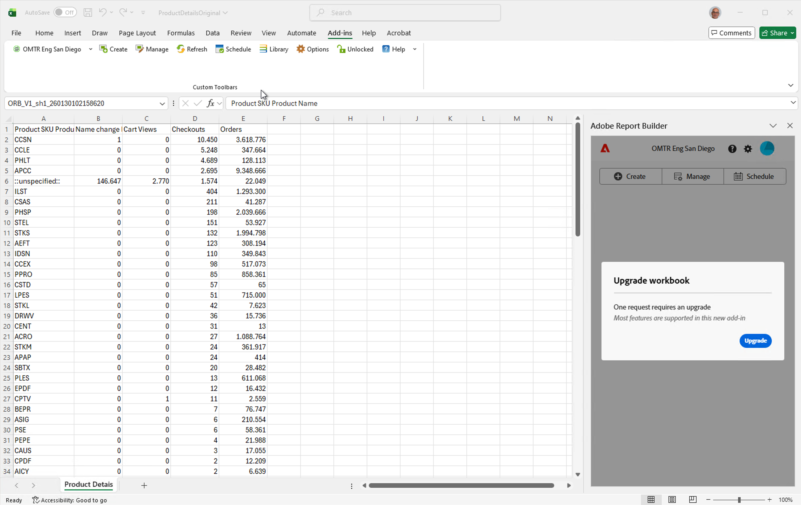
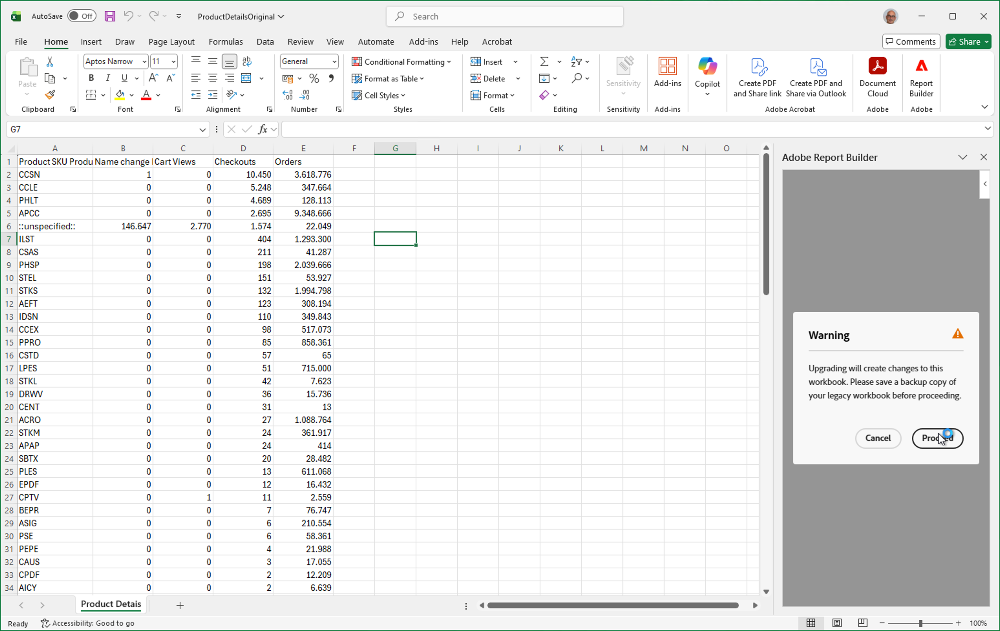
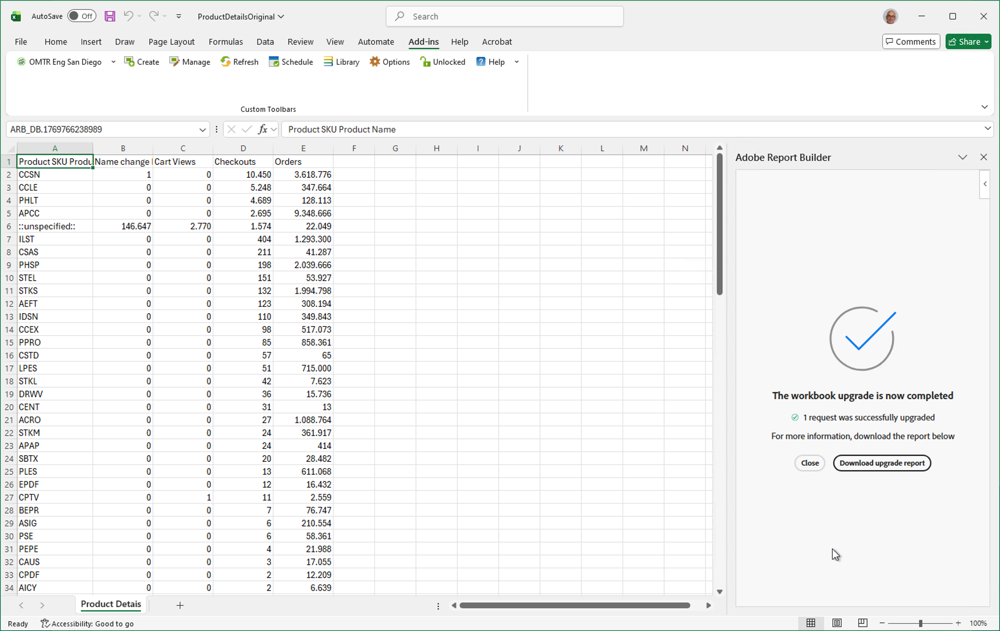

# 従来のReport Builder ワークブックの変換

Report Builderは、2026年6月に提供終了となります。 ブックを従来のReport Builderから新しいReport Builderに移行する必要があります。 新しいReport Builderでは、従来のReport Builderで作成したワークブックをすばやく移行できます。

>[!IMPORTANT]
>
>各ワークブックを複製し、レガシーワークブックを変換する前に1つのバージョンの名前を変更します。 これにより、必要に応じて、元のレガシーブックのコピーを常に保持できます。

>[!BEGINSHADEBOX]

デモ動画については、 [ ワークブックの変換](https://experienceleague.adobe.com/ja/docs/analytics-learn/tutorials/exporting/report-builder/upgrade-and-reschedule-workbooks){target="_blank"}を参照してください。

>[!ENDSHADEBOX]

>[!NOTE]
>
>従来のワークブックを変換するには、まず[新しいReport Builderを設定する必要があります](/help/analyze/report-builder/report-builder-setup.md)。

## 従来のワークブックを開く

レガシーワークブックを開くには、次の操作を行います。

* [Report Builder ハブ ](report-builder-hub.md)の「**[!UICONTROL スケジュール]**」タブから、スケジュールされたレガシーブックを開きます。 このアクションは、スケジュールされたレガシーワークブックに適した方法です。 レガシーワークブックに関連付けられているスケジュールを使用するオプションは、[変換されたレガシーワークブックをスケジュール ](#schedule-a-converted-legacy-workbook)するとすぐに使用できます。

   1. [!DNL Excel]を開き、[!DNL Excel] リボン バーから **[!UICONTROL Report Builder]**&#x200B;を選択します。

   1. 「**[!UICONTROL ログイン]**」を選択し、Report Builderにログインします。

   1. [Report Builder ハブ ](report-builder-hub.md)で「**[!UICONTROL スケジュール]**」を選択します。
   1. 「**[!UICONTROL レガシー]**」タブを選択します。 このタブには、作成した従来のReport Builder ベースのスケジュールされたワークブックが一覧表示されます。

      

   1. リストから変換するスケジュール済みワークブックをを選択し、を選択します。 ワークブックがダウンロードされ、[!DNL Excel]の新しいウィンドウで開きます。 従来のReport Builder ブックを[変換できるようになりました](#convert-a--workbook)。

* ローカルコンピューターまたはネットワークからレガシーブックを直接開きます。 この方法を使用する場合、従来のワークブックに関連付けられている可能性のあるスケジュールは使用できません。   レガシーブックが[!DNL Excel]で開いているとき：

   1. [!DNL Excel]のリボン バーから **[!UICONTROL Report Builder]**&#x200B;を選択します。
   1. 「**[!UICONTROL ログイン]**」を選択し、Report Builderにログインします。
   1. 次に、[従来のワークブックを変換](#convert-a-workbook)します。

## レガシーワークブックの変換

従来のワークブックを変換するには：

1. レガシーのブックを開くと、このブックに[ レガシーのReport Builder](/help/analyze/legacy-report-builder/home.md) リクエストが含まれているかどうかが新しいReport Builderによって検出されます。

   移行アップグレードを示す[!DNL Excel] Report Builder アップグレード レポートの{zoomable="yes"}

1. 1つ以上のレガシーリクエストが見つかった場合は、**[!UICONTROL ワークブックのアップグレード]** ダイアログで「**[!UICONTROL アップグレード]**」をクリックして、ワークブックをアップグレードします。

   >[!NOTE]
   >
   >各リクエストを個別にアップグレードする必要があります。 一括アップグレードはサポートされていません。

1. アップグレードすると、**[!UICONTROL 警告]** ダイアログが表示され、ワークブックの変更を警告します。 また、続行する前に、従来のワークブックのバックアップを作成することも推奨されます。

   移行に関する警告を表示する[!DNL Excel] Report Builder アップグレードレポートの{zoomable="yes"}

1. 「**[!UICONTROL 続行]**」をクリックして、アップグレードを続行します。

   アップグレードが成功すると、**[!UICONTROL ワークブックのアップグレードが完了しました]**&#x200B;という通知が表示されます。

   移行が完了したことを示す[!DNL Excel] Report Builder アップグレード レポートの

   * **[!UICONTROL 閉じる]**&#x200B;を選択して通知を閉じ、新しいReport Builderに対する更新されたリクエストを使用してワークブックで引き続き作業を行います。

   * 「**[!UICONTROL アップグレードレポートをダウンロード]**」を選択して、アップグレードの結果を示す新しい[!DNL Excel] ワークブックをダウンロードして開きます。 例については、以下を参照してください。

     移行レポート ](assets/upgrade-report.png)を表示する[!DNL Excel] Report Builder アップグレード レポートのを[管理できるようになりました。 これらのデータブロックは、アップグレードの結果であり、従来のReport Builder リクエストを置き換えます。

## 変換されたレガシーワークブックのスケジュール

Report Builder ハブの「**[!UICONTROL スケジュール]**」タブからダウンロードして開いた従来のワークブックのスケジュールの詳細を使用するオプションがあります。 このオプションは、ローカルコンピューターまたはネットワークから開くスケジュールの詳細を含むレガシーワークブックには使用できません。

1. 変換されたレガシーワークブックをレガシースケジュールでスケジュールするには：

   * Report Builder ハブから「**[!UICONTROL ブックを送信]**」を選択するか、または
   * Report Builderの「**[!UICONTROL スケジュール]**」タブにある「**[!UICONTROL ワークブック]**」タブから「**[!UICONTROL ワークブックをスケジュール]**」を選択します。

1. 従来のワークブックのスケジュールの詳細をデフォルトのスケジュール設定として使用できます。

   [!DNL Excel] Report Builderの従来のスケジュール設定オプション ](assets/upgrade-legacy-schedule-convert.png)の![ スクリーンショット

   * **[!UICONTROL 使用]**&#x200B;を選択して、従来のスケジュールの詳細を使用します。 スケジュールの詳細は、[ ワークブックを送信](schedule-reportbuilder.md#schedule-a-workbook) インターフェイスに事前入力されます。
   * レガシースケジュールの詳細を使用しない場合は、**[!UICONTROL 使用しない]**&#x200B;を選択します。
   * 「**[!UICONTROL キャンセル]**」を選択すると、キャンセルします。

   今後このワークブックにレガシースケジュールの詳細を使用しない場合は、**[!UICONTROL 今後の使用からレガシーメタデータを削除]**&#x200B;を選択します。

## 従来のReport Builderからの移行

レガシーReport Builderの一部の機能は、Report Builderではサポートされていないか、部分的にサポートされていないか、実装が異なります。

* **リアルタイム リクエスト**。 リアルタイム要求はサポートされておらず、変換されたレガシーワークブックから削除されます。

* **パス/フォールアウトレポート**。 フォールアウト要求はサポートされておらず、変換されたレガシーワークブックから削除されます。

* スケジュール済みレポート **の**[!DNL FTP] オプション。 [!DNL FTP]の場所に送信するレポートをスケジュールするオプションは使用できなくなりました。

* **スケジュール済みレポートの[!DNL Power BI]へのワークブックの公開** オプション。 レポートを[!DNL Power BI]にスケジュールするオプションは使用できなくなりました。

* **訪問者指標**。 次の指標は、変換されたレガシーワークブック内の&#x200B;*ユニーク訪問者*&#x200B;に変換されます。ただし、レポート結果が`visitorshourly`、`visitorsdaily`、`visitorsweekly`、`visitorsmonthly`、`visitorsquarterly`、および`visitorsyearly`と完全に一致しない場合があります。 この変換は、`mobilevisitorshourly`、`mobilevisitorsdaily`、`mobilevisitorsweekly`、`mobilevisitorsmonthly`、`mobilevisitorsquarterly`および`mobilevisitorsyearly`にも適用されます。

* **自動再認証**。 新しい[!DNL Excel] ファイルを開く場合は、明示的に再認証する必要があります。 この再認証は、[!DNL Office Add-ins]機能のセキュリティ機能です。

* **データブロックのグループを含むワークシートをコピー**。 複数のデータブロックを含むワークシートのコピーをサポートするには：

   1. コピーする[!DNL Excel] ワークブックの「ワークシート」タブを選択します。
   1. タブのコンテキストメニューから、**[!UICONTROL 移動またはコピー…]**&#x200B;を選択します
   1. **[!UICONTROL 移動またはコピー]** ダイアログで、次の操作を行います。
      1. コピー先のワークシートを選択します。
      1. **[!UICONTROL コピーの作成]**&#x200B;を有効にしてください。
      1. **[!UICONTROL OK]**&#x200B;を選択します。
   1. ソースワークシートから：
      1. すべてのデータブロックを含むセル範囲を選択します。
      1. [Report Builder ハブ ](/help/analyze/report-builder/report-builder-hub.md)から **[!UICONTROL データブロック]**&#x200B;を選択します。
   1. 宛先ワークシートで、次の操作を行います。
      1. コピーしたセル範囲をペーストするセルを選択します。
      1. [Report Builder ハブ ](/help/analyze/report-builder/report-builder-hub.md)から「 **[!UICONTROL データブロックを貼り付け]**」を選択します。

* **日付範囲**。 Report Builderでは、以前のReport Builderの日付範囲の行ラベルに適用されている日付範囲の書式設定オプション **[!UICONTROL 開始期間と終了期間を]**&#x200B;として表示するオプションは移行されません。

* **平均**。 Report Builderは、選択した書式設定オプション **[!UICONTROL 平均オプション]** （**[!UICONTROL 日平均]**）を、従来のReport Builderの指標に適用するまで移行しません。 ****&#x200B;計算指標を使用して、選択したオプションを置き換えます。

* **テキストの追加/削除**。 Report Builderは、従来のReport Builderの指標に適用された&#x200B;**[!UICONTROL Prepend/postpend text]**&#x200B;を移行しません。

* **小計**。 Report Builderは、従来のReport Builderの指標に適用された書式設定オプション **[!UICONTROL SubTotal （このリクエスト）]**&#x200B;を移行しません。 従来のワークブック要求で&#x200B;**[!UICONTROL SubTotal （この要求）]**&#x200B;を使用すると、機能は&#x200B;**[!UICONTROL Total]**&#x200B;に変換されます。 例えば、上位5つのページ名を持つレガシーデータブロックで、**[!UICONTROL SubTotal （ページビュー）]**&#x200B;を使用して、上位5つのページ名のページビューの合計を返します。 移行後、上位5つのページ名を持つ同じデータブロックは、*すべての* ページ名のページビューの合計を返します。 計算指標の機能を使用して、従来の&#x200B;**[!UICONTROL SubTotal]**&#x200B;機能を置き換えます。
