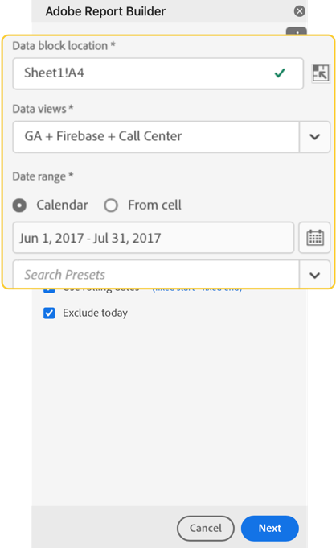
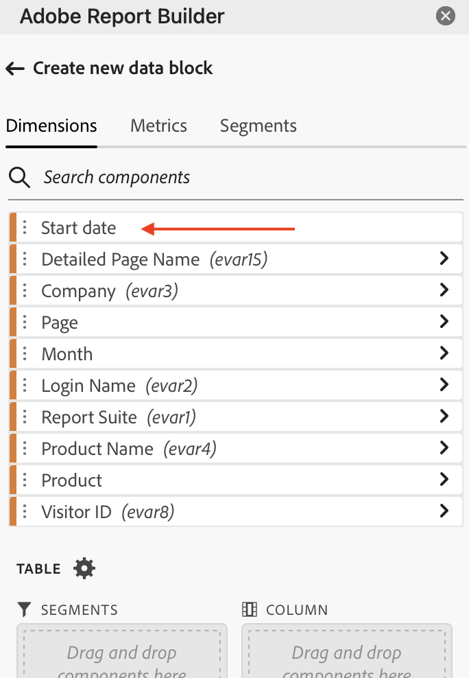
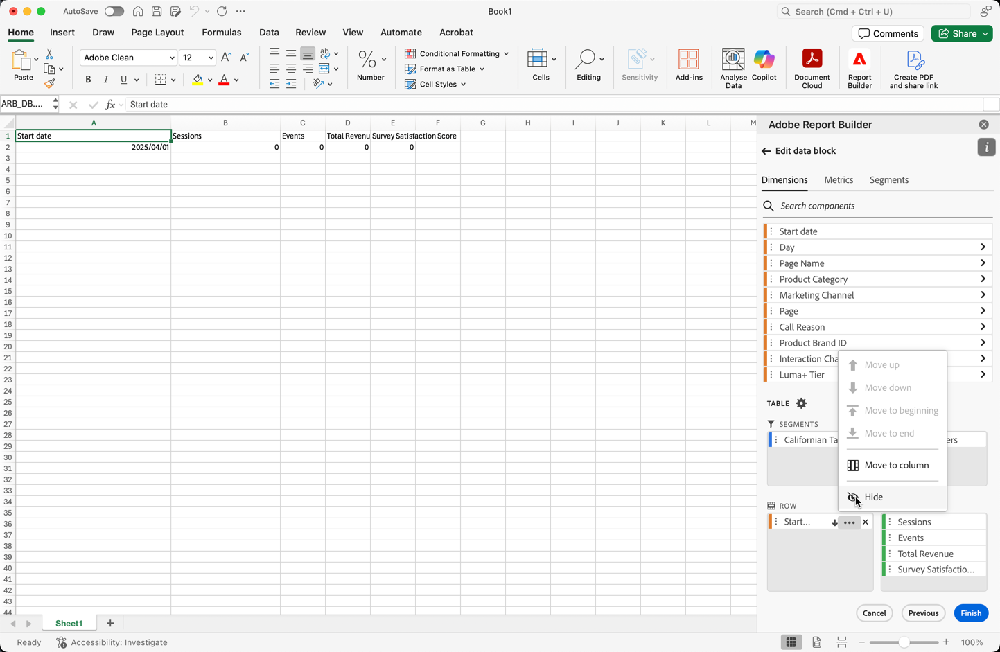
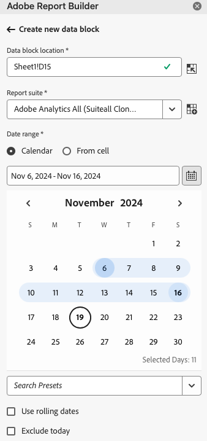

# データブロックの作成

*データブロック*&#x200B;は、単一のデータリクエストによって作成されたデータのテーブルです。 Report Builder のワークブックには、複数のデータブロックを含めることができます。 データブロックを作成する場合は、まずデータブロックを設定し、次にデータブロックを作成します。

## データブロックの設定

データブロックの場所、レポートスイート、日付範囲の初期データブロックパラメーターを設定します。

1.  **[!UICONTROL Create]**&#x200B;を選択します。

   データブロックを作成オプションを示す{zoomable="yes"}

1. 「**[!UICONTROL データブロックの場所]**」を設定します。

   「データブロックの場所」オプションは、Report Builderがワークシートにデータを追加するワークシートの場所を定義します。

   データブロックの場所を指定するには、ワークシートで1つのセルを選択するか、`a3`、`\\\$a3`、`a\\\$3`、`sheet1!a2`などのセルアドレスを入力します。 指定したセルは、データの取得時にデータブロックの左上隅になります。

   を使用して、シート内で現在選択されているセルからデータブロックの場所を選択します。

1. **[!UICONTROL レポートスイート]**&#x200B;を選択します。

   レポートスイートオプションを使用すると、ドロップダウンメニューからレポートスイートを選択したり、セルの場所からレポートスイートを参照したりできます。

   セルからレポートスイートを作成するには、を選択します。

1. 「**[!UICONTROL 日付範囲]**」を設定します。

   **[!UICONTROL 日付範囲]** オプションを使用すると、日付範囲を選択できます。 日付範囲は、固定でも相対日付でも設定できます。

   **[!UICONTROL カレンダー]**&#x200B;を選択して、を使用してデータ範囲を選択するか、日付範囲を手動で入力します。 オプションで、**[!UICONTROL _プリセットの検索_]** ドロップダウンメニューからプリセットを選択できます。

   「**[!UICONTROL セルから]**」を選択して、現在のシートのセルに基づいて開始データと終了データを定義します。

   日付範囲オプションについて詳しくは、[日付範囲を選択](select-date-range.md)を参照してください。

1. 「**[!UICONTROL 次へ]**」を選択します。

   日付範囲オプションとアクティブな「次へ」ボタンを示す

   データブロックを設定したら、ディメンション、指標、セグメントを選択して、データブロックを構築できます。 **[!UICONTROL ディメンション]**、**[!UICONTROL 指標]**、**[!UICONTROL セグメント]**&#x200B;のタブが&#x200B;**[!UICONTROL テーブル]** ペインの上に表示されます。

## データブロックの作成

データブロックを作成するには、レポートコンポーネントを選択してから、レイアウトをカスタマイズします。

1. **[!UICONTROL ディメンション]**、**[!UICONTROL 指標]**、**[!UICONTROL セグメント]**&#x200B;の各コンポーネントを追加します。

   コンポーネントリストをスクロールするか、 **[!UICONTROL _検索コンポーネント_]** フィールドを使用してコンポーネントを検索します。 コンポーネントを[!UICONTROL  テーブル ] ペインにドラッグ&amp;ドロップするか、リスト内のコンポーネント名をダブル選択して、[!UICONTROL  テーブル ] ペインにコンポーネントを追加します。

   コンポーネントをダブル選択して、テーブルのデフォルトセクションにコンポーネントを追加します。

   - Dimension コンポーネントは、 **[!UICONTROL Row]** セクションまたは **[!UICONTROL Column]** セクションに追加されます（列に既にディメンションがある場合）。
   - 日付コンポーネントが **[!UICONTROL Column]** セクションに追加されます。
   - セグメントコンポーネントが「 **[!UICONTROL セグメント]**」セクションに追加されます。
   - 指標コンポーネントが **[!UICONTROL 値]** セクションに追加されます。

1. 「テーブル」ペインの項目を配置して、データブロックのレイアウトをカスタマイズします。

   テーブルパネルの各リスト内にコンポーネントをドラッグ&amp;ドロップして、コンポーネントを並べ替えるか、を選択し、上に移動、下に移動などを選択して、リスト内のコンポーネントを移動します。

   テーブルにコンポーネントを追加すると、データブロックのプレビューがワークシートのデータブロックの場所に表示されます。 テーブル内のアイテムを追加、移動、または削除すると、データブロックプレビューのレイアウトが自動的に更新されます。

   追加されたコンポーネントと更新されたワークシートを示す

1. 必要に応じて、**[!UICONTROL 開始日]**&#x200B;をデータブロックの開始日を識別するディメンションとして設定します。 開始データをディメンションとして追加すると、定期的にスケジュールされたレポートにローリング日付範囲がある場合に役立ちます。 または、従来とは異なる日付範囲があり、開始日を明確にする必要がある場合。

   ディメンションのリストに開始日が表示されている

1. 必要に応じて、行ヘッダーと列ヘッダーを表示または非表示にします。 それには、次の手順を実行します。

   1. **[!UICONTROL テーブル]** 設定アイコンを選択します。

      テーブル設定オプションを示す

   1. 「**[!UICONTROL 行と列のヘッダーを表示]**」オプションをオンまたはオフにします。 ヘッダーはデフォルトで表示されます。

1. 必要に応じて、ディメンションのラベルと指標ヘッダーを表示または非表示にすることもできます。 それには、次の手順を実行します。

   1. ディメンション ラベルまたは列ヘッダーのを選択して、コンテキスト メニューを表示します。

      

   1. ディメンションのラベルまたは列ヘッダーを切り替えるには、 **[!UICONTROL Hide]**&#x200B;または **[!UICONTROL Show]**&#x200B;を選択します。 すべてのラベルはデフォルトで表示されます。

1. 「**[!UICONTROL 完了]**」を選択して、データブロックの設定を完了します。

1. 分析データの取得中に、処理メッセージ **[!UICONTROL #BUSY]**&#x200B;が表示されます。

   

1. Report Builder は、データを取得し、完了したデータブロックをワークシートに表示します。

   

>[!MORELIKETHIS]
>
>[ レポートスイートを選択](select-report-suite.md)
>[日付範囲の選択](select-date-range.md)
>[ディメンションのフィルタリング](filter-dimensions.md)
>[セグメントの操作](work-with-segments.md)
>

<!--

A *data block* is the table of data created by a single data request. A Report Builder workbook can contain multiple data blocks. When you create a data block, first configure the data block and then build the data block.

## Configure the data block

Configure the initial data block parameters for the data block location, report suite, and a date range.

1. Click **[!UICONTROL Create]**.

    

1. Set the **[!UICONTROL Data block location]**.

    The data block location option defines the worksheet location where report builder adds the data to your worksheet.

    To specify the data block location, select a single cell in the worksheet and click the icon next to **[!UICONTROL Data block location]**: 
    
    You can also enter a cell address such as a3, \\\$a3, a\\\$3 or sheet1!a2. The cell specified marks the upper-left corner of the data block when the data is retrieved.

1. Choose a **Report Suite**.

    The report suites option allows you to choose a report suite from a drop-down menu or to reference a report suite from a cell location.

1. Set the **[!UICONTROL Date range]**.

    The Date range option allows you to choose a date range. Date ranges may be fixed or rolling. For information about data range options, see [Select a Date Range](select-date-range.md).

1. Click **[!UICONTROL Next]**.

    

    After you configure the data block, you can select dimensions, metrics, and segments to build your data block. The Dimensions, Metrics, and Filters tabs are displayed above the Table builder pane.

## Build the data block

To build the data block, select report components, and then customize the layout.

1. Add Dimensions, Metrics, and Segments.

    Scroll the component lists or use the **[!UICONTROL Search]** field to locate components. Drag and drop components to the Table pane or double-click a component name in the list to automatically add the component to the Table pane.

    Double-click a component to add it to a default section of the table.

    - Dimension components are added to the Row section or to the Column section if you have a dimension already in the columns.
    - Date components are added to the Column section.
    - Segment components are added to the Segments section.

    **Start date as a Dimension**

    Set the **[!UICONTROL Start date]** as a dimension to clearly identify the start date of your data block. This is helpful if you have a regularly scheduled report that has a rolling date range or if you have an unconventional date range and you need to be clear on the start date.

    {width="30%"}

1. Arrange the items in the Table pane to customize the layout of your data block.

    Drag and drop components in the Table pane to reorder components or right-click a component name and select from the options menu.

    When you add components to the table, a preview of the data block is displayed at the Data block location in the worksheet. The layout of the data block preview automatically updates as you add, move, or remove items in the table.

    

    **Display or hide row and column headers**

1. Click the **[!UICONTROL Table settings]** icon.

    {width="35%"}

1. Check or uncheck the option to Display row and column headers. The headers are displayed by default.

    **Hide or show dimension labels and metric headers**

1. Click the ellipsis icon on either the dimensions or the column headers to display the settings.

    {width="35%"}

1. Click Hide or Show to toggle the dimension labels or column headers. All labels are displayed by default.

1. Click **[!UICONTROL Finish]**.

    A processing message is displayed while the analytics data is retrieved.

    Report Builder retrieves the data and displays the completed data block in the worksheet.

    

-->