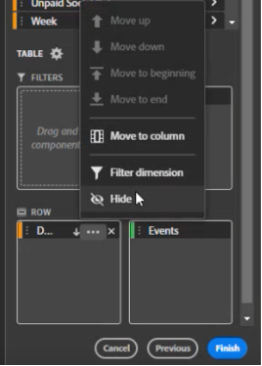

# データブロックの作成

*データブロック*&#x200B;は、単一のデータリクエストによって作成されたデータのテーブルです。Report Builder のワークブックには、複数のデータブロックを含めることができます。データブロックを作成する場合は、まずデータブロックを設定し、次にデータブロックを作成します。

## データブロックの設定

データブロックの場所、レポートスイートおよび日付範囲の初期データブロックパラメーターを設定します。

1. 「**[!UICONTROL 作成]**」をクリックします。

   

1. 「**[!UICONTROL データブロックの場所]**」を設定します。

   「データブロックの場所」オプションは、Report Builder がデータを追加するワークシートの場所を定義します。

   データブロックの場所を指定するには、ワークシート内の 1 つのセルを選択し、「**[!UICONTROL データブロックの場所]**」の横にあるアイコンをクリックします。

   a3、\\$a3、a\\\$3、sheet1!a2 などのセルのアドレスを入力することもできます。 指定したセルは、データを取得する際に、データブロックの左上隅を示します。

1. **レポートスイート** を選択します。

   「レポートスイート」オプションを使用すると、ドロップダウンメニューからレポートスイートを選択したり、セルの場所からレポートスイートを参照したりできます。

1. 「**[!UICONTROL 日付範囲]**」を設定します。

   「日付範囲」オプションでは、日付範囲を選択できます。日付範囲は、固定でも相対日付でも設定できます。データ範囲オプションについて詳しくは、 [日付範囲の選択](select-date-range.md)を参照してください。

1. 「**[!UICONTROL 次へ]**」をクリックします。

   

   データブロックを設定したら、ディメンション、指標およびセグメントを選択して、データブロックを作成できます。 「ディメンション」、「指標」および「フィルター」タブは、テーブルビルダーペインの上に表示されます。

## データブロックの作成

データブロックを作成するには、レポートコンポーネントを選択してから、レイアウトをカスタマイズします。

1. Dimension、指標およびセグメントを追加します。

   コンポーネントリストをスクロールするか、「**[!UICONTROL 検索]**」フィールドを使用してコンポーネントを配置します。 コンポーネントをテーブルペインにドラッグ＆ドロップするか、リスト内のコンポーネント名をダブルクリックして、コンポーネントを自動的にテーブルペインに追加します。

   コンポーネントをダブルクリックして、テーブルのデフォルトセクションに追加します。

   - 既に列にディメンションがある場合、ディメンションコンポーネントは「行」セクションまたは「列」セクションに追加されます。
   - 日付コンポーネントが「列」セクションに追加されます。
   - セグメントコンポーネントが「セグメント」セクションに追加されます。

   **Dimensionとしての開始日**

   **[!UICONTROL 開始日]** をディメンションとして設定し、データブロックの開始日を明確に識別します。 これは、定期的にスケジュールされたレポートで日付範囲が周期的に設定されている場合や、従来とは異なる日付範囲があり、開始日を明確にする必要がある場合に役立ちます。

   {width="30%"}

1. 「テーブル」ペインの項目を配置して、データブロックのレイアウトをカスタマイズします。

   「テーブル」ペインでコンポーネントをドラッグ＆ドロップしてコンポーネントを並べ替えるか、コンポーネント名を右クリックしてオプションメニューから選択します。

   テーブルにコンポーネントを追加すると、データブロックのプレビューがワークシートのデータブロックの場所に表示されます。テーブル内のアイテムを追加、移動、または削除すると、データブロックプレビューのレイアウトが自動的に更新されます。

   

   **行と列のヘッダーの表示または非表示**

1. **[!UICONTROL テーブル設定]** アイコンをクリックします。

   {width="35%"}

1. 「行と列のヘッダーを表示」オプションをオンまたはオフにします。 ヘッダーはデフォルトで表示されます。

   **ディメンションラベルと指標ヘッダーの表示/非表示**

1. ディメンションまたは列ヘッダーの省略記号アイコンをクリックして、設定を表示します。

   {width="35%"}

1. 「非表示」または「表示」をクリックして、ディメンションラベルまたは列ヘッダーを切り替えます。 デフォルトでは、すべてのラベルが表示されます。

1. 「**[!UICONTROL 完了]**」をクリックします。

   分析データの取得中は処理メッセージが表示されます。

   Report Builder は、データを取得し、完了したデータブロックをワークシートに表示します。

   
