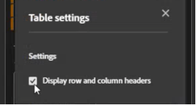

# データブロックの作成

*データブロック*&#x200B;は、単一のデータリクエストによって作成されたデータのテーブルです。Report Builder のワークブックには、複数のデータブロックを含めることができます。データブロックを作成する場合は、まずデータブロックを設定し、次にデータブロックを作成します。

## データブロックの設定

データブロックの場所、レポートスイートおよび日付範囲の初期データブロックパラメーターを設定します。

1.  **[!UICONTROL Create]** を選択します。

   {zoomable="yes"}

1. 「**[!UICONTROL データブロックの場所]**」を設定します。

   「データブロックの場所」オプションは、Report Builderがデータを追加するワークシートの場所を定義します。

   データブロックの場所を指定するには、ワークシート内の 1 つのセルを選択するか、セルのアドレス（`a3`、`\\\$a3`、`a\\\$3`、`sheet1!a2` など）を入力します。 データを取得する際、指定したセルがデータブロックの左上隅になります。

    を使用して、シートで現在選択されているセルからデータブロックの場所を選択します。

1. **[!UICONTROL レポートスイート]** を選択します。

   「レポートスイート」オプションを使用すると、ドロップダウンメニューからレポートスイートを選択したり、セルの場所からレポートスイートを参照したりできます。

    を選択して、セルからレポートスイートを作成します。

1. 「**[!UICONTROL 日付範囲]**」を設定します。

   「**[!UICONTROL 日付範囲]**」オプションでは、日付範囲を選択できます。 日付範囲は、固定でも相対日付でも設定できます。

   **[!UICONTROL カレンダー]** を選択してデータ範囲を選択するか、 を使用して日付範囲を手動で入力します。 必要に応じて、「**[!UICONTROL _プリセットを検索_]**」ドロップダウンメニューからプリセットを選択できます。

   「**[!UICONTROL セルから]**」を選択して、現在のシートのセルに基づいて開始データと終了データを定義します。

   日付範囲オプションについて詳しくは、[&#x200B; 日付範囲の選択 &#x200B;](select-date-range.md) を参照してください。

1. 「**[!UICONTROL 次へ]**」を選択します。

   

   データブロックを設定したら、ディメンション、指標およびセグメントを選択して、データブロックを作成できます。 **[!UICONTROL ディメンション]**、**[!UICONTROL 指標]** および **[!UICONTROL セグメント]** タブは、**[!UICONTROL テーブル]** ペインの上に表示されます。

## データブロックの作成

データブロックを作成するには、レポートコンポーネントを選択してから、レイアウトをカスタマイズします。

1. **[!UICONTROL ディメンション]**、**[!UICONTROL 指標]** および **[!UICONTROL セグメント]** コンポーネントを追加します。

   コンポーネントリストをスクロールするか、「 **[!UICONTROL _コンポーネントを検索_]**」フィールドを使用してコンポーネントを配置します。 コンポーネントを [!UICONTROL &#x200B; テーブル &#x200B;] ペインにドラッグ&amp;ドロップするか、リストでコンポーネント名をダブルクリックして、コンポーネントを [!UICONTROL &#x200B; テーブル &#x200B;] ペインに追加します。

   コンポーネントをダブル選択して、テーブルのデフォルトセクションに追加します。

   - 既に列にディメンションがある場合、Dimension コンポーネントは「 **[!UICONTROL Row]**」セクションまたは「 **[!UICONTROL Column]**」セクションに追加されます。
   - 日付コンポーネントが **[!UICONTROL Column]** セクションに追加されます。
   - セグメントコンポーネントが「**[!UICONTROL セグメント]** セクションに追加されます。
   - 指標コンポーネントが「 **[!UICONTROL 値]** セクションに追加されます。

1. 「テーブル」ペインの項目を配置して、データブロックのレイアウトをカスタマイズします。

   「テーブル」ペインの各リスト内でコンポーネントをドラッグ&amp;ドロップしてコンポーネントを並べ替えるか、 を選択して Move up、Move down などを選択してリスト内のコンポーネントを移動します。

   テーブルにコンポーネントを追加すると、データブロックのプレビューがワークシートのデータブロックの場所に表示されます。テーブル内のアイテムを追加、移動、または削除すると、データブロックプレビューのレイアウトが自動的に更新されます。

   

1. 必要に応じて、**[!UICONTROL 開始日]** をディメンションとして設定し、データブロックの開始日を識別します。 開始データをディメンションとして追加すると、定期的にスケジュールされた、周期的な日付範囲を持つレポートがある場合に役立ちます。 または、従来とは異なる日付範囲があり、開始日を明確にする必要がある場合です。

   

1. 必要に応じて、行ヘッダーと列ヘッダーの表示と非表示を切り替えます。 それには、次の手順を実行します。

   1. **[!UICONTROL Table]** settings アイコンを選択します。

      

   1. 「行と列のヘッダーを表示 **[!UICONTROL するオプションをオンまたはオフ]** します。 ヘッダーはデフォルトで表示されます。

1. オプションで、ディメンションラベルと指標ヘッダーの表示/非表示を切り替えることもできます。 それには、次の手順を実行します。

   1. 次元ラベルまたは列ヘッダーの「」を選択して、コンテキスト・メニューを表示します。

      

   1.  **[!UICONTROL Hide]** または  **[!UICONTROL Show]** を選択して、ディメンション ラベルまたは列ヘッダーを切り替えます。 デフォルトでは、すべてのラベルが表示されます。

1. 「**[!UICONTROL 完了]**」を選択して、データブロックの設定を完了します。

1. 分析データの取得中は、処理メッセージ **[!UICONTROL #BUSY]** が表示されます。

   

1. Report Builder は、データを取得し、完了したデータブロックをワークシートに表示します。

   

>[!MORELIKETHIS]
>
>[レポートスイートの選択](select-report-suite.md)
>[日付範囲を選択 &#x200B;](select-date-range.md)
>[ディメンションのフィルター &#x200B;](filter-dimensions.md)
>[セグメントの操作 &#x200B;](work-with-segments.md)
>

<!--

A *data block* is the table of data created by a single data request. A Report Builder workbook can contain multiple data blocks. When you create a data block, first configure the data block and then build the data block.

## Configure the data block

Configure the initial data block parameters for the data block location, report suite, and a date range.

1. Click **[!UICONTROL Create]**.

    

1. Set the **[!UICONTROL Data block location]**.

    The data block location option defines the worksheet location where report builder adds the data to your worksheet.

    To specify the data block location, select a single cell in the worksheet and click the icon next to **[!UICONTROL Data block location]**: 
    
    You can also enter a cell address such as a3, \\\$a3, a\\\$3 or sheet1!a2. The cell specified marks the upper-left corner of the data block when the data is retrieved.

1. Choose a **Report Suite**.

    The report suites option allows you to choose a report suite from a drop-down menu or to reference a report suite from a cell location.

1. Set the **[!UICONTROL Date range]**.

    The Date range option allows you to choose a date range. Date ranges may be fixed or rolling. For information about data range options, see [Select a Date Range](select-date-range.md).

1. Click **[!UICONTROL Next]**.

    

    After you configure the data block, you can select dimensions, metrics, and segments to build your data block. The Dimensions, Metrics, and Filters tabs are displayed above the Table builder pane.

## Build the data block

To build the data block, select report components, and then customize the layout.

1. Add Dimensions, Metrics, and Segments.

    Scroll the component lists or use the **[!UICONTROL Search]** field to locate components. Drag and drop components to the Table pane or double-click a component name in the list to automatically add the component to the Table pane.

    Double-click a component to add it to a default section of the table.

    - Dimension components are added to the Row section or to the Column section if you have a dimension already in the columns.
    - Date components are added to the Column section.
    - Segment components are added to the Segments section.

    **Start date as a Dimension**

    Set the **[!UICONTROL Start date]** as a dimension to clearly identify the start date of your data block. This is helpful if you have a regularly scheduled report that has a rolling date range or if you have an unconventional date range and you need to be clear on the start date.

    {width="30%"}

1. Arrange the items in the Table pane to customize the layout of your data block.

    Drag and drop components in the Table pane to reorder components or right-click a component name and select from the options menu.

    When you add components to the table, a preview of the data block is displayed at the Data block location in the worksheet. The layout of the data block preview automatically updates as you add, move, or remove items in the table.

    

    **Display or hide row and column headers**

1. Click the **[!UICONTROL Table settings]** icon.

    {width="35%"}

1. Check or uncheck the option to Display row and column headers. The headers are displayed by default.

    **Hide or show dimension labels and metric headers**

1. Click the ellipsis icon on either the dimensions or the column headers to display the settings.

    {width="35%"}

1. Click Hide or Show to toggle the dimension labels or column headers. All labels are displayed by default.

1. Click **[!UICONTROL Finish]**.

    A processing message is displayed while the analytics data is retrieved.

    Report Builder retrieves the data and displays the completed data block in the worksheet.

    

-->