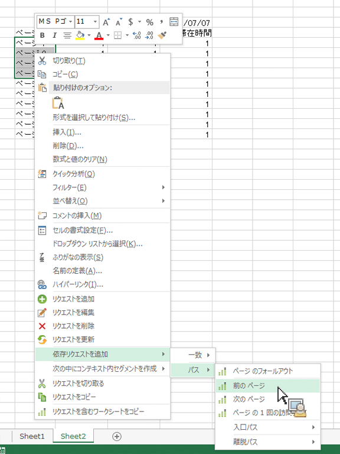

# 依存リクエストの追加によるパスレポートのフィルタリング

事前定義済みのフィルターを使用してパスレポートを作成する方法について説明します。

Reports &amp; Analytics には、[!UICONTROL 次]および[!UICONTROL 前のサイトセクション]レポート、入口および[!UICONTROL 出口サイトセクション]レポート、[!UICONTROL 単一サイトセクション]レポートなど、事前定義済みのフィルターが適用されたトップパスレポートであるスタンドアロンレポートがいくつか用意されています。

Report Builder ではこれらはスタンドアロンレポートとしては提供されていませんが、コンテキストメニューで、**[!UICONTROL 依存リクエストを追加]**／**[!UICONTROL パス]**&#x200B;を選択してこれらを作成できます。次のレポートを使用できます。

* パス／ページのフォールアウト
* パス／入口パス
* パス／離脱パス
* パス／次のページ
* パス／入口パス／次のページ
* パス／前のページ
* パス／離脱パス／前のページ
* パス／入口パス／入口ページ
* パス／離脱パス／出口ページ

1. 既存のリクエストから複数行を選択し、右クリックして、**[!UICONTROL 依存リクエストを追加]**／**[!UICONTROL パス]**&#x200B;を選択します表示する行を 3 つ以上選択する必要があります。 **[!UICONTROL ページフォールアウト]** メニュー項目。

   

2. 「**[!UICONTROL 前のページ]**」など、事前定義済みのフィルターを選択します。

   「前のページ」指標が既に選択された状態でリクエストウィザードが表示されます。1. 引き続きリクエストウィザードでリクエストを絞り込んで、リクエストを生成します。
