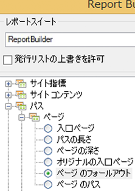
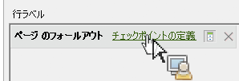

# リクエストウィザードを使用したフォールアウトレポートのフィルター

フィルターを適用してフォールアウトレポートを作成する手順について説明します。

この例では、ページのフォールアウトレポートを示します。

1. In Adobe Report Builder, click **[!UICONTROL Create]** to open the Request Wizard.
1. 適切なレポートスイートを選択します。
1. In the tree view on the left, select **[!UICONTROL Paths]** &gt; **[!UICONTROL Page]** &gt; **[!UICONTROL Page Fallout]**.

   

1. Configure the appropriate [date ranges](../../../../analyze/report-builder/data-requests/configuring-report-dates/custom-calendar.md).
1. Click **[!UICONTROL Next]**.
1. In Step 2 of the Wizard, under **[!UICONTROL Row Labels]**, click the **[!UICONTROL Define Checkpoints]** link. （フォールアウトレポートでは、パターンが事前に適用されているパスレポートとは異なり、常にパスエレメントを定義する必要があります）。

   

1. **[!UICONTROL 「フィルター」]** オプションを選択します。

1. In the **[!UICONTROL Define Site Section Fallout Checkpoints]** dialog, define checkpoints from a range of cells or from a list. Then click **[!UICONTROL OK]**.
1. セルの範囲またはリストのいずれから選択するかを決定します。
1. If you select from a list, click **[!UICONTROL Add]** to select checkpoints to add to the fallout path. 3 ～ 8 件のチェックポイントを定義できます(Search for available elements by clicking **[!UICONTROL More]**.)

   For more information on refining the filter, see [Filter Dimensions](../../../../analyze/report-builder/layout/c-filter-dimensions/filter-dimensions.md#concept_9C0518E2CF604AADA97DDBB1B4ECAAF8). 1. Move **[!UICONTROL Available Elements]** from the left column to the right by selecting them and clicking the orange arrow.
1. Click **[!UICONTROL OK]** three times, then click **[!UICONTROL Finish]**.

   レポートが更新されます。