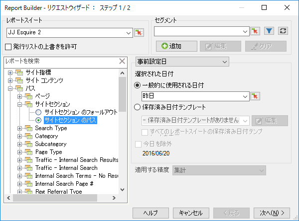
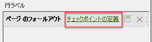
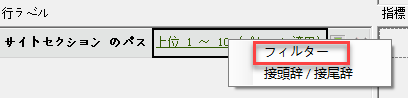
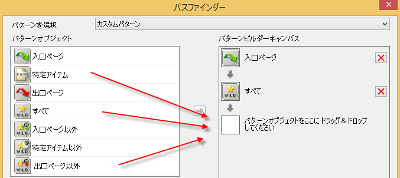
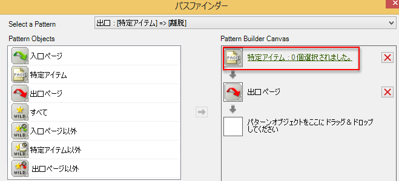
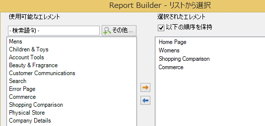

# リクエストウィザードを使用したパスレポートのフィルタリング

フィルターを適用してパスレポートを作成する手順について説明します。

この例では、サイトセクションのパスを使用します。

1. In Adobe Report Builder, click **[!UICONTROL Create]** to open the Request Wizard.
1. 適切なレポートスイートを選択します。
1. In the tree view on the left, select **[!UICONTROL Paths]** &gt; **[!UICONTROL Site Sections]** &gt; **[!UICONTROL Site Section Paths]**.

   

1. 適切な日付を指定します。
1. Click **[!UICONTROL Next]**.
1. In Step 2 of the Wizard, under **[!UICONTROL Row Labels]**, click the **[!UICONTROL Top 1-10 (pattern applied)]** link. パスレポートに、デフォルトでパターンが適用されます。

   

1. **[!UICONTROL 「フィルター」]** オプションを選択します。

   

1. **[!UICONTROL 「サイトセクションパス」のパスパターン]** を定義ダイアログボックスで、
   1. レポートに表示を開始するランク
   1. レポートに表示するエントリ数
1. Click **[!UICONTROL Edit]** to define a path pattern.
1. If you want a custom pattern, drag and drop any **[!UICONTROL Pattern Objects]** from the list on the left into the **[!UICONTROL Pattern Build Canvas]** on the right.

   

1. You can also select a predefined pattern from the **[!UICONTROL Select a Pattern]** drop-down list and modify it. 利用可能なパターンは次のとおりです。

   

   これらのパターンのうち、入口の次、出口の前、次のアイテムの各パターンは、Report Builder に固有のパターンです。
1. 事前定義済みのパターンを編集するには：
   1. パターンを選択します。For example, select the **[!UICONTROL Exited Site Pattern]**: 

   1. ユーザーが離脱する直前のサイトセクションを定義するため、**[!UICONTROL 「特定アイテム」をクリックします。0が選択]**&#x200B;されています。セルの範囲から選択するか（既存のリクエストを編集している場合）、またはセクションのリストから選択して、このパスを定義できます。
   1. To select from a range of cells from a previous request, select **[!UICONTROL From range of cells]** and click the cell selector icon. Then pick the cells from the report. 

   1. To select from a list of site sections, select **[!UICONTROL From list]** and click **[!UICONTROL Add]**.
   1. **[!UICONTROL 「利用可能なエレメント」]** 列からエレメントを選択し、 **[!UICONTROL オレンジ色の矢印をクリックして、「選択可能なエレメント」]** 列に移動します。The click **[!UICONTROL OK]**. 

   1. To save the pattern you just established, click **[!UICONTROL Save]**.
   1. Click **[!UICONTROL OK]** three times and then click **[!UICONTROL Finish]**. フィルターが適用されたパスリクエストが生成されます。
