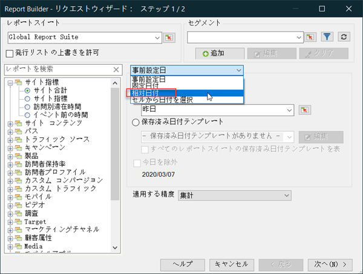
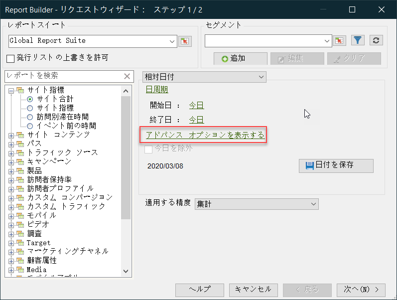
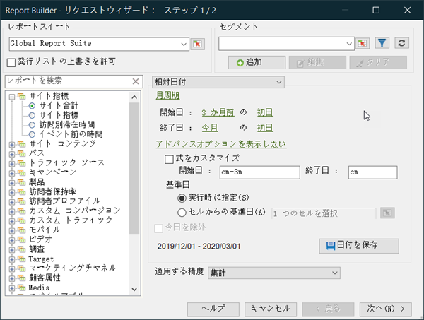
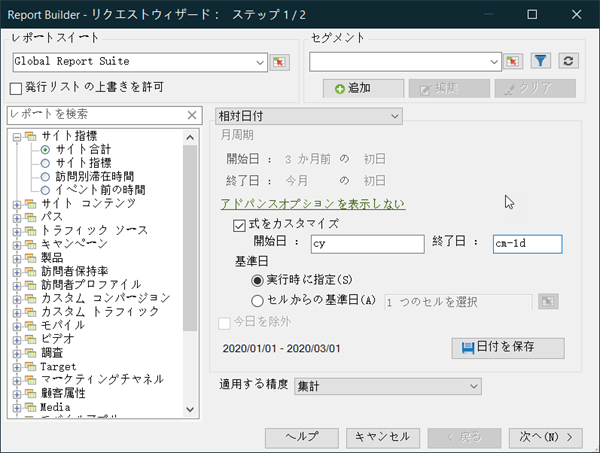

# カスタマイズされた日付式 - 概要

カスタム式を作成して、複雑な日付範囲を指定することができます。

週数と日数を正しく指定するために、式の作成時にカレンダーを参照することをお勧めします。 Excel には、期間の日数、勤務日数、月数、年数を計算できる、様々なビルトイン関数があります。これらの関数を数式で使用して、週や四半期などの他の期間を計算することもできます。

**カスタム式を有効にするには**

**[!UICONTROL 相対日付]**&#x200B;の使用例です。

1. [!UICONTROL リクエストウィザード：手順1]で、「**[!UICONTROL 事前設定日]**」を使用する代わりに、「**[!UICONTROL 相対日付]**」を選択します。

   

1. 周期的な週別、月別、四半期別、年別に切り替えます。 以下のオプションが変化することに注意してください。
1. その他のカスタマイズオプションを表示するには、[**[!UICONTROL アドバンスオプションを表示]**]をクリックします。

   

1. 例えば、上の日付を3か月前の最初の日から今月の初日までの月周期に変更すると、前のオプション部分の日付自体が更新され、次のように反映されます。

   

1. **[!UICONTROL 式のカスタマイズ]**&#x200B;を有効にします。 「**[!UICONTROL 相対日付]**」でオプションを選択すると、カスタムの日付式の構文を簡単に確認できます。

   

   「アドバンスオプション」を使用して、カスタムの日付式を組み合わせて一致させることができます。 例えば、年初から月末までのデータを表示したい場合は、次のように入力できます。`From: cy` `To: cm-1d`。 ウィザードでは、これらの日付は2020年1月1日 —1/31/2020と表示されます。
