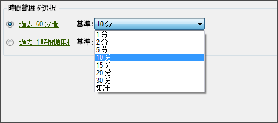

# リアルタイムリクエストの設定

リアルタイムリクエストの日付の設定手順です。

1. Reports &amp; Analytics の[管理ツール](https://marketing.adobe.com/resources/help/en_US/reference/?f=real_time_admin)でリアルタイムレポートが有効であることを確認します。
1. [!UICONTROL リクエストウィザード:手順1]で **[!UICONTROL 、リアルタイムレポート]** / **[!UICONTROL `<report type>`]**

   例えば、「トラフィックレポート」を選択します。リアルタイムレポートのタイプを選択すると、「[!UICONTROL 時間範囲を選択]」オプションが表示されます。

1. 期間を分単位または時間単位で選択します。

   

   リアルタイムレポートは、過去 20 時間分のみ利用できます。精度については、1 分から 30 分までを選択できます。
1. Click **[!UICONTROL Next]** and continue [configuring the request layout](../../../../analyze/report-builder/layout/layout.md#concept_D66E1C2217E24E1F837AC064C61919DB).
