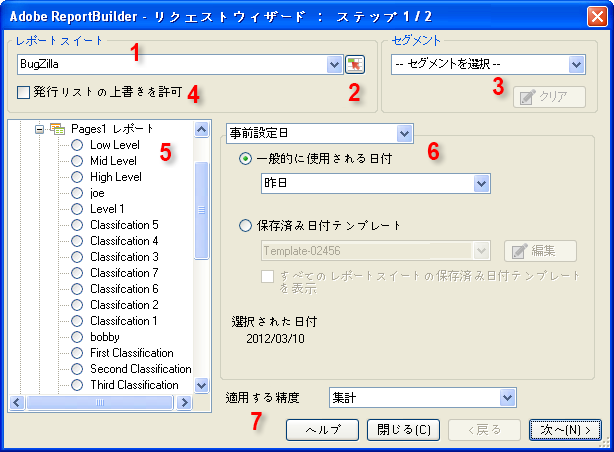

# データリクエスト-リクエストウィザード:ステップ1

リクエストウィザード：ステップ 1 のフォームでは、レポートスイート、レポートタイプ、セグメントおよび設定日を選択します。

1. **[!UICONTROL レポートスイート：]**&#x200B;ログイン中のユーザーが権限を持つレポートスイートのリストです。See [Select Report Suites](../../../analyze/report-builder/data-requests/selecting-report-suites/t-select-report-suites.md#task_59444416F6F042D1998217AE91580913).

1. **範囲選択アイコン**：レポートスイート ID が記入されたセルを選択します。詳しくは、 [レポートスイートの選択](../../../analyze/report-builder/data-requests/selecting-report-suites/t-select-report-suites.md#task_59444416F6F042D1998217AE91580913).

1. **セグメント**：データのカスタムサブセット、または作成した規則でフィルターされたデータです。セグメントはヒット、訪問および訪問者に基づいています。セグメントについて詳しくは、[Analytics セグメントガイド](https://marketing.adobe.com/resources/help/en_US/analytics/segment/)を参照してください。

   例えば、[!UICONTROL ページレポート]を実行し、初回訪問件数セグメントを適用できます。

1. **発行リストの上書きを許可**：レポートをスケジュールする場合、その配信に使用する発行リストを選択できます。Publishing lists are set up in **[!UICONTROL Analytics]** &gt; **[!UICONTROL Admin tools]**. リクエストで指定されたレポートスイートは、発行リストの各受信者に割り当てられるレポートスイート ID に置き換えられます。詳しくは、[発行リストの上書きの許可](../../../analyze/report-builder/data-requests/allow-publishing-list-overrides.md#concept_BCB19A20DC4B4B8D984F9670EE018D8C)を参照してください。

1. **レポートタイプ**：データリクエストで取得するベースのレポートを指定します。リクエストごとに 1 つのレポートを指定します。なお、ベースのレポートに対して複数のディメンションと指標を設定できます。レポートタイプの指標およびディメンションは、「[!UICONTROL リクエストウィザード：ステップ 2]」インターフェイスに表示されます。詳しくは、[「レポートタイプ](../../../analyze/report-builder/data-requests/c-report-types/select-report-types.md#concept_C711B27E6FB64C18AC564EE142FC7EFC)」を選択します。

1. **日付範囲**：リクエストの対象期間を指定します。リクエストの期間には、事前設定、固定、相対など複数のタイプが用意されています。なお、指定できる期間の個数は 366 が最大です。また、セルで指定する日付範囲を選択したり、テンプレートとして日付範囲を保存して再利用したりできます。See [Configuring Report Dates](../../../analyze/report-builder/data-requests/configuring-report-dates/custom-calendar.md)

1. **精度の適用**：日付範囲を分割する単位を指定します。詳しくは、 [精度](../../../analyze/report-builder/data-requests/configuring-report-dates/granularity.md#concept_A13CBA2962E24FF882456135431B7ADB).

>[!MORE_LIKE_THIS]
>
>* [データリクエストの作成](/help/analyze/report-builder/data-requests/t-create-a-data-request.md)