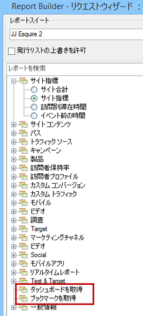

# ブックマークされたレポートおよびダッシュボードレポートレットのインポート

ブックマークされたレポートおよびダッシュボードレポートは、リクエストウィザードの手順 1 でディメンションとして表示され、Report Builder リクエストとしてインポートできるようになりました。

ブックマークされたレポートを選択すると、リクエストウィザードでは、このブックマークされたレポートを定義するすべてのディメンションおよび指標が自動的に選択状態になります。選択されたブックマークに基づいて、日付範囲、精度およびセグメントも更新されます。を参照してください。

リクエストウィザードの手順 1 では、次のようにダッシュボードおよびそのレポートレットが表示されます。

When you click **[!UICONTROL Retrieve your Dashboards]** or **[!UICONTROL Retrieve your Bookmarks]**, your existing dashboard and/or bookmark data is retrieved and pasted in the worksheet.

>[!NOTE]
>
>Report Builderでは、利用可能なダッシュボードとブックマークのリストは、ユーザーに限定されます。また、ウィザードの手順1で選択したレポートスイートに適用されるものにも制限されます。一方、Reports &amp; Analytics では、ユーザーがアクセス可能なブックマークとダッシュボードであれば、これらのダッシュボードとブックマークでどのレポートスイートが使用されるかに関係なく、すべてにアクセスできます。

>[!NOTE]
>
>データのみがインポートされるので、ブックマークにグラフが含まれている場合や、ダッシュボードレポートレットがチャートのみで構成されている場合は、グラフの入力に使用されるデータのみがインポートされます。

ダッシュボードレポートレット（またはブックマーク）をインポートしてリクエストを作成すると、そのリクエストはレポートレット（またはブックマーク）のプライマリディメンションに関連付けられます。その結果、リクエストを編集する場合、ツリービューではダッシュボードレポートレットのツリービューノード（またはブックマークノード）は選択されず、代わりにプライマリディメンションが選択された状態になります。

インポートされたブックマークレットは、レポートスイート、選択されたセグメント、ディメンションおよび選択された指標を、Reports &amp; Analytics のブックマークで公開されているのと同じパラメーターに適切に設定します。

>[!IMPORTANT]
>
>日付範囲は、同じ日付範囲に設定されますが、Reports&amp; Analyticsのブックマークでこの日付範囲が周期的な日付範囲であった場合でも、静的な日付範囲として設定されます。

