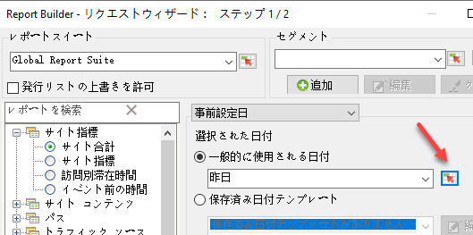
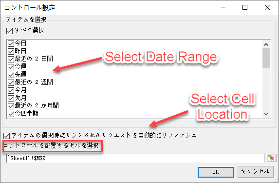
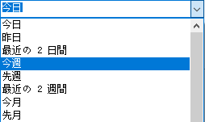
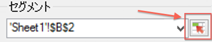
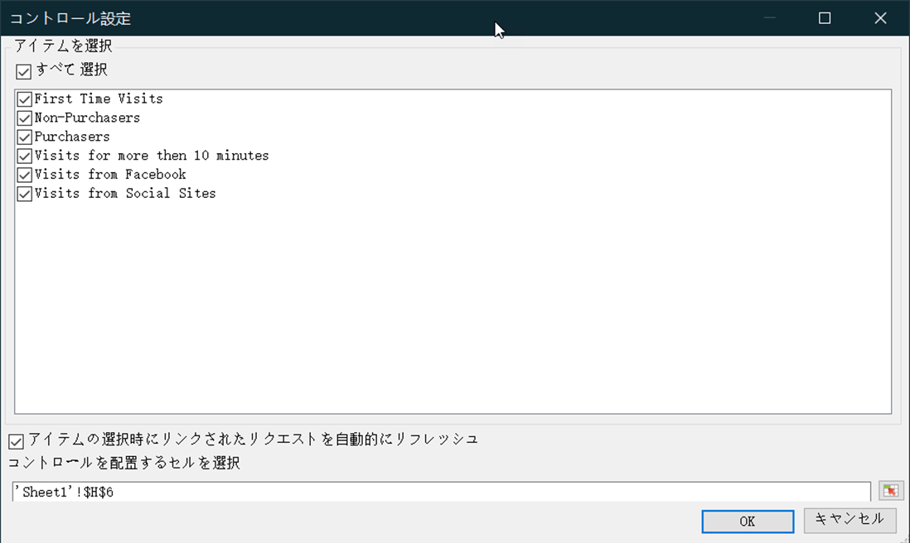
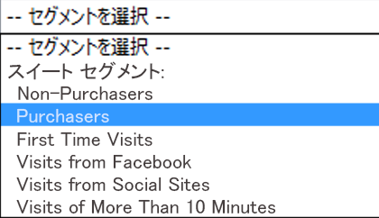

# インタラクティブコントロール

インタラクティブコントロールを使用すると、リクエストのセグメントや日付範囲をワークシートから直接編集できます。これにより、Report Builder リクエストを柔軟に更新できるようになります。

インタラクティブコントロールは、アナリストがワークブックを作成し、作成したワークブックをマーケティング組織と共有するという一般的なワークフローに対応して作成されました。インタラクティブコントロールを使用することで、マーケティング担当者は、Report Builder のしくみを深く理解しなくても、リクエストを変更したり更新したりできます（リクエストを更新するには、ワークブックの受信者が Report Builder ユーザーであることが必要です）。これらのコントロールは、スケジュールされたワークブック内でも動作します。現在、インタラクティブコントロールには 2 種類あります。

* 相対的な日付範囲
* セグメント

>[!IMPORTANT]
>
>インタラクティブコントロールを機能させるには、Report Builder v5.0がインストールされている必要があります。&gt;
>* 古いバージョンの Report Builder を実行している場合や、Report Builder がインストールされていない場合は、インタラクティブコントロールで値を変更することはできますが、関連するリクエストは更新されず、リクエストの関連パラメーターも更新されません。
>* Mac で Excel を実行している場合は、コントロールで値を変更すると、「マクロ 'Adobe.ReportBuilder.Bridge.FormControlClick.Event' が見つかりません」というメッセージが表示されます。
>

>[!IMPORTANT]
>
>コントロールの名前を改ざんしないでください。（名前を確認するには、コントロールにフォーカスを設定すると、Excel グリッドのすぐ上の左上隅にコントロール名が表示されます）。

## Implement interactive date range control {#section_39B228F2D2C44985863D31424C953280}

1. リクエストウィザードの手順 1 で、例えば&#x200B;**[!UICONTROL ページ]レポートを選択します。**
1. 「**[!UICONTROL 一般的に使用される日付]**」ドロップダウンの横にある「**コントロール設定[!UICONTROL 」アイコンをクリックします。]**

   

1. コントロール設定ダイアログボックスで、インタラクティブコントロールに表示するすべての日付範囲アイテムを選択します。さらに、コントロールの左上セルの場所を指定します。

   

1. 「リンクされたリクエストをアイテム選択に基づいて自動的にリフレッシュ」オプションも指定します。

   * このオプションを有効にすると、このコントロールを使用するすべてのリクエストが自動で更新されます。
   * このオプションを有効にしないと、リクエストの設定は更新されますが、リクエストのデータは更新されません。

1. Click **[!UICONTROL OK]**. 指定したセルの場所にコントロールが表示されます。

   

1. これで、日付範囲を変更できるようになります。変更した日付範囲に応じて、リクエストが更新されます。
1. リクエストをコピーし、右クリックして、「リクエストを貼り付け」の 2 つのオプションのうちどちらかを使用できます。

   * **[!UICONTROL リクエスト]** を貼り付け/ **[!UICONTROL 絶対入力セル]**&#x200B;を使用コピーされたリクエストは、元のリクエストと同じインタラクティブ日付範囲コントロールを参照します。

   * **[!UICONTROL リクエスト]**&#x200B;を貼り付け/ **[!UICONTROL 相対入力セル]**&#x200B;を使用コピーされたリクエストは、独自のコントロールを参照します。

      >[!NOTE]
      >
      >ネイティブのMicrosoft Excel切り取り/コピー/貼り付けコントロール機能を使用できます。Report Builder は貼り付けによって追加されたコントロールを自動的に認識します。

## Implement interactive segment control {#section_5003D3F724644280BF1BCD6E1B0CB784}

インタラクティブなセグメントコントロールの実装方法は、日付範囲コントロールの実装と同様です。

1. リクエストウィザードの手順 1 で、「**[!UICONTROL セグメント]」ドロップダウンリストの横にある「セグメントコントロール設定」アイコンをクリックします。**

   

1. セグメントコントロール設定ダイアログボックスで、ドロップダウンに含めるセグメントを選択します。さらに、コントロールの左上セルの場所を指定します。

   

1. 新しいインタラクティブコントロールがワークブック上に表示されます。

   

