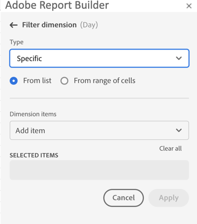
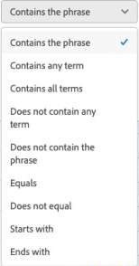
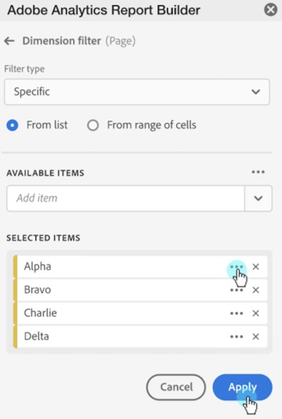

# ディメンションのフィルタリング

デフォルトでは、テーブルの各ディメンション項目は、そのディメンションの上位 10 項目を返します。

各ディメンションに対して返されるディメンション項目を変更するには：

1. データブロックのセルを選択します。

1.  パネルの「**[!UICONTROL 編集]****[!UICONTROL データブロックの編集]** を選択します。

1. 「**[!UICONTROL 次へ]**」を選択して、「**[!UICONTROL ディメンション]**」タブを表示します。

1. テーブルのコンポーネント名の横にある  を選択します。

   {zoomable="yes"}

1. ポップアップメニューで「**[!UICONTROL フィルターディメンション]**」を選択し、「**[!UICONTROL フィルターディメンション]**」ペインを表示します。

1. **タイプ** として **一番人気** または **[!UICONTROL 特定]** を選択します。

   {zoomable="yes"}

1. 選択した [ フィルタータイプ ](#filter-type) に基づいて適切なオプションを選択します。

1. 「**[!UICONTROL 適用]**」を選択して、フィルターを追加します。

1. Report Builder は、追加したフィルターを確認する通知を表示します。

適用したフィルターを表示するには、ディメンションの上にカーソルを合わせます。フィルターが適用されたディメンションには、ディメンション名の横に  フィルターアイコンが表示されます。

## フィルターと並べ替え順序の変更

データブロックのフィルタリングと並べ替えに使用する指標の横に  または  が表示されます。 矢印の方向は、指標を昇順または降順で並べ替えるかどうかを示します。

並べ替え順を変更するには：

- 指標の横にある  または  を選択して、並べ替え順を切り替えます。

データブロックのフィルタリングと並べ替えに使用する指標を変更するには：

1. テーブルビルダーで目的の指標コンポーネントにカーソルを合わせると、追加のオプションが表示されます。

2. 目的の指標に対して  を選択します。

   {zoomable="yes"}

## フィルタータイプ

ディメンション項目をフィルタリングする方法には、「一番人気 [ と ](#most-popular) 特定 [ の 2 つがあり ](#specific-filtering) す。

### **[!UICONTROL 一番人気]**

「**[!UICONTROL 一番人気]**」オプションを使用すると、指標値に基づいてディメンション項目を動的にフィルタリングできます。 「一番人気」では、指標値に基づいて、最もランクの高いディメンション項目を返します。 デフォルトでは、最初の 10 個のディメンション項目が、データブロックに追加された最初の指標によって並べ替えられ、一覧表示されます。

{zoomable="yes"}

#### ページと行のオプション

「**[!UICONTROL ページ]**」および「**[!UICONTROL 行]**」フィールドを使用して、データをシーケンシャルグループまたはページに分割します。この機能を使用すると、最上位の値以外のランク付けされた行の値をレポートに取り込むことができます。 また、50,000 行の制限を超えるデータを取り込む場合に特に便利です。

ページのデフォルトは `1` で、行のデフォルトは `10` です。 これらのデフォルトは、各ページに 10 行のデータがあることを意味します。 ページ 1 は上位 10 項目を返し、ページ 2 は次の 10 項目を返します。

下のテーブルに、ページと行の値の例と、結果の出力を示します。

| ページ | 行 | 出力 |
|------|--------|----------------------|
| 1 | 10 | 上位 10 項目 |
| 2 | 10 | 項目 11 ～ 20 |
| 1 | 100 | 上位 100 項目 |
| 2 | 100 | 101 ～ 200 番目の項目 |
| 2 | 50,000 | 50,001 ~ 100,000 番目の項目 |

次の表に、ページと行の最小値と最大値を示します。

|       | 最小値 | 最大値 |
|-------|---------------:|---------------:|
| 開始ページ | 1 | 5,000 万 |
| 行数 | 1 | 50,000 |

#### 「値なし」を含める

Customer Journey Analyticsでは、一部のディメンションは *値なし* エントリを収集します。 **[!UICONTROL 「値なし」を含める]** 設定を使用すると、これらの値をレポートから除外できます。 例えば、製品の SKU キーに基づく製品名の分類などの分類を作成できます。特定の製品 SKU が特定の製品名分類で設定されていない場合、その製品名の値は *値なし* に設定されます。

デフォルトでは **[!UICONTROL 「値なし」を含める]** が選択されています。 値なしのエントリを除外するには、このオプションの選択を解除します。

#### 条件でフィルタリング

ディメンション項目は、すべての条件を満たしているか、またはいずれかの条件を満たしているかに基づいてフィルタリングできます。

フィルター条件を設定するには：

1. オペレータードロップダウンメニューからオペレーターを選択します。 デフォルトでは **[!UICONTROL フレーズを含む]** が選択されています

   {zoomable="yes"}

1. 検索語句を入力します。

1. **[!UICONTROL 行を追加]** を選択して選択を確定し、別の条件項目を追加します。

1.  を選択して、条件項目を削除します。

最大 10 個の条件項目を含めることができます。

### **[!UICONTROL 固有]**

「**[!UICONTROL 特定]**」オプションを使用すると、各ディメンションに固定のディメンション項目のリストを作成できます。 「**[!UICONTROL 特定]**」のフィルタリングタイプを使用して、フィルターに含める正確なディメンション項目を指定します。リストまたはセル範囲から項目を選択できます。

{zoomable="yes"}

#### リストから

1. 「**[!UICONTROL リストから]**」オプション選択して、ディメンション項目を検索および選択します。

   「**リストから**」オプションを選択すると、**[!UICONTROL Dimension items]** リストには、イベント数で並べ替えられたディメンション項目が入力されます。

   {zoomable="yes"}

1.  **[!UICONTROL _項目を追加_]** に検索語句を入力してリストを検索します。

1. 過去 90 日間のデータに含まれていない項目を検索するには、「**[!UICONTROL 過去 6 か月間の項目を表示]**」を選択して、検索範囲を広げます。 過去 6 か月のデータの読み込み後、Report Builderは「**[!UICONTROL 過去 18 か月間の項目を表示]** へのリンクを更新します。

1. **[!UICONTROL 選択した項目]** リストから項目を削除するには、「」を選択します。

1. **[!UICONTROL 選択した項目]** リスト内の項目を移動するには、項目をドラッグ&amp;ドロップするか、 を選択してコンテキストメニューを表示し、移動オプションから選択します。

1. 「**[!UICONTROL 適用]**」を選択します。

Report Builder はリストを更新し、適用した特定のフィルタリングを表示します。

#### セルの範囲から

「**セルの範囲から**」オプションを選択して、一致するディメンション項目のリストを含むセルの範囲を選択します。

{zoomable="yes"}

セルの範囲を選択する場合は、次の制限事項を考慮してください。

- 範囲には少なくとも 1 つのセルが必要です。
- 50,000 個を超えるセルを範囲に含めることはできません。
- 範囲は、連続した単一の行または列にする必要があります。

選択範囲には、空のセルまたは特定のディメンション項目と一致しない値を持つセルを含めることができます。

### ディメンションをすばやくフィルタリングします

現在フィルターが適用されていないディメンションをフィルタリングするには：

1. ディメンションの場合は、「」を選択します。 例えば、**[!UICONTROL インタラクションチャネル]** などです。

1. フィルターに追加するディメンション項目をダブルクリックします。 または、1 つ以上のディメンション項目を選択し、選択範囲を **[!UICONTROL Row]** セクションにドラッグ&amp;ドロップします。

   {zoomable="yes"}

<!--

By default, each dimension item in the table returns the top 10 items for that dimension.

To change the dimension items returned for each dimension

1. Click **[!UICONTROL Manage]** and select a data block from the list.

   

1. Click **[!UICONTROL Edit data block]** in the COMMANDS panel.

1. Click **[!UICONTROL Next]** to display the Dimensions tab.

1. Click the **...** icon next to a component name in the table.

    

1. Select **[!UICONTROL Filter dimension]** in the pop-up menu to display the **[!UICONTROL Filter dimension]** pane.

1. Select **[!UICONTROL Most popular]** or **[!UICONTROL Specific]**.

    

1. Select appropriate options based on the filter type chosen.

1. Click **[!UICONTROL Apply]** to add the filter.

    Report Builder displays a notification to confirm the added filter.

To display applied filters, hover over a dimension. Dimensions with applied filters display a filter icon to the right of the Dimension name.

## Filter Type

There are two ways to filter dimension items: Most popular and Specific.

## Most popular

The [!UICONTROL Most popular] option allows you to dynamically filter dimension items based on metric values. [!UICONTROL Most popular] filtering returns the highest ranked dimension items based on metric values. By default, the first 10 dimensions items are listed, sorted by the first metric added to the data block.

 

### Page and Rows options

Use the **Page** and **Rows** fields to divide data into sequential groups or pages. This allows you to pull ranked row values other than the top-most values into your report. This feature is especially useful for pulling data beyond the 50,000 row limit.

#### Page and Rows defaults

- Page = 1
- Rows = 10

The Page and Rows default settings identify that each page has 10 rows of data. Page 1 returns the top 10 items, page 2 returns the next 10 items, and so on.

The table below lists examples of page and row values and the resulting output.

| Page | Row    | Output               |
|------|--------|----------------------|
| 1    | 10     | Top 10 items         |
| 2    | 10     | Items 11-20          |
| 1    | 100    | Top 100 items        |
| 2    | 100    | Items 101-200        |
| 2    | 50,000 | Items 50,001-100,000 |

#### Minimum and maximum values

- Starting page: Min = 1, Max: 50 million
- Number of rows: Min = 1, Max: 50,000

### Include "No value"

In Adobe Analytics, some dimensions collect a "no value" entry. This filter allows you to exclude these values from reports. For example, you can create a classification such as the Product Name classification based on the Product SKU key. If a specific product SKU has not been set up with its specific Product Name classification, its Product Name value is set to "no value".

Include "**No value**" is selected by default. Deselect this option to exclude entries with no value.

### Filter by Criteria

You can filter dimension items based on whether all criteria are met or if any criteria are met.

To set filtering criteria

1. Select an operator from the drop-down list.

    

1. Enter a value into the search field.

1. Click **[!UICONTROL Add row]** to confirm the selection and add another criteria item.

1. Click the delete icon to remove a criteria item.

    You can include up to 10 criteria items.

### Change the filter and sort order

An arrow appears next to the metric used to filter and sort the data block. The direction of the arrow indicates whether the metric is sorted greatest to least or least to greatest.

To change the sort direction, click the arrow next to the metric.

To change the metric used to filter and sort the data block,

1. Hover over the desired metric component in the Table builder to display additional options.

2. Click the arrow on the preferred metric.

   

## Specific filtering

The Specific option allows you to create a fixed list of dimension items for each dimension. Use the **[!UICONTROL Specific]** filtering type to specify the exact dimension items to include in your filter. You can select items from a list or from a range of cells.

### From list

1. Select the **[!UICONTROL From list]** option to search for and select dimension items.

    When you select the **[!UICONTROL From list]** option, the list is populated with dimension items with the most events first.

    

    The **[!UICONTROL Available items]** list is ordered from dimension items with the most events to those with the least.

1. Enter a search term in the **[!UICONTROL Add item]** field to search the list.

1. To search for an item not included in the last 90 days of data, click **[!UICONTROL Show items for the last 6 months]** to extend the search.

    

    After data from the past 6 months loads, Report Builder updates the link to **[!UICONTROL Show items for last 18 months]**.

1. Select a dimension item.

    Selected dimension items are automatically added to the **[!UICONTROL Selected items]** list.

    

    To delete an item from the list, click the delete icon to remove the item from the list.

    To move an item in the list, drag and drop the item or click ... to display the move menu.

    

1. Click **[!UICONTROL Apply]**

    Report Builder updates the list to show the specific filtering you applied.

### From range of cells

Select the **[!UICONTROL From range of cells]** option to choose a range of cell that contain the list of dimensions items to match.

 

When you select a range of cells, consider the following restrictions:

- The range must have at least one cell.
- The range can't have more than 50,000 cells.
- The range must be in a single uninterrupted row, or column.

Your selection can contain empty cells or cells with values that don't match with a specific dimension item.

### From the Dimensions tab in the Table builder

From the **[!UICONTROL Dimensions]** tab, click the chevron icon next to a dimension name to view the list of dimension items.

 

You can drag and drop items onto the **[!UICONTROL Table]** or double-click an item name to add it to the **[!UICONTROL Table]** builder.

-->