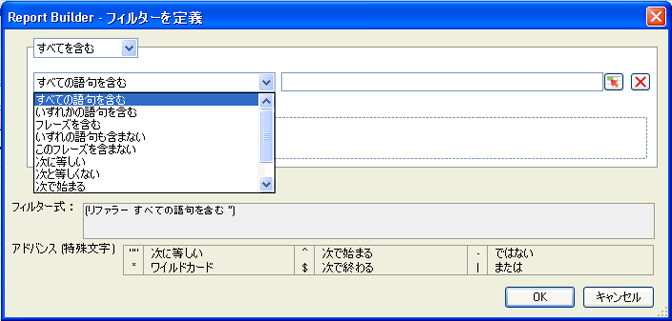

# ディメンションフィルターの概要

ディメンションに対して、フィルターを設定できます。フィルターによって、表示されるディメンションのデータが絞り込まれます。フィルターは、ピボットレイアウトまたはカスタムレイアウトで適用できます。ピボットレイアウトからディメンションフィルターを設定する際は、さらにセルから表示エントリ数を指定することができます。

選択されたフィルターフォームに、Report Builder リクエストで選択されたエレメントおよび指標に基づいて値が入力されます。

## Define filter - values and special characters {#section_15840216A4044C40974945FAA435AD93}

Information about filters in the **[!UICONTROL Most Popular Filter]** &gt; **[!UICONTROL Define Filter]** panel.

次の表に、フィルターの例とフィルターについての情報を示します。

<table id="table_8AC3A26FF02143DBA949B30F2A46CF11"> 
 <thead> 
  <tr> 
   <th colname="col1" class="entry"> フィルター </th> 
   <th colname="col02" class="entry"> 説明 </th> 
   <th colname="col2" class="entry"> フィルターの例 </th> 
   <th colname="col3" class="entry"> フィルタリング結果 </th> 
  </tr> 
 </thead>
 <tbody> 
  <tr> 
   <td colname="col1"> 
すべての語句を含む 
 </td> 
   <td colname="col02"> 
スペースで区切られた値すべて（順不同）を含むデータを抽出します。 
 </td> 
   <td colname="col2"> 
a b c 
 </td> 
   <td colname="col3"> 
抽出される:  ab  cand b a c，など。 
 </td> 
  </tr> 
  <tr> 
   <td colname="col1"> 
いずれかの語句を含む 
 </td> 
   <td colname="col02"> 
スペースで区切られた値の少なくとも 1 つを含むデータを抽出します。 
 </td> 
   <td colname="col2"> 
A B C 
 </td> 
   <td colname="col3"> 
抽出される:  A1、  B2、  C3、 D4は含まれません。 
 </td> 
  </tr> 
  <tr> 
   <td colname="col1"> 
フレーズを含む 
 </td> 
   <td colname="col02"> 
フレーズを含むデータを抽出します。フレーズ以外の語句が付加される場合もあります。 
 </td> 
   <td colname="col2"> 
abc 
 </td> 
   <td colname="col3"> 
抽出される:  abc 、  abc def。 
 </td> 
  </tr> 
  <tr> 
   <td colname="col1"> 
いずれの語句も含まない 
 </td> 
   <td colname="col02"> 
指定した値を含まないデータをすべて抽出します。 
 </td> 
   <td colname="col2"> 
a b c 
 </td> 
   <td colname="col3"> 
抽出される:  d e f 、  c d e fではない。 
 </td> 
  </tr> 
  <tr> 
   <td colname="col1"> 
このフレーズを含まない 
 </td> 
   <td colname="col02"> 
指定したフレーズを含まないデータをすべて抽出します。 
 </td> 
   <td colname="col2"> 
abc 
 </td> 
   <td colname="col3"> 
抽出されない：  abc、abc def  、および defに一致しま  す 
 </td> 
  </tr> 
  <tr> 
   <td colname="col1"> 
次に等しい 
 </td> 
   <td colname="col02"> 
指定した値と完全に一致するデータを抽出します。 
 </td> 
   <td colname="col2"> 
abc 
 </td> 
   <td colname="col3"> 
  abcが返さ れ、他には何も返されません。 
 </td> 
  </tr> 
  <tr> 
   <td colname="col1"> 
等しくない 
 </td> 
   <td colname="col02"> 
指定した値と一致しないデータをすべて抽出します。 
 </td> 
   <td colname="col2"> 
a 
 </td> 
   <td colname="col3"> 
次に一致しないすべてのデータが抽出される：  a. 
 
Matches  a b c. 
 
abcに一致  します。 
 </td> 
  </tr> 
  <tr> 
   <td colname="col1"> 
次の語句で始まる 
 </td> 
   <td colname="col02"> 
指定した値で始まるデータを抽出します。 
 </td> 
   <td colname="col2"> 
abc 
 </td> 
   <td colname="col3"> 
抽出される:  abcd ,  not 1abc 
 </td> 
  </tr> 
  <tr> 
   <td colname="col1"> 
次の語句で終わる 
 </td> 
   <td colname="col02"> 
指定した値で終わるデータを抽出します。 
 </td> 
   <td colname="col2"> 
xyz 
 </td> 
   <td colname="col3"> 
抽出される:  wxyz (  wxyz0は除く) 
 </td> 
  </tr> 
  <tr> 
   <td colname="col1"> 
アドバンス（特殊文字） 
 </td> 
   <td colname="col02"> 
正規表現用の文字を使用できます。 
 
 <code> "", ^, -, *, $, | </code> 
 </td> 
   <td colname="col2"> 
"^ホーム*ページ$" | スポーツ 
 </td> 
   <td colname="col3"> 
 このフィルタでは  Home, and then looks for zero or more characters, and then ends with  Page. 
 
また、スポーツが含まれ  るページ 。 
 
抽出結果の例： 
 
    <ul id="ul_72D76C5AFEAF405E8A0E4E3C604D10AE"> 
     <li id="li_4D490059B667450DA8A0103167C7B391">ホームページ </li> 
     <li id="li_1351619156274092AEB2771D882AD357">ホーム および (その他の文字列) ページ </li> 
     <li id="li_940EAA99A8CF49308E8471065EB317B1">ホーム スポーツ </li> 
     <li id="li_50A895F14A454BE9BF06EE0F07F99B3B">スポーツ ページ </li> 
     <li id="li_F3CE0D07941D4C2485D2DE0B73E00677">スポーツ </li> 
     <li id="li_E84C15C061824A5D922D9900392F2996">xyz スポーツ abc </li> 
    </ul> </td> 
  </tr> 
 </tbody> 
</table>

<table id="table_8BBB06C8860745DEA41B39673699DC0F"> 
 <thead> 
  <tr> 
   <th colname="col1" class="entry"> 特殊文字 </th> 
   <th colname="col2" class="entry"> 目的 </th> 
   <th colname="col3" class="entry"> メモ </th> 
  </tr> 
 </thead>
 <tbody> 
  <tr> 
   <td colname="col1"> " " </td> 
   <td colname="col2"> 次に等しい </td> 
   <td colname="col3"> 
単独で（ペアでなく）使われる場合はエスケープされません。例えば、 17イン  チディスプレイ （17インチ）はフレーズではありません。 
 </td> 
  </tr> 
  <tr> 
   <td colname="col1"> * </td> 
   <td colname="col2"> ワイルドカード </td> 
   <td colname="col3"> 
通常の正規表現で使われるアスタリスクと同じです。 
 </td> 
  </tr> 
  <tr> 
   <td colname="col1"> ^ </td> 
   <td colname="col2"> 次の語句で始まる </td> 
   <td colname="col3"> </td> 
  </tr> 
  <tr> 
   <td colname="col1"> $ </td> 
   <td colname="col2"> 次の語句で終わる </td> 
   <td colname="col3"> </td> 
  </tr> 
  <tr> 
   <td colname="col1"> - </td> 
   <td colname="col2"> NOT </td> 
   <td colname="col3"> </td> 
  </tr> 
  <tr> 
   <td colname="col1"> | </td> 
   <td colname="col2"> OR </td> 
   <td colname="col3"> 
サポートされるのは アドバ  ンス（特殊文字）フィルタ 。 
 </td> 
  </tr> 
 </tbody> 
</table>
