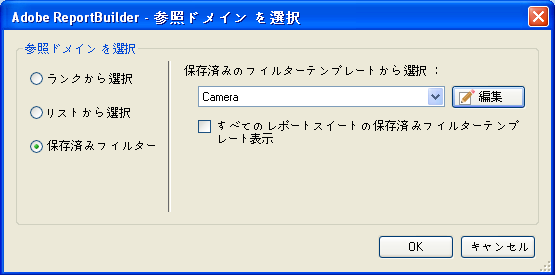

# 保存済みフィルター

Report Builder にフィルターのパラメーターを保存して、他のワークシートまたはワークブックで使用できます。これらのパラメーターは、他のコンピューターや他の Report Builder ユーザーが使用できるように Analytics サーバー上に保存されます。

フィルターを作成するときには、「[!UICONTROL ページを選択]」フォームでフィルターを保存します。この手順の例については、[固有フィルター](/help/analyze/report-builder/layout/c-filter-dimensions/t-specific-filters.md)を参照してください。

