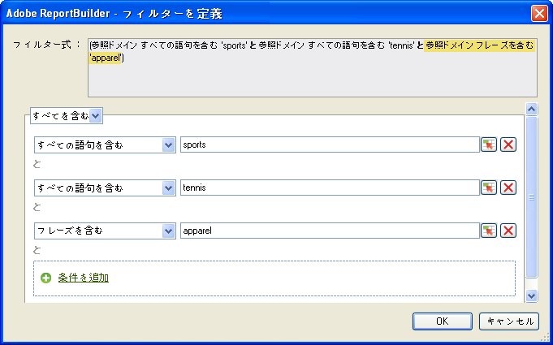
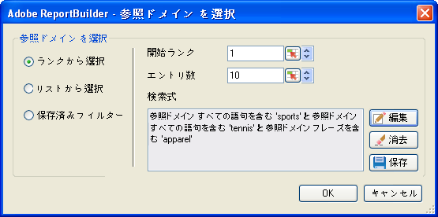

# 最頻使用フィルター

Boolean ロジックと AND／OR 検索式を使用して設定する、ランキングおよび条件フィルター。

最頻使用フィルターは、Boolean ロジックと AND／OR 条件を使用して設定する式フィルターです。「[!UICONTROL  を含まないページ&#x200B;]*`<product name>`*」、「[!UICONTROL すべてを含む]」、「[!UICONTROL いずれかを含む]」、「[!UICONTROL すべてを除外]」などの条件を設定できます。現在のワークブックや他のワークブックで使用する他のリクエスト用に、これらの式を[保存](/help/analyze/report-builder/layout/c-filter-dimensions/saved-filters.md)することができます。

**最頻使用フィルターを作成するには**

1.  リクエストを作成または編集して、[!UICONTROL リクエストウィザード：ステップ 2] に進みます。

   

1.  [!UICONTROL リクエストウィザード：ステップ 2] で、グリッド内のディメンションの隣にあるリンクをクリックし、「**[!UICONTROL フィルター]**」を選択します。
1.  「[!UICONTROL ページを選択]」フォームで、「**[!UICONTROL ランクから選択]**」を有効にして、次のオプションを設定します。

   **開始ランク：**&#x200B;ディメンションの表示開始位置です。デフォルトのランクである「1」は、レポートされるデータのリストの最上位項目を示します。例えば、「[!UICONTROL ページ]」ディメンションで開始マーク「1」を指定した場合、サイトで「最も」リクエストの多いページを示します。開始ランクセルには 10 などの他の値を指定することもできます。これにより、「10」位以降の項目が表示されます。指標は降順に並べられます。このため、最大のアクティビティがある行項目が、リストの最初に表示されます。最大行数である 50,000 を超える項目を取得したい場合は、リクエストをコピーして開始ランクを変更することで、50,000 の単位で大量のデータを取得することができます。

   **エントリ数：**（[!UICONTROL ピボットレイアウト]のみ）表示される項目数を指定します。1 つの指標に対して何百ものエントリを表示する指標もあれば、数個のエントリのみを表示する指標もあります。例えば、「[!UICONTROL サイトセクション]」ディメンションでは、エントリ数を 25 に指定すると、最も多く訪問された上位 25 のサイトセクションがレポートされます。

   矢印アイコンをクリックすると、シート内の最初のデータポイントである「[!UICONTROL 開始ランク]」と「[!UICONTROL エントリ数]」を変更することができます。デフォルトでは、「[!UICONTROL 開始ランク]」が 1、「[!UICONTROL エントリ数]」が 10 に設定されます。これらの値は、最小 1、最大 50,000 の間で調整できます。「[!UICONTROL エントリ数]」の最大値は、指標やディメンションにより異なります。負の数やゼロをこれらのフィールドに入力することはできません。「[!UICONTROL 開始ランク]」として 15 を、また「[!UICONTROL エントリ数]」として 10 を選択すると、最も訪問されたページとして 10 ページ分が返され、その中で一番訪問されたページは、指定した日付範囲のリストの 15 番目のものになります。つまり、最も訪問されたページの上位 15 位から 25 位までにランクされたすべてのページが、降順で表示されます。

   >[!NOTE]
   >
   >既存のリクエストにフィルターを適用すると、表示されているデータが変更されます。セル $A$1 から $A$10 にかけて、上位 10 [!UICONTROL ページ]をマッピングし、「[!UICONTROL 開始ランク]」に 1、「[!UICONTROL エントリ数]」に 10 を入力しているとします。「[!UICONTROL 開始ランク]」に 1、「[!UICONTROL エントリ数]」に 3 のみを表示するように値を変更した場合、セル $A$4 から $A$10 に表示されていたデータは表示されなくなります。

1. 検索式を作成するには、「**[!UICONTROL 追加]**」をクリックします。

   

1. 「[!UICONTROL フィルターを定義]」フォームで、必要に応じて条件を設定します。

    をクリックすると、セルの値に定義された条件が示されます。

   **条件を追加：**&#x200B;式に条件を追加します。追加できる条件の数に制限はありません。

1. 「**[!UICONTROL OK]**」をクリックします。

   

1. 「[!UICONTROL ページを選択]」で「**[!UICONTROL 保存]**」をクリックし、式を保存します。
1. 「**[!UICONTROL OK]**」をクリックします。
