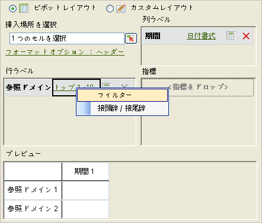
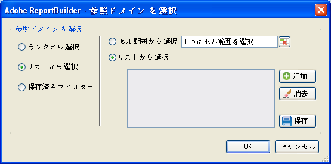

# 特定のフィルター

値を直接指定するフィルターです。

条件に厳密に一致するフィルターを作成することにより、特定のディメンション項目を検索できます。For example, you can create the following type of filter: page in [!DNL homepage.htm], [!DNL contact_us.html], [!DNL corporate_info.html].

**特定のフィルターを作成するには**

1.  リクエストを作成または編集して、[!UICONTROL リクエストウィザード：ステップ 2] に進みます。

   

1. [!UICONTROL リクエストウィザード:手順2]で、グリッド内のディメンションの横にあるリンクをクリックし、「フィルター」を選択 ****&#x200B;します。

   

1. **[!UICONTROL 「特定の」を有効に]**&#x200B;して、次のいずれかのオプションを有効にします。

   * **セル範囲から選択：**&#x200B;セルからデータを選択します。以下を選択できます。
   * **範囲内のすべてのセル：**&#x200B;範囲内のすべてのセルからフィルター条件を読み取ります。説明テキストでは、選択する必要のあるセルのグループ数が指定されます。隣接しない複数の領域を指定するには、Ctrl キーを押しながらセル範囲を指定します。マッピングする必要のある範囲に含まれるセルが 1 つのみである場合は、使用できるのはこのオプションだけになります。
   * **範囲の最初のセル：**&#x200B;選択する必要があるのは、範囲の左上のセルのみで、次に、データの方向を指定します。また、リクエストに複数の期間が含まれる場合、期間の方向を選択して、期間と期間の間のセルをいくつかスキップするかどうかを選択します。
   * **リストから選択：**&#x200B;データの追加先のリストからデータを選択します。
1. If you enable **[!UICONTROL From List]**, select any available listed items or click **[!UICONTROL Add]**.

   「**[!UICONTROL 追加]**」をクリックすると、「[!UICONTROL リストから選択]」フォームに現在のリクエストの日付範囲で使用可能なディメンションの値のリストが表示されます。このリストが表示する項目は最初の 10,000 項目に制限されます。これらの項目を検索することもできます。または、「**[!UICONTROL その他...]**」をクリックして[!UICONTROL 「検索」フォーム]を表示し、ディメンションのより詳細な検索を行います。
1. On the [!UICONTROL Select From List], click **[!UICONTROL OK]**.
1. On the [!UICONTROL Choose Page] form, save your Specific filter if you want, then click **[!UICONTROL OK]**.
