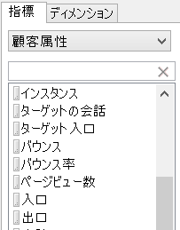
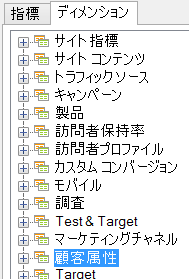

# 顧客属性

顧客属性は、VisAttr という名前の新たなタイプの要素に保存されます。これはディメンションまたは指標として選択できます。

顧客属性をアップロードする方法について詳しくは、「[Experience Cloud ヘルプ](https://marketing.adobe.com/resources/help/en_US/mcloud/attributes.html)」を参照してください。

* 指標として設定する場合、VisAttr は「ディメンション」と指標の両方として表示されます。

    

* eVar と同様の分類（クロス集計）が可能です（どの項目も任意の項目で分類できます）。
* VisAttr では eVar に追加可能なすべての指標がサポートされています。
* 指標としての VisAttr では、「グループ化」（例えば、サイトでの滞在時間：0 ～ 30、31 ～ 60 など）がサポートされています。
* VisAttr はセグメントディメンションとしても利用できます。

