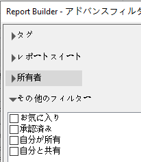

# 計算指標

Report Builder5.2 では、Adobe Analyticsを統合した計算指標がサポートされています。 これにより、すべての計算指標にグローバル ID が付けられ、複数のレポートスイートで使用することができるようになりました。

>[!NOTE]
>
>既存のワークブックでは、従来の指標 ID の付いたリクエストを参照している場合があります。Report Builder 5.2 を使用すると、既存のワークブックでは従来の指標 ID が新しいグローバル ID に変換されます。Report Builder 5.1 を使用しているユーザーと共有した場合、計算指標は共有先で表示されません。

新しい計算指標ビルダーおよび計算指標マネージャでの計算指標の作成と管理方法について詳しくは、[計算指標](https://experienceleague.adobe.com/docs/analytics/components/calculated-metrics/cm-overview.html?lang=ja)ガイドを参照してください。

リクエストウィザードのステップ 2 では、計算指標へのフィルター設定と計算指標の適用ができます。

## 計算指標へのフィルター設定 {#section_376E986D3E684999A7CDB08E53854159}

**フィルター** 計算指標を選択するには、フィルターアイコンをクリックします。  

アドバンスフィルターダイアログに、標準指標と計算指標の両方が入力されます。

次のフィルターを利用できます。

| フィルター名 | 説明 |
|---|---|
| タグ | 特定のタグで計算指標にフィルターを設定できます。タグフィルターでは、AND 演算子が使用されます。2 つのタグを選択すると、右パネルに&#x200B;**両方の**&#x200B;タグが付いた指標が表示されます。 |
| レポートスイート | 「*レポートスイート名*&#x200B;のみ」フィルターを [!DNL Reports & Analytics] の Calculated Metric Builder で適用し、[!DNL Report Builder] でアドバンスフィルターを表示すると、アドバンスフィルターでは、選択されたレポートスイートの計算指標のみが表示されます。 |
| 所有者 | 所有者フィルターを設定できます。所有者フィルターでは、OR 演算子が使用されます。2 人の所有者を選択すると、右パネルに&#x200B;**いずれかの**&#x200B;所有者が所有する指標が表示されます。 |
| その他のフィルター／承認済み | 正式に承認された指標が表示されます。 |
| その他のフィルター／お気に入り | お気に入りに登録した指標が表示されます。 |
| その他のフィルター／自分が所有 | 自分が所有するすべての指標が表示されます。 |
| その他のフィルター／自分と共有 | 自分と共有されているすべての指標が表示されます。 |

## 計算指標の適用 {#section_DF5CF349460A45FDA4B6E6BB8B52F18E}

フィルターを選択した後、**[!UICONTROL 適用]**&#x200B;をクリックすると、リクエストに計算指標が適用されます。選択した指標がレポートのレイアウトに追加されます。

