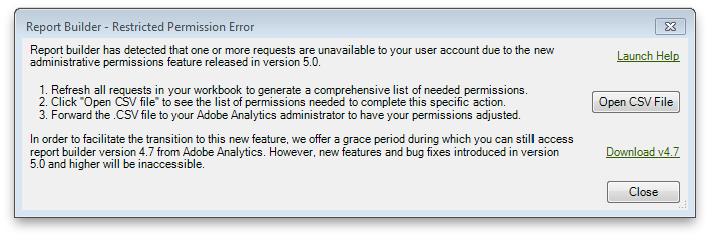

# ディメンションおよび指標のユーザーアクセス権限

現在、Adobe Report Builder には、Analytics 管理ツールの権限設定に似た権限設定があります。

管理者ではないユーザーが、アクセス権を持たないディメンションおよび指標を参照したリクエストのあるワークブックを以前に作成している場合があります。このような場合、権限の設定が適用されるようになりました。

例えば、アクセス権を持たないディメンションまたは指標を含むリクエストを更新すると、制限付き権限エラーが発生します。

保持している&#x200B;**各** Report Builder ワークブックに対して次の手順をおこないます。

1. ワークブックを開きます。
1. すべてのリクエストを更新します。
1. ユーザーアクセス権限エラーが発生したら、「**[!UICONTROL CSV ファイルを開く]」をクリックして、制限付き権限エラーの一覧を表示します。**
1. ファイル「AllRestrictedPermissionErrors.xlsx」を作成し、制限付き権限エラーの一覧を CSV ファイルからコピーして、このファイルに貼り付けます。
1. Report Builder ワークブックを閉じます。

すべてのワークブックを処理したら、「AllRestrictedPermissionErrors.xlsx」に制限付き権限エラーのすべての一覧が完成します。この一覧を Adobe Analytics のユーザーアクセス管理者に送信して、該当する指標およびディメンションへのアクセス権を付与するように依頼します。
