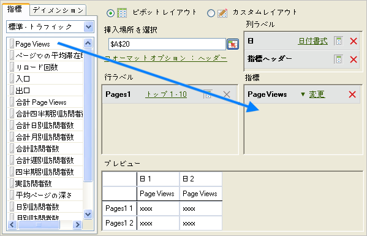
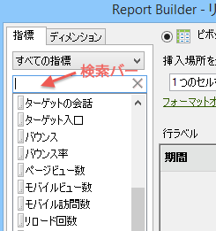
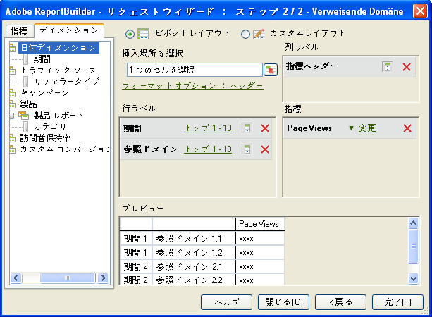

# 指標とディメンションの追加

リクエストに指標およびディメンションを追加する手順です。

1. [リクエストウィザード](../../../../analyze/report-builder/data-requests/data-requests.md#concept_E14C1E6B63C44D02BF8D80021B4B0F89) でデータリクエスト [!UICONTROL を作成します。ステップ1]で、「 **[!UICONTROL 次へ]**」をクリックします。
1. [!UICONTROL リクエストウィザード：ステップ 2] で、指標をダブルクリックするか、目的の位置までドラッグします。

   

   指標を追加しても、「[!UICONTROL 指標]」タブからは削除されません。1 つのリクエスト内で指標を複数回表示することができるからです。例えば、それぞれの値に加え、指標の小計を表示することができます。ただし、使用可能な指標のリストは、ディメンションの追加や削除のたびに変わります。

   「[!UICONTROL 指標]」レイアウトセクションには、指標のみを追加することができます。指標は[!UICONTROL 指標ヘッダー]として[!UICONTROL 列ラベル]のレイアウトに追加されます。[!UICONTROL 指標ヘッダー]を[!UICONTROL 列レイアウト]から[!UICONTROL 行レイアウト]に変更すると、指標ヘッダーは行レイアウトに表示され、指標が分類として使用されます。

   検索バーは、「指標」タブの、指標リストのすぐ上に表示されます。

   

   次の点に注意してください。

   * 検索語句を入力する途中でも、リストは自動的に更新され、名称が一致する指標だけが表示されます。
   * 一致の判定では、大文字と小文字が区別されません。また、「次を含む」の検索と等価になります。
   * 完全一致や検索フラグ（starts with、ends with、AND、OR など）には対応していません。

      リクエストウィザードを終了する（すなわち、「完了」または「キャンセル」をクリックする）か、リクエストウィザードの手順 1 に戻るか、または、指標カテゴリーを変更すると、検索語句がクリアされます。

      次の場合には、検索語句がクリアされません。

   * リストから指標項目の 1 つをドラッグ＆ドロップ（またはダブルクリック）して、その項目がピボットレイアウト／カスタムレイアウト指標パネルに追加される場合。
   * ピボットレイアウト／カスタムレイアウト指標パネルから指標項目を削除する場合。
   * 「ディメンション」タブをクリックしてから、「指標」タブに戻る場合。
   * 終了時にリクエストウィザードの手順 2 に戻る他のサブフォーム（モーダルかモードレスかを問わず）を起動する場合。以下のようなフォームがあります。

      * ディメンションフィルターフォーム
      * 期間書式設定フォーム
      * フォーマットオプションフォーム
      * 接頭辞／接尾辞フォーム
      * 出力範囲場所フォーム

1. （オプション）リクエストを指標で並べ替えるには、指標のラベルをクリックします。
1. 指標の追加時と同様にディメンションを追加します。

「[!UICONTROL ディメンション]」タブには、分類されたディメンション、またはステップ 1 で選択するベースレポートの分類、レポートスイートの設定に関するディメンションが表示されます。ディメンションをレイアウトグリッドにドロップすると、そのディメンションはツリービューから削除され、使用可能な残りのディメンションのリストが再計算されます。

「[!UICONTROL 日付]」ディメンションは自動的に追加されます。使用可能な日付ディメンションは、[!UICONTROL リクエストウィザード：ステップ 1] で選択された精度によって異なります（有効な値は次のとおりです。

    * Hour
    * Day
    * Week
    * Month
    * Year
    *日付範囲（精度が指定されていない場合）

1. [フォーマットオプション](../../../../analyze/report-builder/layout/t-format-display-headers.md#task_45C7C4938C2C47FCB02634A1248AA831) とフィルターを設定して、指標およびディメンションを変更します。
1. Click **[!UICONTROL Finish]**.
次の例では、[!UICONTROL ページ]指標に関連するディメンションが表示されています。ここでは、[!UICONTROL 参照ドメイン]ディメンションによって、[!UICONTROL ページ]と[!UICONTROL 参照ドメイン]の分類レポートが作成されています。分類レポートに追加できるディメンションのみが表示されるように、「[!UICONTROL ディメンション]」タブが更新されます。

