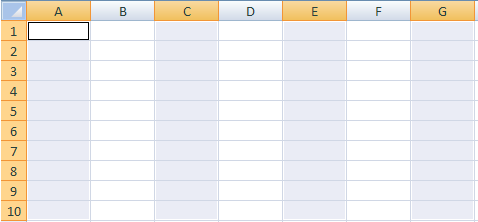

# 指標およびディメンションのセルへのマッピング

スプレッドシートへの項目のマッピングを開始する前に、スプレッドシートが保護されていないことを確認してください。ワークシートの保護によってユーザーの操作が妨げられると、スプレッドシートでセルを選択できなくなります。まず、シートの保護を解除してから、セルのマッピングを追加してください。

マッピングする領域とセルの数は、選択した指標、精度、日付範囲、設定したフィルターによって異なります。 例えば、「 [!UICONTROL サイト指標] > [!UICONTROL トラフィックレポート]，設定 [!UICONTROL 週] 精度を設定し、 [!UICONTROL 最近の 2 週間]を使用すると、3 つのセルをマッピングするよう求められます ( [!UICONTROL カスタムレイアウト]) を [!UICONTROL リクエストウィザード：ステップ 2]. このリクエストでは、1 週目のデータと 2 週目のデータを取得します。各データポイントの値は、ページビューの値と等しくなります。 3 つ目のセルは行ヘッダーとなります。この行ヘッダーは、「[!UICONTROL フォーマットオプション]」を使用して設定できます。

スプレッドシートで互換性のない場所を誤ってマッピングした場合、Report Builderでエラーが発生します。

詳しくは、次の項を参照してください。

* [セルの範囲の選択 ](/help/analyze/report-builder/layout/map-metrics-and-dimensions-to-cells.md#section_1E37FB46DA194FB7A1050B8833A48AC6)
* [セル選択のテクニック ](/help/analyze/report-builder/layout/map-metrics-and-dimensions-to-cells.md#section_760421C3D7F84D67A639174710C93B22)
* [マッピングの問題 ](/help/analyze/report-builder/layout/map-metrics-and-dimensions-to-cells.md#section_CC1BCF841291447EB3A994EB08F3A099)

## セルの範囲の選択 {#section_1E37FB46DA194FB7A1050B8833A48AC6}

[!UICONTROL リクエストウィザード：ステップ 2] で、トレンドリクエストに対して「[!UICONTROL カスタムレイアウト]」を有効にすると、セルの一定の範囲にリクエストをマッピングすることができます。

マッピングする項目の隣にある&#x200B;**[!UICONTROL 範囲セレクター]** をクリックします。

* **範囲内のすべてのセル：**[!UICONTROL カスタムレイアウト]スタイルのリクエストに対して、セルの範囲を選択する必要があります。
* **範囲の最初のセル：**&#x200B;範囲の左上にあたるセルを選択します。その後、「[!UICONTROL 範囲の方向]」が表示されるので、そこで入力セルと出力セル（列または行）について、縦方向または横方向を指定します。このオプションを使用すると、Report Builderがセルを自動的に選択します。
* **範囲の方向：**&#x200B;列または行としてセル範囲の方向を指定します。
* **範囲の先頭のセルを選択：**&#x200B;セル参照を表示します。

## セル選択のテクニック {#section_760421C3D7F84D67A639174710C93B22}

**[!UICONTROL 範囲選択]**&#x200B;アイコン  をクリックして日付を設定できます。

 をクリックし、スプレッドシートで選択したいセル範囲をマウスでクリック＆ドラッグして、データを選択します。連続した選択領域が、黒の枠線で囲まれます。

離れた行を選択した場合は、各行の周りに細い白の枠線が表示されます。

1 つのリクエスト内で離れた複数の行をマッピングするには、[!UICONTROL Ctrl] キーを使用して、選択したいセルの上でカーソルをクリックおよびドラッグします。例えば、40 セル分の連続した領域 1 つではなく、それぞれ 10 セル分の 4 つの領域に対してリクエストを作成するような場合に、これを実行します。

セルの選択後、[!UICONTROL 範囲の選択]フォームの&#x200B;**[!UICONTROL 範囲選択アイコン]**&#x200B;を再度クリックして、[!UICONTROL リクエストウィザード：ステップ 2] に戻ります。

## マッピングの問題のトラブルシューティング{#section_CC1BCF841291447EB3A994EB08F3A099}

既にアクティブなマッピングを持つセルに誤ってマッピングした場合、セル参照は範囲選択アイコンの横のテキストボックスに表示されません。 クリック時 [!UICONTROL OK]「 」Report Builderを選択すると、エラーが表示され、 *選択した範囲は別のリクエストの範囲と交差します。*&#x200B;選択を変更してください。

* このセルを使用する必要がある場合は、セル（複数の場合もあります）を右クリックして、「**[!UICONTROL リクエストを削除]**」を選択します。

このメッセージが表示されないようにするには、次の 2 つの方法があります。

* リクエストとマッピングが設定されたセルへの書式を設定して、見た目で区別できるようにします。
* マッピングを含むスプレッドシートの領域を確認します。

リクエストが埋め込まれている領域を確認するには、次の方法があります。

* [!UICONTROL リクエストマネージャー]を起動し、表示される個々のリクエストをクリックします。リクエストをクリックすると、リクエストがマッピングされているスプレッドシート内のセルが強調表示されます。
* リクエストマネージャーを起動し、新しいマッピングのために使用するセルを選択し、「[!UICONTROL シートから取得]」をクリックします。[!UICONTROL リクエストマネージャー]によって、選択されたセルと交差する出力項目があるリクエストがリスト内で選択されます。選択されるリクエストがない場合は、そのセルを使用することができます。
* スプレッドシートでセルを選択し、右クリックでコンテキストメニューを表示し、「[!UICONTROL リクエストを編集]」を選択できるかどうかを確認します。選択できる場合は、そのセルに関連付けられたリクエストが存在します。
