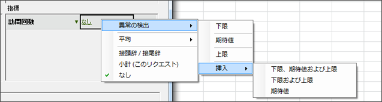
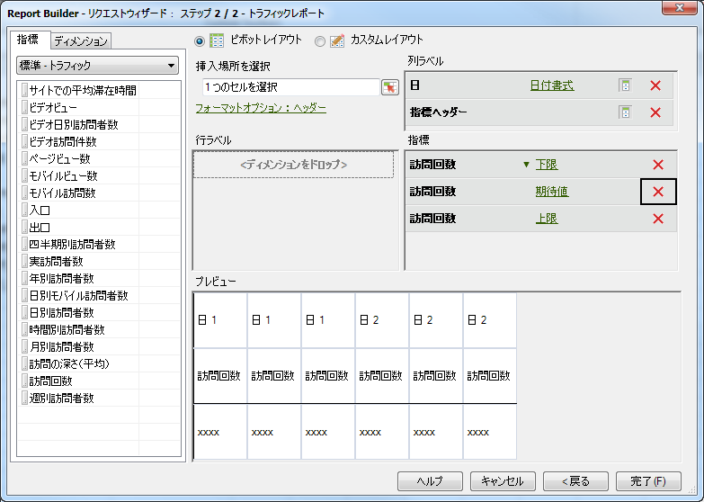

# 異常値検出リクエストの設定

Report Builder で異常値検出関連データを抽出する手順です。

1. **サイト指標**／**[!UICONTROL トラフィック]**&#x200B;レポートなどで、トレンドレポートを選択します。
1. In the [!UICONTROL Apply Granularity] menu, select **[!UICONTROL Day]**.

   >[!NOTE]
   >
   >[!UICONTROL 異常値検出] メニューは、「日」の精度を選択した場合にのみ使用できます。選択した期間を問わず、過去 30 日間のデータが統計データのトレーニング期間として使用されます。

1. After configuring date ranges, click **[!UICONTROL Next]**.

   手順1.On the Request Wizard: Step 2 of 2, add a metric, such as **[!UICONTROL Visits]**.

   手順1.For the added metric, click the **[!UICONTROL None]** link.

   

1. **[!UICONTROL 異常値検出]** / **[!UICONTROL `<selection>`]**&#x200B;を選択します。

   

   いずれかのオプションを選択すると、元の指標から異常値検出用のコピーが作成されます。例えば、訪問指標の場合、[!UICONTROL 指標]グループに下限訪問指標が追加されます。
1. Click **[!UICONTROL Finish]** and select the cell for output to Excel.

   See [Anomaly Detection](../../../analyze/analysis-workspace/virtual-analyst/c-anomaly-detection/anomaly-detection.md#concept_9476D6C093334B1A8044AE63835BDBE7) for definitions.
