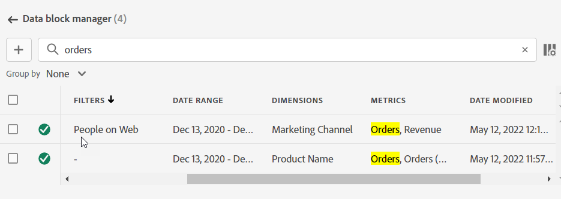

# データブロックの管理

[!UICONTROL  データブロックマネージャー ] を使用すると、ブック内のすべてのデータブロックを表示および管理できます。 [!UICONTROL  データブロックマネージャー ] には、特定のデータブロックを検索、フィルタリング、並べ替える機能が用意されています。 1 つまたは複数のデータブロックを選択した後、選択したデータブロックを編集、削除、または更新できます。

## データブロックを表示

ワークブック内のすべてのデータブロックを一覧表示するテーブルを表示するには、「**[!UICONTROL Manage]**」を選択します。

{zoomable="yes"}

**[!UICONTROL データブロックマネージャ]** には、ワークブックに存在するすべてのデータブロックを含むテーブルが表示されます。

{zoomable="yes"}

 を使用して、表示する列を選択できます。

## データブロックの並べ替え

表示された列でデータブロックテーブルを並べ替えることができます。 例えば、レポートスイート、セグメント、日付範囲、その他の変数でデータブロックを並べ替えることができます。

データブロックテーブルを並べ替えるには、列見出しを選択します。 並べ替え順を逆にするには、同じ列見出しを選択します。

## データブロックを検索

「 **[!UICONTROL _検索_]**」フィールドを使用して、データブロックテーブル内の項目を検索します。 例えば、データブロックやレポートスイートに含まれている指標を検索できます。また、日付範囲、変更日または最終実行日の列に表示される日付を検索することもできます。

## データブロックを編集

データブロックのレポートスイートと日付範囲を編集できます。 または、データブロックに適用されたセグメント。

例えば、1 つ以上のデータブロック内で、既存のセグメントを新しいセグメントに置き換えることができます。

1. 更新するデータブロックを選択します。最上位のチェックボックスを選択してすべてのデータブロックを選択するか、個々のデータブロックを選択できます。

   {zoomable="yes"}

1.  を選択して **[!UICONTROL クイック編集]** ウィンドウを表示します。

   {zoomable="yes"}

1. レポートスイート、日付範囲またはセグメントを更新するためのリンクを選択します。 **[!UICONTROL クイック編集]** - **[!UICONTROL セグメント]** では、選択したデータブロックのセグメントを追加、削除または更新できます。

   {zoomable="yes"}

## データブロックを更新

「」を選択して、データブロックテーブルを更新します。

データブロックが更新されたかどうかを確認するには、更新ステータスアイコンを確認します。

- データブロックが正常に更新されると、 が表示されます。

- 更新に失敗したデータブロックには、 が表示されます。

## データブロックを削除

1 つ以上のデータブロックを削除するには：

1. 1 つ以上のデータブロックを選択します。
1. 「」を選択します。
1. **[!UICONTROL データブロックを削除]** ダイアログで **[!UICONTROL 削除]** を選択するか、**[!UICONTROL キャンセル]** を選択して削除をキャンセルします。

## データブロックのグループ化

**[!UICONTROL グループ化の条件]** ドロップダウンメニューを使用するか、列タイトルを選択して、データブロックをグループ化できます。

データブロックを列で並べ替えるには、列タイトルを選択します。 データブロックをグループ別にグループ化するには、**[!UICONTROL グループ化の条件]**&#x200B;ドロップダウンメニューからグループ名を選択します。例えば、以下のスクリーンショットは、レポートスイート別にグループ化されたデータブロックを示しています。

グループ化を使用すると、セグメントなどの共通の要素を変更するデータブロックをすばやく選択できます。

{zoomable="yes"}

<!--

# Manage Data Blocks in Report Builder

You can view and manage all data blocks in a workbook using the Data Block Manager. The Data Block Manager provides search, filter, and sort capabilities that allow you to quickly locate specific data blocks. After selecting one or more data blocks, you can edit, delete, or refresh the selected data blocks.

## View Data Blocks

Click **Manage** to view a list of all data blocks in a workbook.

The Data Block Manager lists all data blocks present in a workbook. 

## Sort the Data Blocks list

You can sort the data block list by a displayed column. For example, you can sort the data block list by report suites, segments, date range, and other variables.

To sort the data block list, click a column heading.

## Search the Data Block list

Use the Search field to locate anything in the data block table. For example, you could search for metrics contained in the data blocks or report suite. You can also search for dates appearing in the date range, date modified, or last run date columns.

## Edit Data Blocks

You can edit the report suite, date range, or the segments applied to one or more data blocks.

For example, you can replace an existing segment with a new segment in one or more data blocks.

1. Select the data blocks that you want to update. You can select the top-level check box to select all data blocks or you can select individual data blocks.

   

1. Click the edit icon to display the Quick edit window.

   

1. Select a segment link to update report suites, date ranges, or segments.

   

## Refresh Data Blocks

Click the refresh icon to refresh the data blocks in the list.

To verify if a data block is refreshed, view the refresh status icon. 

A successfully refreshed data block displays a checkmark in a green circle: . 

A data block that has failed to refresh displays a warning icon: .This makes it easy to identify if any data blocks have errors.

## Delete a Data Block

1. Select a data block in the Data Block manager. 
1. Click the trash can icon to delete the selected data block.

## Group Data Blocks

You can group data blocks using the **Group by** drop-down menu or you can click a column title. To sort data blocks by column, click the column title. To group data blocks by groups, select a group name from the **Group by** drop-down menu. For example, the screenshot below shows data blocks grouped by Sheet. It shows data blocks grouped by Sheet1 and Sheet2.  This is useful, for example, in the segment-replacing use case. If you have multiple segments applied to each data block, it is helpful to create a group containing all the data blocks that you want to replace. Then you can easily select and edit them all at once.

## Modify the Data Block Manager view

You can modify which columns are visible in the Data Block Manager window.

Click the column list  icon to select which columns are listed in the Data Block Manager. Select a column name to display the column. Deselect the column name to remove the column from view.

-->