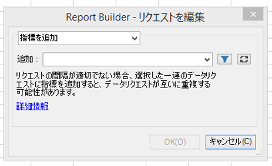
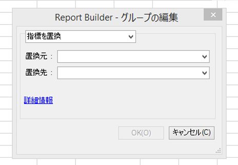
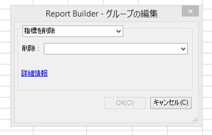

# 複数のリクエストにわたる指標の編集

複数のリクエストの指標を編集する機能を使用すると、既存のリクエストの指標やグループ化されたリクエストの指標を容易に追加、削除または置換できます。

## Add metrics {#section_3FBDA9668039404895059618D70FCBCD}

次の点に注意してください。

* 指標は、ピボットレイアウトリクエストにのみ追加できます。選択したリクエストの一部がカスタムレイアウトの場合、指標は追加できません。これは、レイアウトがカスタマイズされているので、スプレッドシートのどこに新しい指標が配置されるかを Report Builder が認識しないためです。
* そのため、カスタムレイアウトリクエストのみを選択した場合、「**[!UICONTROL 指標を追加]」オプションは利用できません。**
* 指標を追加すると、リクエストのサイズが増加し、別のリクエストと重なる可能性があります。リクエストの周囲に指標を追加できる十分な領域があることを確認してください。
* 追加された指標が選択したリクエストのいずれかに既に存在している場合、そのリクエストには追加されません。

1 つ以上の指標を追加するには

1. Select one or more requests in Excel and right-click to select **[!UICONTROL Edit Metrics]**. (Or, click **[!UICONTROL Manage]** &gt; **[!UICONTROL Edit Multiple]** &gt; **[!UICONTROL[choose metric]]** &gt; **[!UICONTROL Edit Group]** **** to select the group of requests to modify.)

1. Select **[!UICONTROL Add Metric(s)]**and select the metrics to add.

   

1. リクエストを更新して、実際のデータを表示します。更新するまで、オフラインデータが表示されます。

## Replace metric {#section_D773AAC7B30C4FBEBDB66B203C217818}

次の点に注意してください。

* 1 対 1 の置換のみ許可され、1 対多または多対 1 は許可されません。
* 置換するために選択した指標が選択したリクエストのいずれかに存在しない場合、このリクエストは変更されません。
* 新しい指標は、置換された指標と同じ場所に配置されます。つまり、以下のとおりです。

   * **ピボットレイアウト内**：ピボットレイアウトリクエストが日付、訪問、訪問者、日別訪問者数を出力し、「訪問者」が「売上高」に置換される場合、更新されたリクエストのレイアウトは、日付、訪問、売上高、日別訪問者数になります。
   * **カスタムレイアウト内**：「訪問者」指標がセル F11 に出力されていた場合、更新されたリクエストレイアウトは「売上高」を同じセル F11 に表示します。

* 置換された指標に演算が適用されていた場合（平均、前に追加されたテキスト、後に追加されたテキスト、マイクロチャート）、これらの演算は新しい指標にも適用されます。

指標を置換するには

1. Select one or more requests in Excel and right-click to select **[!UICONTROL Edit Metrics]**. (Or, click **[!UICONTROL Manage]** &gt; **[!UICONTROL Edit Multiple]** &gt; **[!UICONTROL[choose metric]]** &gt; **[!UICONTROL Edit Group]** **** to select the group of requests to modify.)

1. Select **[!UICONTROL Replace Metric]**.

   

1. 置換する指標と置換される指標を選択します。
1. リクエストを更新します。更新するまで、オフラインデータが表示されます。

## Remove metrics {#section_D3CD5BAC7670416593B633B2B8423C60}

次の点に注意してください。

* 削除するために選択した指標のいずれかが選択したリクエストのいずれかに存在しない場合、このリクエストは変更されません。
* ピボットレイアウト内では、指標の削除により、削除した指標の後ろにある指標のレイアウトが変更されます。

   **例**：ピボットレイアウトリクエストが日付、訪問、訪問者、日別訪問者数を出力し、「訪問」を削除すると、更新されたリクエストのレイアウトには、日付、訪問者、日別訪問者数が表示されます。

指標を削除するには

1. Select one or more requests in Excel and right-click to select **[!UICONTROL Edit Metrics]**. (Or, click **[!UICONTROL Manage]** &gt; **[!UICONTROL Edit Multiple]** &gt; **[!UICONTROL[choose metric]]** &gt; **[!UICONTROL Edit Group]** **** to select the group of requests to modify.)

1. Select **[!UICONTROL Remove Metric(s)]**.

   

1. リクエストから削除する 1 つ以上の指標を選択します。
1. リクエストを更新します。更新するまで、オフラインデータが表示されます。

