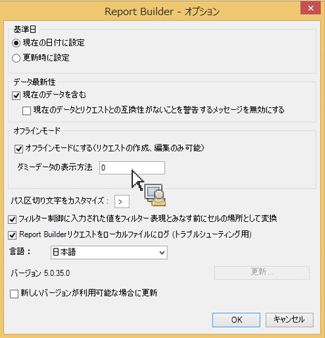
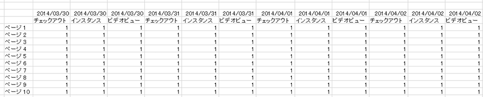

# リクエストの作成と編集のためのオフラインモード

オフラインモードでは、リクエストの作成および編集の後のサーバー通信が抑制され、プレースホルダーデータが表示されるので、リクエスト編集作業を効率化できます。

新しいリクエストを作成または編集すると、データを取得するためにレポート API が呼び出されます。この処理が実行されると、データが返されるのを待たないと次の手順に移れないので、リクエスト作成プロセスに時間がかかります。オフラインモードではプレースホルダーデータのみが返され、API 呼び出しは行われません。

オフラインモードを有効にするには：

1. Report Builder メニューの&#x200B;**[!UICONTROL オプション]を選択します。**

   

1. Check the checkbox next to **[!UICONTROL Turn on offline mode for creating and editing requests]**.
1. 「**[!UICONTROL ダミーデータの表示方法]」フィールドに、リクエストで返すプレースホルダーデータを入力します。**&#x200B;例えば、「1」と入力します。
1. Click **[!UICONTROL OK]**.
1. リクエストウィザードを使用して、（オフラインモードで）リクエストを作成し、実行します。
1. プレースホルダーデータとして「1」が指定されたリクエストは次のように表示されます。

   

   >[!IMPORTANT]
   >
   >実際のデータを使用してリクエストを実行する前に、オフラインモードを無効にしてください。無効にするには、**[!UICONTROL オプション]メニューでチェックボックスをオフにします。**

