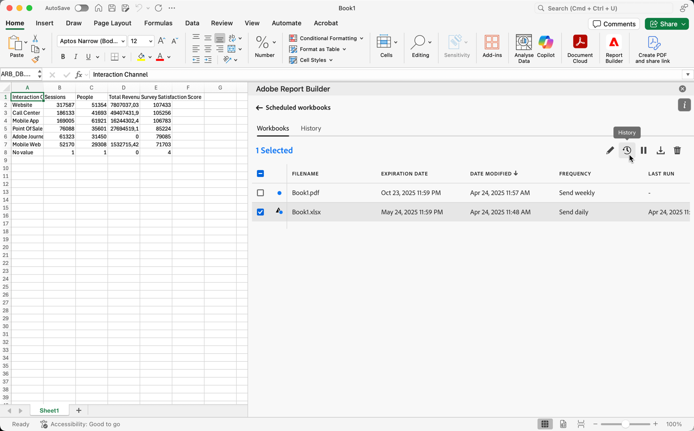

# スケジュールされたワークブックの管理

次の記事の説明に従って、電子メールまたはクラウドの宛先にエクスポートして共有するブックをスケジュールできます。

* [メールでの共有によるワークブックのスケジュール設定](/help/analyze/report-builder/schedule-reportbuilder.md)

* [クラウドの宛先に書き出してワークブックをスケジュールする](/help/analyze/report-builder/report-builder-export.md)

次の節では、スケジュールされた後にワークブックを管理する方法について説明します。

## スケジュールされたワークブックの表示と管理

「**[!UICONTROL ワークブック]**」タブでは、スケジュールされたすべてのワークブックを表示および管理できます。

1. Report Builder ハブで **[!UICONTROL スケジュール]** を選択します

1. 「**[!UICONTROL ワークブック]**」タブを選択します。 スケジュールされたすべてのワークブックのリストが表示されます。 （または、[**[!UICONTROL 従来]**]タブを選択して、新しいReport Builderに移行する必要がある従来のブックの一覧を表示することもできます）。

   {zoomable="yes"}

1. 次のいずれかの操作を行います。

   * アイコンにカーソルを合わせると、スケジュールされたブックのステータスが表示されます。

   * 検索フィールド  で、スケジュールされた特定のワークブックを検索します。

   * 列アイコン  を選択して、表示する列を定義します。

   * フィルターアイコン  を選択し、「[!UICONTROL **すべて表示**] を選択して、特定の組織でスケジュールされたすべてのワークブックを表示します。

1. 1 つ以上のワークブックを選択します。

   {zoomable="yes"}

   次のオプションがあります。

   | オプション | 説明 |
   |---|---|
   |  | 選択したブックのスケジュールを編集します。 |
   |  | 選択したワークブックの履歴を表示します。 |
   |  | 選択したワークブックのスケジュールを一時停止します。 |
   |  | 選択したワークブックのスケジュールを再開します。 |
   |  | 選択したブックを新しいブックにダウンロードします。 |
   |  | 選択したブックのスケジュールを削除します。 |

## スケジュールされたブックの履歴と状態

スケジュールされたブックの履歴と状態は、[**[!UICONTROL 履歴]**]タブで確認できます。

1. Report Builder ハブで **[!UICONTROL スケジュール]** を選択します。

1. 「**[!UICONTROL 履歴]**」タブを選択します。 スケジュールされたすべてのワークブックのリストが表示されます。

   {zoomable="yes"}

   リスト内の特定のワークブックを検索するには、 を使用します。
表示する列を定義するには、 を使用します。

   **[!UICONTROL 履歴]** タブでは、スケジュールされた各タスクのステータスを確認できます。 個別の行に、スケジュールされた各タスクのステータス変更が記載されます。

   * は、ブックが正常に送信されたことを示します。
   * は、エラーが発生したことを示します。

または、[]タブで選択した1つ以上のブックの&#x200B;**[!UICONTROL 履歴]**&#x200B;を選択できます。 このアクションにより、選択でフィルターされたリストを含む&#x200B;**[!UICONTROL 履歴]**&#x200B;タブが表示されます。 を選択してフィルターを削除します。
