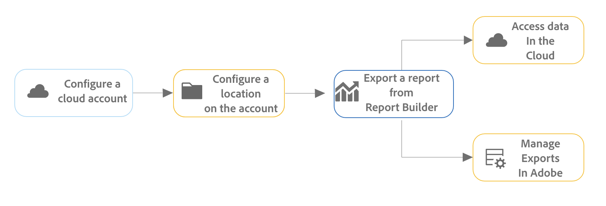
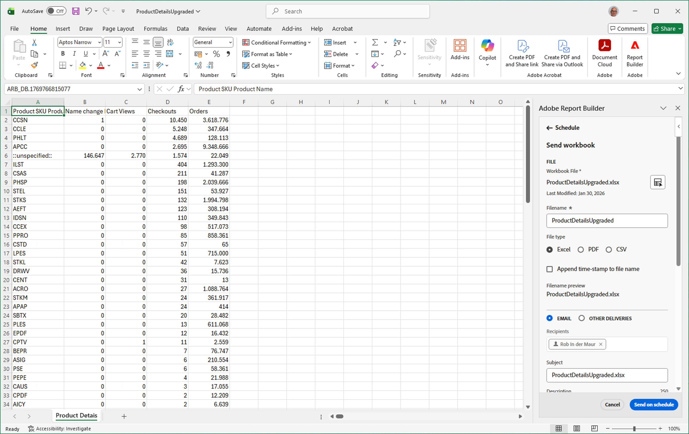

# クラウドの宛先に書き出してワークブックをスケジュールする

Report BuilderからCustomer Journey Analytics ワークブックを、Google、Azure、Amazonなどのクラウドプロバイダーに書き出すことができます。

[ レポートビルダーからクラウドにレポートを書き出す利点](#advantages-of-exporting-to-the-cloud)には、サードパーティツールでレポートを使用したり、外部データとレポートを組み合わせたりできる機能があります。

Report Builderからクラウドの宛先にワークブックをエクスポートする前に、データブロック、環境、および権限が[書き出し要件](#export-requirements)を満たしていることを確認してください。

## 書き出しプロセスについて

Report Builderからクラウドにワークブックを書き出す場合は、次のプロセスを使用します。

1. [クラウドアカウントを設定](/help/components/locations/configure-import-accounts.md)

1. [アカウントの場所を設定](/help/components/locations/configure-import-locations.md)

1. [Report Builderからのレポートのエクスポート](#export-a-report-from-report-builder)

1. クラウドアカウント内のデータにアクセスし、[Adobeでの書き出しを管理](/help/components/locations/configure-import-locations.md)

## Report Builderからのレポートのエクスポート

>[!NOTE]
>
>この節で説明したようにデータを書き出す前に、上記の節の[書き出しプロセス ](#understand-the-export-process)の詳細を確認してください。

Report Builderからレポートを書き出すには：

1. まだ行っていない場合は、[クラウドの書き出しアカウントの設定](/help/components/locations/configure-import-accounts.md)の説明に従って、書き出しのアカウントと場所を設定します。

1. 書き出すデータを含むExcel スプレッドシートで、**[!UICONTROL Adobe Report Builder]**&#x200B;の右側のパネルを開きます。

1. [!UICONTROL **スケジュール**]&#x200B;を選択します。

1. 「**[!UICONTROL ワークブック]**」タブで、プラスアイコンを選択して新しいスケジュールを作成します

   または

   既に作成したスケジュールでワークブックを書き出すには、スケジュールのリストからスケジュールを選択し、**[!UICONTROL スケジュールに従って送信]**&#x200B;を選択します。

1. [!UICONTROL **Adobe Report Builder**]&#x200B;の右側のパネルで、新しいスケジュールの作成を続行するには、次の情報を指定します。

   

   | フィールド名 | 関数 |
   |---------|----------|
   | **[!UICONTROL ファイル]** | 書き出し用に現在選択されているワークブックファイルを表示します。 ファイル名の横にあるワークブックアイコン を選択して、現在のワークブックがまだ選択されていない場合に選択します。 |
   | **[!UICONTROL ファイル名]** <!--should be File name --> | ブックを書き出す前にファイル名を変更できます。
ワークブックのファイル名は、デフォルトでワークブックの名前になります
 |
   | **[!UICONTROL ファイルの種類]** | 書き出すファイルのファイルタイプを選択します。 Excel、PDF、CSVのいずれかを選択できます。 
**[!UICONTROL CSV]**&#x200B;を選択すると、スケジュールされたワークブックがZIP添付ファイルとして送信されることに注意してください。 一部の企業の電子メール管理機能では、ZIP添付ファイルを含む電子メールをブロックする場合があります。 それに応じて警告が表示されます。
 |
   | **[!UICONTROL ファイル名にタイムスタンプを追加]** | ファイル名にタイムスタンプを追加して、ワークブックが更新された日付を識別するには、このオプションを選択します。 タイムスタンプは、特定の日付に送信されたワークブックのバージョンを確認するのに役立ちます。 選択すると、次のいずれかを選択できます。 |
   | **[!UICONTROL ファイル名プレビュー]** <!--should be File name preview --> | 書き出し後にファイル名がどのように表示されるかのプレビューを表示します。 |
   | **[!UICONTROL ワークブックをパスワードで保護]** | 書き出したファイルを保護するパスワードを指定して、パスワードを持つユーザーのみがアクセスできるようにします。 
パスワードは8文字以上で、1つ以上の数字と1つの特殊文字（`!`、`@`、`#`、`$`など）を含んでいる必要があります。
 |
   | **[!UICONTROL 電子メール]** | 特定の電子メールアドレスにファイルを送信するには、このオプションを選択します。 詳しくは、[電子メールを介した共有によるワークブックのスケジュール設定](schedule-reportbuilder.md)を参照してください。 |
   | **[!UICONTROL その他の配信]** | このオプションを選択してファイルをクラウドアカウントに送信し、次に説明する&#x200B;**[!UICONTROL アカウント]**&#x200B;および&#x200B;**[!UICONTROL 場所]** ドロップダウンメニューを使用してアカウントと場所を選択します。 |
   | **[!UICONTROL アカウント]** | データを送信するクラウド書き出しアカウントを選択します。 
または、使用するクラウドアカウントをまだ設定していない場合は、新しいアカウントを設定できます。<ol><li>「[!UICONTROL **アカウントを追加**]」を選択し、次の情報を指定します。<ul><li>[!UICONTROL **場所アカウント名**]：場所アカウントの名前を指定します。 この名前は、場所を作成する際に表示されます。 </li><li>[!UICONTROL **場所アカウントの説明**]：同じアカウントタイプの他のアカウントと区別できるように、アカウントの簡単な説明を入力します。</li><li>**[!UICONTROL 組織内のすべてのユーザーがアカウントを利用できるようにします]**：このオプションを選択すると、組織内の他のユーザーがアカウントを使用できるようになります。 セグメントを共有する際は、次の点を考慮してください。<ul><li>共有したアカウントは、共有解除できません。</li><li>共有したアカウントは、アカウントの所有者のみが編集できます。</li><li>誰でも共有したアカウントの場所を作成できます。</li></ul></li><li>[!UICONTROL **アカウントの種類**]：書き出すクラウドアカウントの種類を選択します。 利用できるアカウントタイプは、Amazon S3 Role ARN、Google Cloud Platform、Azure SAS、Azure RBACです。</li></ul><li>アカウントの設定を完了するには、[ クラウドのインポートとエクスポートのアカウントを設定](/help/components/locations/configure-import-accounts.md)の手順6に進み、選択した&#x200B;[!UICONTROL **アカウントタイプ**]&#x200B;に対応するセクションを展開します。 
次のアカウントタイプを使用できます。
<ul><li>Amazon S3 Role ARN</li><li>Google Cloud Platform</li><li>Azure SAS</li><li>Azure RBAC</li></ul></ol> |
   | **[!UICONTROL 場所]** | 書き出しデータを送信するアカウント上の場所を選択します。
または、選択したアカウントで使用する場所をまだ設定していない場合は、新しい場所を設定できます。<ol><li>「[!UICONTROL **場所を追加**]」を選択し、次の情報を指定します。 <ul><li>[!UICONTROL **名前**]：場所の名前。</li><li>[!UICONTROL **説明**]：アカウント上の他の場所と区別できるように、場所の簡単な説明を入力します。</li><li>**[!UICONTROL 組織内のすべてのユーザーが場所を利用できるようにします]**：組織内の他のユーザーが場所を使用できるようにするには、このオプションを選択します。 セグメントを共有する際は、次の点を考慮してください。<ul><li>共有している場所は共有を解除できません。</li><li>共有場所は、アカウントの所有者のみが編集できます。</li><li>場所を共有できるのは、場所が関連付けられているアカウントも共有されている場合のみです。</li></ul></li><li>[!UICONTROL **場所アカウント**]：場所を作成するアカウントを選択します。</li></ul><li>場所の設定を完了するには、「[!UICONTROL **場所アカウント**]」フィールドで選択したアカウントタイプに対応する以下のリンクに進みます。<ul><li>[Amazon S3 Role ARN](/help/components/locations/configure-import-locations.md#amazon-s3-role-arn)</li><li>[Google Cloud Platform](/help/components/locations/configure-import-locations.md#google-cloud-platform)</li><li>[Azure SAS](/help/components/locations/configure-import-locations.md#azure-sas)</li><li>[Azure RBAC](/help/components/locations/configure-import-locations.md#azure-rbac)</li></ul> |
   | **[!UICONTROL スケジュール設定オプションを表示]** | このオプションを選択すると、書き出しのスケジュール設定に関する追加オプションが表示されます。 書き出しを1回だけ送信する場合は、このオプションを選択しないでください。 このオプションを選択しない場合、書き出しは直ちに開始されます。 |
   | **[!UICONTROL 開始日：]** | 定期エクスポートを開始する日時。 
このオプションは、定期エクスポート頻度を選択する場合にのみ使用できます。
 |
   | **[!UICONTROL に終了日：]** | 定期エクスポートが期限切れになる日時。 定期エクスポートは、設定した日時以降は実行されなくなります。 
このオプションは、定期エクスポート頻度を選択する場合にのみ使用できます。
 |
   | **[!UICONTROL 頻度]** | 頻度は、1 時間ごと、毎日、毎週、毎月または毎年特定の日に設定できます。 例えば、月の最初の日曜日の夜にワークブックを送信するスケジュールを設定して、受信者が月曜日の朝に受信トレイに電子メールを最初に受信するように設定できます。 |

   {style="table-layout:auto"}

1. 「[!UICONTROL **スケジュールに送信**]」を選択して、ワークブックを書き出します。

   データは、指定した頻度で指定したクラウドアカウントに送信されます。

## クラウドへの書き出しのメリット

Adobe Analytics データをクラウドに書き出すと、次のことが可能になります。

* Google Cloud Platform、Microsoft Azure、Amazon S3などの共有場所に書き出します。

* 大量の履歴データを保存する。

  このタイプのデータを使用すると、ビジネスインテリジェンスを獲得するために長期的なトレンドを検出し、最終的により良いビジネス上の意思決定につながります。

* 書き出したAdobe Analytics データに計算指標を含めます。

* 連結された値としてデータ出力を構造化する。

* 1 回限りで書き出すか、スケジュールに従って書き出す

* Excel、PDF、またはCSV形式でファイルを書き出します。

* 複数のディメンションを含むデータブロックを書き出します。

## 書き出し要件 {#export-requirements}

### 最小要件

データブロック、環境、権限が次の要件を満たしていることを確認します。

* **データブロック：**&#x200B;すべてのデータブロックには、列、行、または値に対する少なくとも1つのコンポーネントを含める必要があります。

* **Environment:** Adobe Analyticsで使用される[IP アドレス ](/help/technotes/ip-addresses.md)と[ ドメイン ](/help/technotes/domains.md)が、組織のファイアウォールを通じて許可されていることを確認します。
